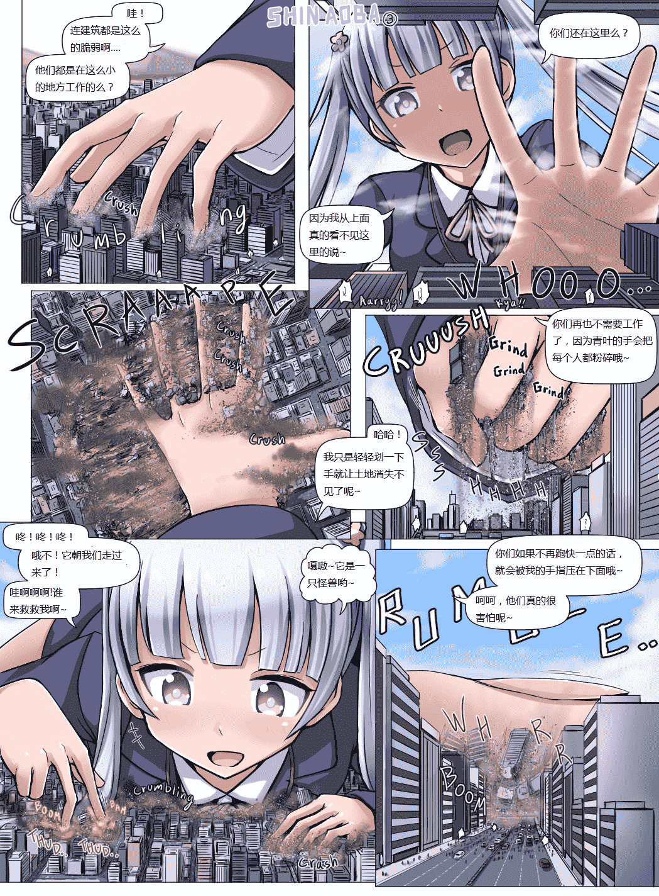

# [翻译][寺田落子]大怪兽凉风青叶3

作者：四糸乃

TID：21742

 

# 1

看着翻译前辈们后突然有了一颗想翻译些什么的心正好寺田老师的这张新图出来了就索性翻了一下，但是自翻日文的图后我看着弄出来的东西一脸懵逼好在找到了张英文版的于是就翻了一下英文版的 <ignore_js_op>

**gigaaoba3_eng.jpg** *(710.57 KB, 下載次數: 122)*

[下載附件](forum.php?mod=attachment&aid=NjM3NzR8NDU0YjM2OWJ8MTYwMzg1NTgzNHwxODIzMHwyMTc0Mg%3D%3D&nothumb=yes)

2016-9-3 00:37 上傳

里面按照我自己的想法改了一下原句让其看起来更加通顺一点也更易懂一点，这只是个人认为，不知道你们看的怎么样而且里面出现的三个含有“你们”的句子，原句应该就是单一的一个“你”的意思？毕竟是巨大化类的，所以我就把“你”改成了“你们”，不知道会不会影响？而且这是咱的第一个帖子，有什么不好的地方望多多包涵啦 

# 2

> [cloverone 發表於 2016-9-3 21:35](https://giantessnight.com/gnforum2012/forum.php?mod=redirect&goto=findpost&pid=307227&ptid=21742)

> 从最后一张图来看，有一栋8层楼房，按每层楼3.5m算，28m的楼只有一节关节大小，cz一米五初三党，按资料（fr ...

我的天，这个有点6啊=，学渣表示伤不起= 

# 3

> [max 發表於 2016-9-3 23:24](https://giantessnight.com/gnforum2012/forum.php?mod=redirect&goto=findpost&pid=307236&ptid=21742)

> 啧，被抢先发布了啊，明明我就差镶字了……

> 不过又多了个翻译真的是太好了，翻译来几个都不嫌多。

> ...

翻译的话只是一时兴起的，要是找不到英文图我也是一脸懵逼的来着，而且开学了上论坛的时间也少了

 

# 4

> [max 發表於 2016-9-3 23:24](https://giantessnight.com/gnforum2012/forum.php?mod=redirect&goto=findpost&pid=307236&ptid=21742)

> 啧，被抢先发布了啊，明明我就差镶字了……

> 不过又多了个翻译真的是太好了，翻译来几个都不嫌多。

> ...

关于换成“我只是用手轻轻一划就把地面变的到处都是废墟了”也许合理一点吧，不过我印象里的文章都是“抹去了”“消失了”之类的，所以就下意识翻译成消失不见了来着

 

# 5

> [max 發表於 2016-9-4 15:06](https://giantessnight.com/gnforum2012/forum.php?mod=redirect&goto=findpost&pid=307328&ptid=21742)

> 一样，我也是一时兴起才开始翻译的，等我回过神来的时候已经翻了四五篇文章了，而且反响还不错，然后索性 ...

对啊对啊，我就是看到你和另一位仁兄翻译的图片才翻译的QWQ</ignore_js_op>