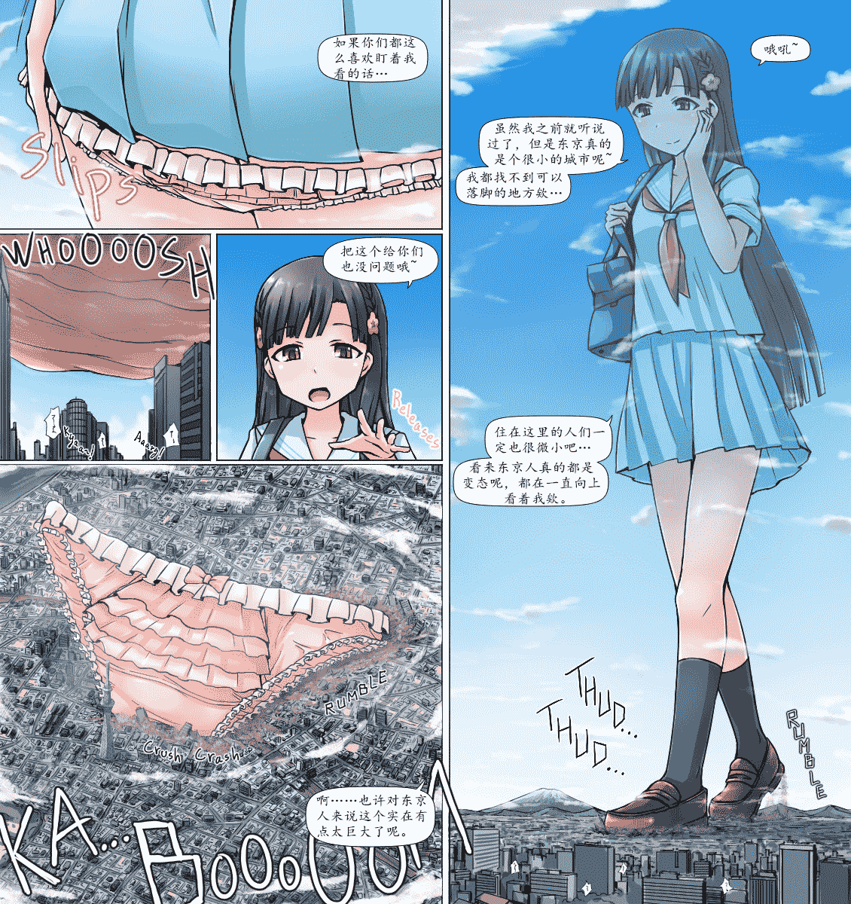
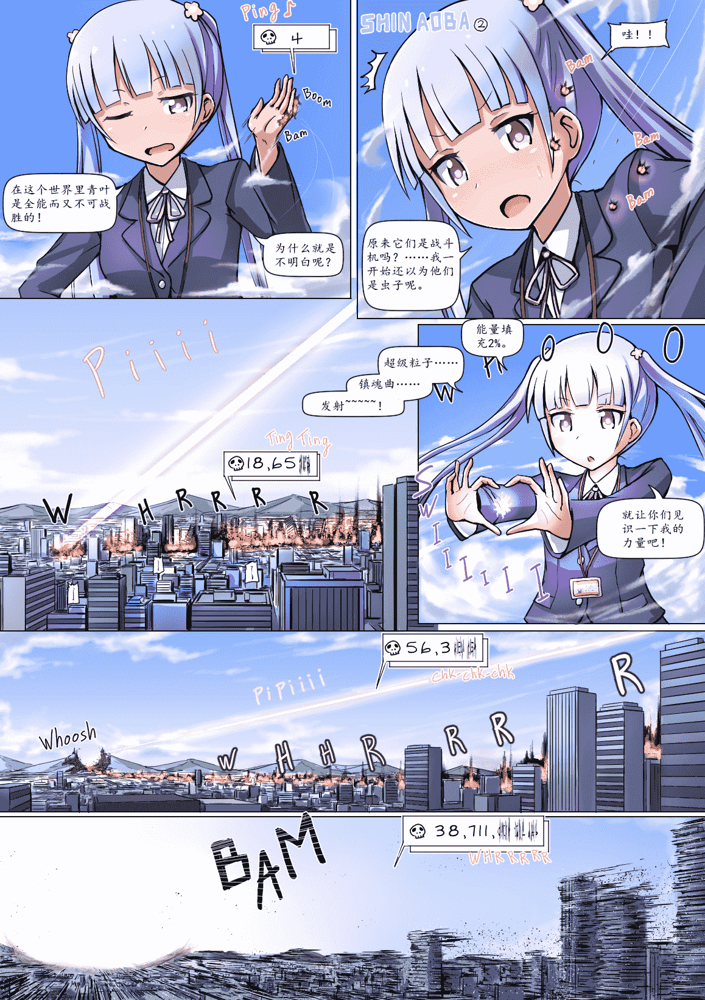

# [翻译][寺田落子]小早川紗枝

作者：猫头咕咕鹰

TID：21568

 

# 1

*本帖最後由 max 於 2016-8-14 16:11 編輯*

额……

因为这次的图是之前就做好了一半的，所以就没改成竖排版，我想下一次的图应该就是竖排版了，这回就先凑活着看吧。

然后大怪兽凉风青叶2那张图我参照源酱的建议作出了修改，这次也一并放出。

然后我有三个问题需要跟大家问一下……

1.你们……有没有……那个……就是那种……可以直接识别图片上的文字的软件？我记得很久以前有人在咱们论坛发过这么个东西。因为我实际上对日语一窍不通，也不会用日语打字，所以我之前翻的所有图片实际上都是从英文版翻过来的，二次翻译的话……跟原版的差距可能会比较大，所以如果有这么一种能直接识别图片上的文字的软件就太好了。

不过其实最好的是有懂日语的人愿意接活，这样翻译的准确度应该也会比较高，我也能退休享清福……但是似乎没有这种人QAQ

2.投票贴应该怎么发

3投票贴应该的发到哪个版块

<ignore_js_op>

**kobayakawasae_eng_副本.jpg** *(534.42 KB, 下載次數: 126)*

[下載附件](forum.php?mod=attachment&aid=NjI5NTV8ODE1NjE3ODF8MTYwMzg1NjMyN3wxODIzMHwyMTU2OA%3D%3D&nothumb=yes)

2016-8-13 18:50 上傳

这妹子实际上是有口音的，所以翻译的时候真的超级麻烦……老实说我到现在都不确定是不是该这么翻译，这些对话基本全是靠上下文语境猜出来然后再交由源酱润色的。在这里还是要特别鸣谢一下源酱@源儿biubiubiu ，老实说没她在的话这图片翻译出来总会差些味道……因为我实在不太会用女生的口气说话。

<ignore_js_op>

**gigaaoba2_eng_副本.jpg** *(734.86 KB, 下載次數: 35)*

[下載附件](forum.php?mod=attachment&aid=NjI5NTZ8OWI2YjI3ZDZ8MTYwMzg1NjMyN3wxODIzMHwyMTU2OA%3D%3D&nothumb=yes)

2016-8-13 18:50 上傳

 

# 2

> [wbsdb 發表於 2016-8-14 00:31](https://giantessnight.com/gnforum2012/forum.php?mod=redirect&goto=findpost&pid=303856&ptid=21568)

> lz会翻译寺田新画的秋山优花里的图么

> 感觉不错的样子

不好意思，请问是哪张图？我对秋山优花里这个名字完全没印象啊。

 

# 3

> [605651871 發表於 2016-8-14 10:39](https://giantessnight.com/gnforum2012/forum.php?mod=redirect&goto=findpost&pid=303903&ptid=21568)

> 效率异常的高呢 希望翻译神崎兰子的图 楼主幸苦了

这个又是哪位啊？我看的番真心不多，所以你们想指定我先翻译哪张图的话请直接附上原图谢谢。

 

# 4

> [葬儀社 發表於 2016-8-14 10:59](https://giantessnight.com/gnforum2012/forum.php?mod=redirect&goto=findpost&pid=303907&ptid=21568)

> 他應該是說這張吧

> 

> http://gs-uploader.jpn.org/upld- ... ochiko/c90omake.jpg

这样啊……那就没辙了。

不过说到流出，最近ex上不是流出了邻家的轻熟女的英文版嘛，接下来我想挑战一下那个，所以估计这段时间会暂停更新单图和文章的翻译。

希望不要跟别人撞车啊，不然我就白费工了。

 

# 5

> [，，，， 發表於 2016-8-13 20:55](https://giantessnight.com/gnforum2012/forum.php?mod=redirect&goto=findpost&pid=303813&ptid=21568)

> 没有，滚……开个玩笑，其实WPS里有这种东西，能识别中文和英文，日文全特么是乱码，附图为证

> 

> ————— ...

不，这个应该用得上，就像我后面几楼说的，我想把那个邻家的轻熟女英文版翻了，但是老实说那个的文字量实在是太大，纯手打的话太浪费时间了，但是能有个可以抓英文的就会好很多。

 

# 6

> [葬儀社 發表於 2016-8-14 11:37](https://giantessnight.com/gnforum2012/forum.php?mod=redirect&goto=findpost&pid=303914&ptid=21568)

> 應該沒有吧

> 雖然漫畫區那裏有人說翻完 可以過超久都沒動作

我记得更早之前寺田落子老师还有一个邻居阿姨为题材的漫画来着，而且还是两本，如果能找到英文版的话我也可以试着弄一下……不过前提是我有那个能力就是了，总之别抱太多期待。

 

# 7

> [，，，， 發表於 2016-8-14 13:32](https://giantessnight.com/gnforum2012/forum.php?mod=redirect&goto=findpost&pid=303940&ptid=21568)

> 关于这张图，流出的希望不大，寺田貌似会在enty上更新全彩版，但是到目前为止enty上的图还没有流出一张。 ...

说到这个……怎么出钱投资啊？然后出多少钱啊？ 

# 8

> [静儿_ 發表於 2016-8-13 22:52](https://giantessnight.com/gnforum2012/forum.php?mod=redirect&goto=findpost&pid=303833&ptid=21568)

> 语气词太多了

> 什么呢……吧……啊……呀这些，用多了会让人觉得做作

的确显得有些作……但是有些时候作一点才更有意思啊，还有说好的50字呢？doge 

# 9

> [shendanxiaogui 發表於 2016-8-14 18:38](https://giantessnight.com/gnforum2012/forum.php?mod=redirect&goto=findpost&pid=303975&ptid=21568)

> 问题来了，源儿不发帖这大家没法评分啊...

> 其实有个办法就是积分转让...但是...嗯...给600到500，税率蛮高 ...

呃……和为贵，和为贵嘛……都不要激动，你们这弄得我很尴尬啊……

 

# 10

> [，，，， 發表於 2016-8-14 17:14](https://giantessnight.com/gnforum2012/forum.php?mod=redirect&goto=findpost&pid=303967&ptid=21568)

> https://enty.jp/teradaochiko

> 这是寺田的enty主页。

> 其实这个可以说是投资，国内一般叫众筹，但它跟众筹 ...

哦哦，这样啊……感觉好麻烦的样子啊……估计这段时间是没工夫搞这个了。话说如果我现在加入这个众筹的话，以前的东西我能看吗？ 

# 11

> [，，，， 發表於 2016-8-14 22:12](https://giantessnight.com/gnforum2012/forum.php?mod=redirect&goto=findpost&pid=304010&ptid=21568)

> 当然可以，而且在取消投资之后，最后投钱的那一个月以及之前的所有内容只要符合你的投资记录依旧可以查看 ...

是要把前面的钱补上才能看前面的东西吧？

 

# 12

> [我属于被称为 發表於 2016-8-14 22:09](https://giantessnight.com/gnforum2012/forum.php?mod=redirect&goto=findpost&pid=304009&ptid=21568)

> 顶顶！谢谢楼主翻译！想问下楼主，寺田大大的有些图是没有显示是要额外的条件才可以吗？ ...

额……您想知道的情报这个帖子里应该是基本都齐了，如果您的时间比较充裕的话就请自己阅览吧

 

# 13

> [我属于被称为 發表於 2016-8-14 22:35](https://giantessnight.com/gnforum2012/forum.php?mod=redirect&goto=findpost&pid=304017&ptid=21568)

> 嗯不是这里的是gs-uploader这个上面的

要说隐藏的话……右上角那些勾你打上了没？如果没打上的话的确会有一些不让你看吧。

 

# 14

*本帖最後由 max 於 2016-8-18 23:21 編輯*

> [hzhywyf97 發表於 2016-8-18 22:32](http://giantessnight.com/gnforum2012/forum.php?mod=redirect&goto=findpost&pid=304627&ptid=21568)

> 表示支持支持支持支持

少年你这样容易被人查水表啊……你这号才注册没一个月吧？这么作死真的好吗？发的所有评论全是支持支持支持之类的？你发一回两回就算了，可以理解你是虽然想用心写点什么但是文笔太差写不出。但是全部评论都是这样的？请给我一个可以判定你不是在恶意水贴的证据吗？

我登上论坛之后发现有两条新回复，兴冲冲的过来看了一下，结果居然是你在水贴，而且两条都是……心瞬间凉了半截……总之先举报为敬，不好意思。</ignore_js_op></ignore_js_op>