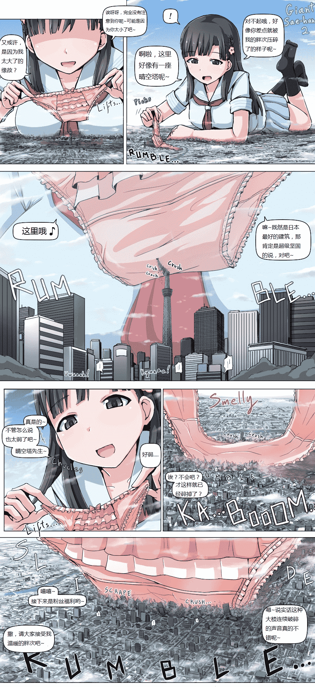

# [翻译][寺田落子]小早川纱织2

作者：四糸乃

TID：22350

<title>1</title> <link href="../Styles/Style.css" type="text/css" rel="stylesheet">

# 1

*本帖最後由 半肉ADC 於 2016-12-31 02:16 編輯*

个人渣翻，依旧是翻译从网上找到的英文版，里面各种东西是我机翻+脑补出来的，如果和原本意思相不符的话还望前辈们指正，另外翻译的不好求不喷本人只是个高二的学渣 <ignore_js_op>

**gigasaehan2_eng.jpg** *(844.62 KB, 下載次數: 291)*

[下載附件](forum.php?mod=attachment&aid=NjYxMTZ8NWIxN2RlMDN8MTYwMzg1NTg0NHwxODIzMHwyMjM1MA%3D%3D&nothumb=yes)

2016-12-31 02:12 上傳

ps:顺便膜拜一下翻译前辈们<title>2</title> <link href="../Styles/Style.css" type="text/css" rel="stylesheet">

# 2

> [max 發表於 2016-12-31 03:15](https://giantessnight.com/gnforum2012/forum.php?mod=redirect&goto=findpost&pid=318668&ptid=22350)
> 嗯，怎么说呢?之前我在试着翻译图片的时候被指出来的问题，你也犯了呐。翻译文本的时候是可以用英文版，但 ...

了解~谢谢前辈指点，下次会注意的QWQ
<title>3</title> <link href="../Styles/Style.css" type="text/css" rel="stylesheet">

# 3

> [archer 發表於 2016-12-31 12:01](https://giantessnight.com/gnforum2012/forum.php?mod=redirect&goto=findpost&pid=318693&ptid=22350)
> 赞赞赞  翻译过的看起来更有感觉

但是总感觉意思和原文差了好多→_→
<title>4</title> <link href="../Styles/Style.css" type="text/css" rel="stylesheet">

# 4

> [1482521703 發表於 2017-3-31 14:01](https://giantessnight.com/gnforum2012/forum.php?mod=redirect&goto=findpost&pid=327743&ptid=22350)
> 在后续翻译补齐就好
> 再说翻译其实字数也不是取决于自己的...可以理解的
> 而且私心这篇很好看（笑 ...

虽说我这只是个图片翻译，但你这也太驴头不对马嘴了吧，好好说话就那么难吗→_→</ignore_js_op>