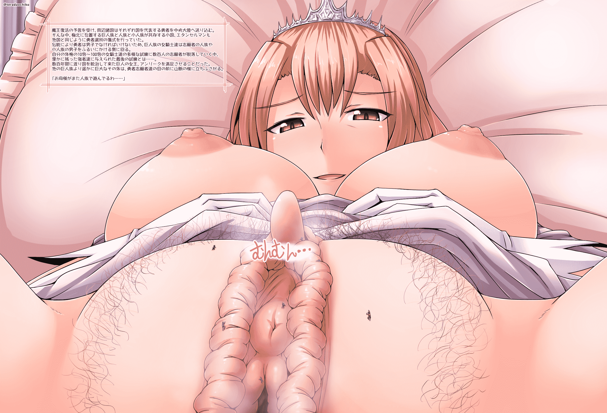

# [翻译][寺田落子]巨人女王

作者：猫头咕咕鹰

TID：21609

 

# 1

*本帖最後由 max 於 2016-8-18 18:40 編輯*

这次这个翻译不是特别理想……因为日文的看不懂，英文的翻译出来总感觉很奇怪，所以就以通过把一些关键词句穿起来进行再整合的形式来优先确保通顺性了，但是这样做的后果就是跟原文可能会有比较大的差异……

诶，总之凑合着看吧，希望能有懂日语的大神接下这张图的烂摊子……

另外我不会修图，所以别吐槽我这回把文字挂在图片外面了，谢谢。

然后@葬儀社 你要的巨人女王

<ignore_js_op>

**kyojin-jouou.jpg** *(2.57 MB, 下載次數: 185)*

[下載附件](forum.php?mod=attachment&aid=NjMwOTJ8YmQxMDJjZWR8MTYwMzgyOTcxM3wxODIzMHwyMTYwOQ%3D%3D&nothumb=yes)

2016-8-18 14:24 上傳

在收到了魔王即将归来的预言后，来自各个国家的志愿勇者们都被派到了中央大

陆。在极北的地区有一个巨人族、人族和小人族共同生活的小国家，他们要在那

里进行勇者的选拔。

根据传统，勇者必须是男性，而巨人族的女骑士则必须对这些来自人族和小人族

的志愿勇者们进行筛选。

志愿成为勇者的人会被比自己巨大10倍甚至100倍的女骑士不断刷落，最后仅仅剩

下数名强者来接受最后的考验……。

使数百年来一直统治着国家的anri'ku女王感到满足。

她的身体比其他巨人更加巨大，在志愿勇者们看来就像是一座山一样耸立着。

“母上大人又在和人族玩游戏了呐……”

 

# 2

> [zsd 發表於 2016-8-18 15:21](https://giantessnight.com/gnforum2012/forum.php?mod=redirect&goto=findpost&pid=304555&ptid=21609)

> ……我尽力了

强！无敌！不朽！不但翻译视频，还能镶字！

 

# 3

> [源青之绅 發表於 2016-8-19 08:10](https://giantessnight.com/gnforum2012/forum.php?mod=redirect&goto=findpost&pid=304679&ptid=21609)

> 好顶赞，这是单图吗？

是单图，作者是寺田落子老师。

[http://gs-uploader.jpn.org/upld-index.php?uname=ochiko](http://gs-uploader.jpn.org/upld-index.php?uname=ochiko)</ignore_js_op>