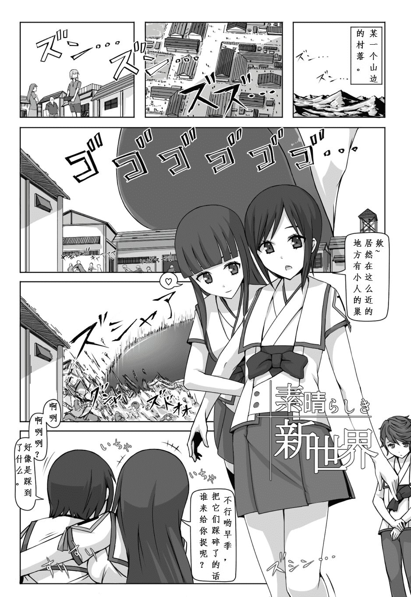
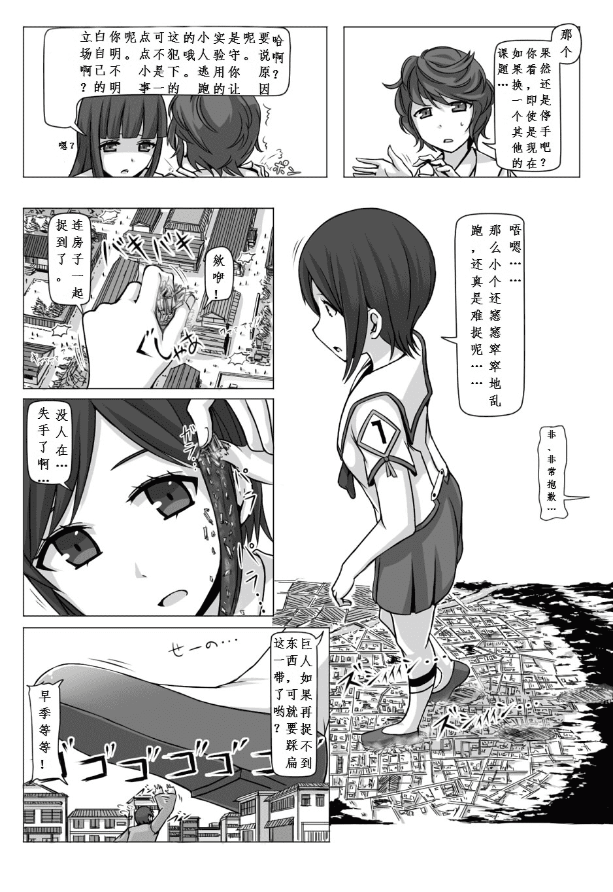
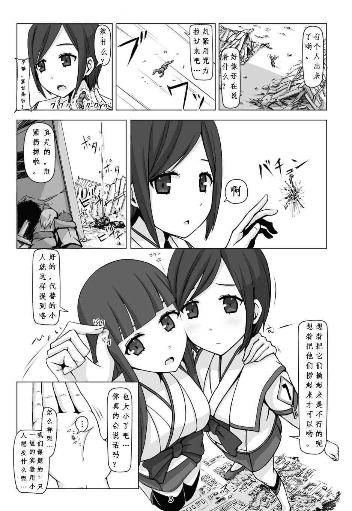
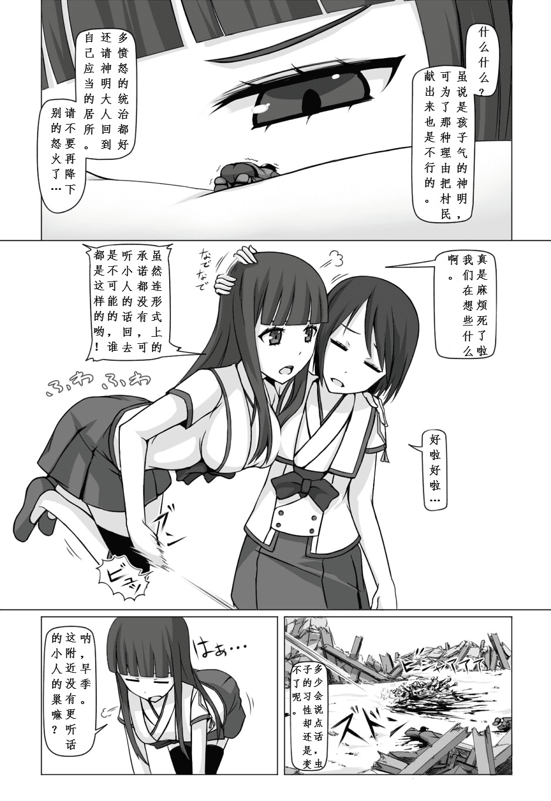
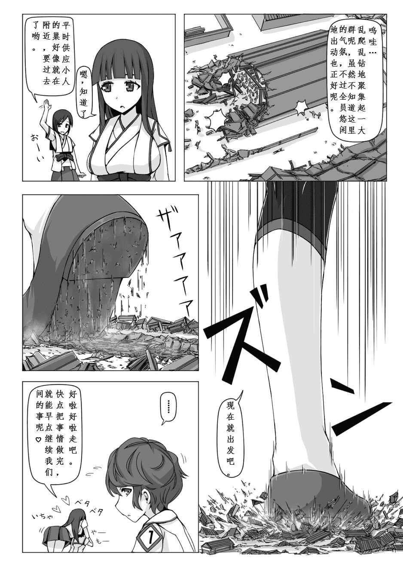

# 【翻译】【寺田落子】来自新世界

作者：smyzgl

TID：21586

<title>1</title> <link href="../Styles/Style.css" type="text/css" rel="stylesheet">

# 1

  大家好，我又来倒腾旧货了，这次是寺田以来自新世界为主题的五张图，记得挺早之前在谈天区就有人在动漫GTS角色科普时就推介过了，虽然是黑白的，但窃以为内容还是挺有意思的。这次稍微有些文字量，而且有些日语特有的迷一般的语法习惯令我十分费解，有些地方翻得不尽如人意，还请各位多多海涵，多多指教。
<ignore_js_op>

**来自新世界1.jpg** *(365.46 KB, 下載次數: 135)*

[下載附件](forum.php?mod=attachment&aid=NjMwMDd8MWU0OTZmZDd8MTYwMzg0MTY1N3wxODIzMHwyMTU4Ng%3D%3D&nothumb=yes)

2016-8-16 17:38 上傳

<ignore_js_op>

**来自新世界2.jpg** *(404.52 KB, 下載次數: 103)*

[下載附件](forum.php?mod=attachment&aid=NjMwMDh8MWU2YjJlZTF8MTYwMzg0MTY1N3wxODIzMHwyMTU4Ng%3D%3D&nothumb=yes)

2016-8-16 17:38 上傳

<ignore_js_op>

**来自新世界3.jpg** *(366.9 KB, 下載次數: 103)*

[下載附件](forum.php?mod=attachment&aid=NjMwMDl8NzA2MTY2ZDB8MTYwMzg0MTY1N3wxODIzMHwyMTU4Ng%3D%3D&nothumb=yes)

2016-8-16 17:38 上傳

<ignore_js_op>

**来自新世界4.jpg** *(315.96 KB, 下載次數: 91)*

[下載附件](forum.php?mod=attachment&aid=NjMwMTB8ZmRlNjIxNTV8MTYwMzg0MTY1N3wxODIzMHwyMTU4Ng%3D%3D&nothumb=yes)

2016-8-16 17:38 上傳

<ignore_js_op>

**来自新世界5.jpg** *(361.67 KB, 下載次數: 99)*

[下載附件](forum.php?mod=attachment&aid=NjMwMTF8OTlkYzlmMjZ8MTYwMzg0MTY1N3wxODIzMHwyMTU4Ng%3D%3D&nothumb=yes)

2016-8-16 17:39 上傳

P·S：1.第四張第二大格左邊，真理亚（长直）的原話是：“形式上とはいえ承諾無しに小人を連れて帰れないって誰が決めたのよ”
        2.第五張右一的原話後半段是：“こっちの気も知らないで呑気そうで良いわね”
以上兩句存疑，我姑且翻成了意思還比較通順的句子，但不知道對不對= =|</ignore_js_op></ignore_js_op></ignore_js_op></ignore_js_op></ignore_js_op>