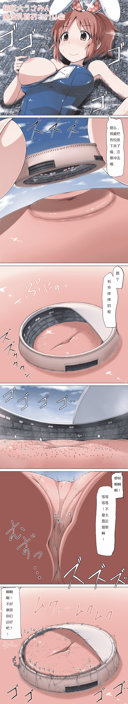

# [翻译][寺田落子]超巨大安部菜菜（小兔兔星人）

作者：四糸乃

TID：22852

<title>1</title> <link href="../Styles/Style.css" type="text/css" rel="stylesheet">

# 1

那么，又是一个新鲜出炉寺田大大的汉化单图翻译的意思可能不准确，包含了自己的理解，理解错误的话还望纠正，标题起成这样是因为日翻英翻以后还是搞不懂原标题后半段的意思（手动土下座）还望多多包涵<title>2</title> <link href="../Styles/Style.css" type="text/css" rel="stylesheet">

# 2

 <ignore_js_op>[usaminchikubi.jpg](forum.php?mod=attachment&aid=Njc0NDZ8NTAzNTFhODV8MTYwMzg1NjA2MnwxODIzMHwyMjg1Mg%3D%3D&nothumb=yes) *(714.2 KB, 下載次數: 329)*

[下載附件](forum.php?mod=attachment&aid=Njc0NDZ8NTAzNTFhODV8MTYwMzg1NjA2MnwxODIzMHwyMjg1Mg%3D%3D&nothumb=yes)

2017-4-2 18:22 上傳  

</ignore_js_op> <title>3</title> <link href="../Styles/Style.css" type="text/css" rel="stylesheet">

# 3

啊哈哈，其实我只是闲的无聊看了下寺田的主页就发现这张图，然后就直接翻译了，一切都是那么的巧