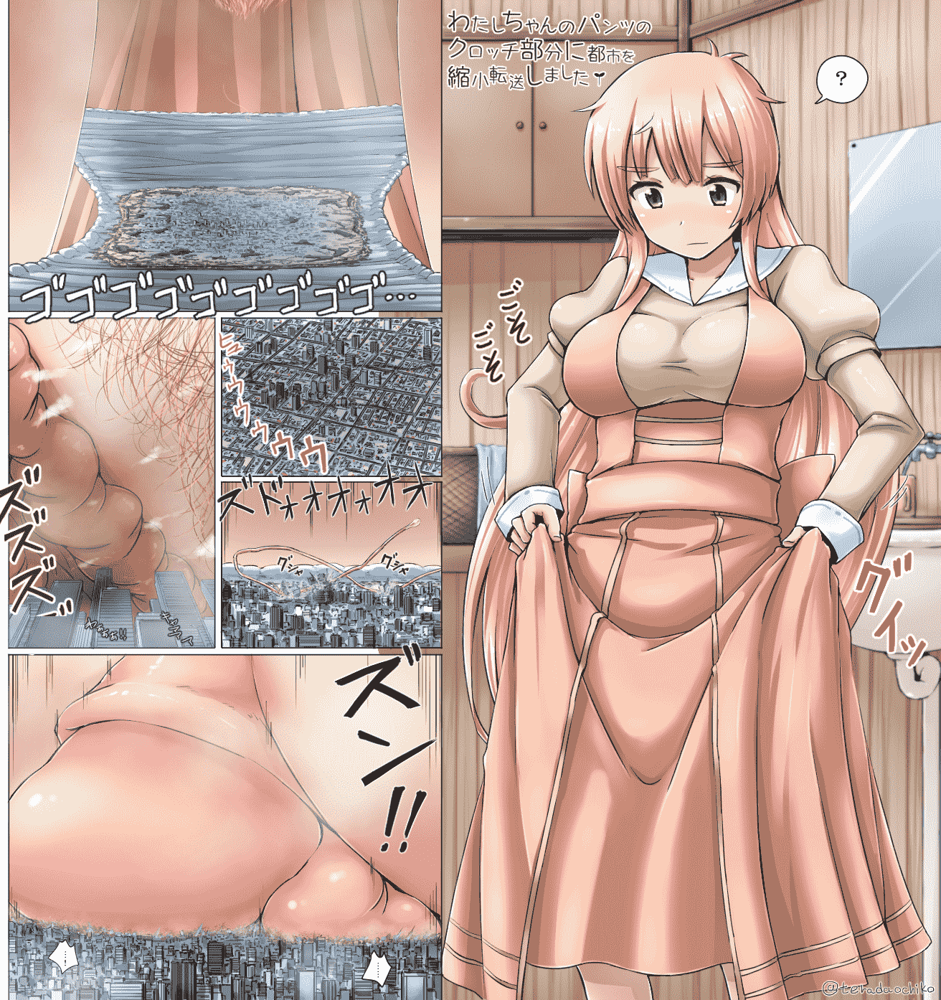

# [翻译][寺田落子]超巨大小兔兔星人／人类小姐

作者：猫头咕咕鹰

TID：21653

<title>1</title> <link href="../Styles/Style.css" type="text/css" rel="stylesheet">

# 1

额……还是因为不太会修图的原因，所以这次还是以外挂文字的形式放出，麻烦有心人帮忙修下图，谢谢。
<ignore_js_op>

**usamin.jpg** *(1.95 MB, 下載次數: 51)*

[下載附件](forum.php?mod=attachment&aid=NjMzMDN8ZjE1MjgxYmV8MTYwMzg1NTk4OXwxODIzMHwyMTY1Mw%3D%3D&nothumb=yes)

2016-8-23 21:46 上傳

小兔兔星人（地球人的100万倍）
身高:1460km
体重:40,000,000,000,000t
<ignore_js_op>

**watashi-tensou.jpg** *(1.76 MB, 下載次數: 102)*

[下載附件](forum.php?mod=attachment&aid=NjMzMDR8ZTM4NWE0MDN8MTYwMzg1NTk4OXwxODIzMHwyMTY1Mw%3D%3D&nothumb=yes)

2016-8-23 21:48 上傳

一座城市被缩小并传送到我胯下的胖次上了
<title>2</title> <link href="../Styles/Style.css" type="text/css" rel="stylesheet">

# 2

> [qazzaqjkl 發表於 2016-8-23 21:52](http://giantessnight.com/gnforum2012/forum.php?mod=redirect&goto=findpost&pid=305542&ptid=21653)
> 第二幅图的主角是不是有一部独立的漫画来着？好像叫人类衰退之前还是之后？ ...

是人类衰退之后，然后这妹子似乎没名字，就被称为人类小姐。漫画，动画和小说都有。
<title>3</title> <link href="../Styles/Style.css" type="text/css" rel="stylesheet">

# 3

> [hte222 發表於 2016-8-23 21:57](https://giantessnight.com/gnforum2012/forum.php?mod=redirect&goto=findpost&pid=305544&ptid=21653)
> 上面那个是偶像大师哦寺田为这个单独有小说

这次我有稍微做功课哦？上面的是安部菜菜，偶像大师灰姑娘女孩里的角色……等等，寺田大大为这个有单独的小说是什么意思？在哪里有？<title>4</title> <link href="../Styles/Style.css" type="text/css" rel="stylesheet">

# 4

> [18662190358 發表於 2016-8-25 17:28](https://giantessnight.com/gnforum2012/forum.php?mod=redirect&goto=findpost&pid=305822&ptid=21653)
> 寺田竟然出动画了，不错不错

诶……寺田老师啥时候出动画了……<title>5</title> <link href="../Styles/Style.css" type="text/css" rel="stylesheet">

# 5

> [堕丶天使 發表於 2016-8-26 09:33](https://giantessnight.com/gnforum2012/forum.php?mod=redirect&goto=findpost&pid=306013&ptid=21653)
> 求第二个的独立漫画啊

寺田大大的人类小姐本早就有翻译好的资源流出了。请去熊猫上找。
<title>6</title> <link href="../Styles/Style.css" type="text/css" rel="stylesheet">

# 6

> [605651871 發表於 2016-8-27 18:58](https://giantessnight.com/gnforum2012/forum.php?mod=redirect&goto=findpost&pid=306272&ptid=21653)
> 楼主辛苦了  我还有个图 很久了 还是没人翻译 想请你帮忙 毕竟我是个文盲
> ...

本身预计下一个就是它，但是我这边最近在忙着做开学前的准备，时间并不富裕。然后寝室这边因为没交网费所以暂时也没网，我现在是跑到学校旁的网吧里过夜才用上网的，但是我也不好在这里搞翻译…(别问我为什么不在寝室过夜…我可不想和一个加强团的小强一起过夜…明明放假临走前把所有吃剩下的的全扔了，为毛还是出现了这么多小强啊…)
<title>7</title> <link href="../Styles/Style.css" type="text/css" rel="stylesheet">

# 7

> [skt1234565 發表於 2017-1-12 00:59](https://giantessnight.com/gnforum2012/forum.php?mod=redirect&goto=findpost&pid=320021&ptid=21653)
> 又见寺田，感谢楼主分享，话说那根阴毛真是牛

兄弟你一个晚上回了我四个已经沉了好久的帖子了，我觉得你已经涉嫌水贴了。</ignore_js_op></ignore_js_op>