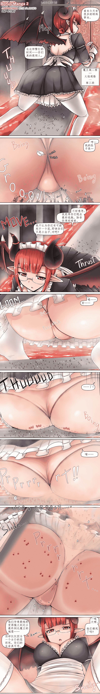
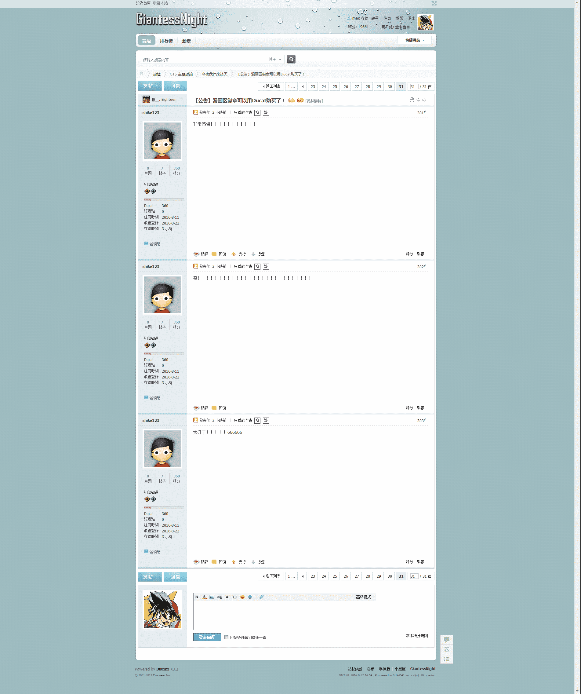
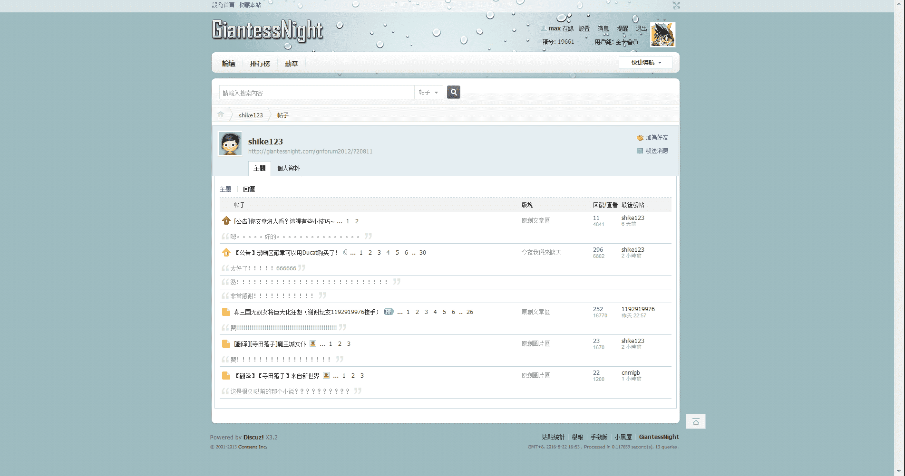

# [翻译][寺田落子]魔王城女仆

作者：猫头咕咕鹰

TID：21517

<title>1</title> <link href="../Styles/Style.css" type="text/css" rel="stylesheet">

# 1

*本帖最後由 max 於 2016-8-7 10:01 編輯*

不好意思我又开了个新坑，明明前面的文章翻译的坑都还没填上的……
其实是因为前段时间有些忙所以没时间翻译了。先是学车，好不容易考完了科三，我老家的一个姨又重病，结果我又得和我父母一起赶过去帮着照看病人，直到今天才回家。因为我实际上看不懂日文嘛，所以翻译的时候是机翻加润色，在老家没网的情况下我什么也干不了，所以就一直拖到现在。
不过我多少看得懂一点点英文，而且我笔记本电脑里又存了一些已经翻译成了英文版的寺田落子老师的图，所以干脆就趁着换班的时候偷空翻译了这么一张图，虽然这图我个人不是很喜欢就是了……（毕竟题材是放屁，这种重口的就有点……）
我大概会在这个月九号或者十号重启十六夜老师系列文章的翻译，至少要先把翻译了一半的那篇文的坑填了先……附一下那个坑的链接吧 [http://giantessnight.com/gnforum ... iewthread&tid=21324](http://giantessnight.com/gnforum2012/forum.php?mod=viewthread&tid=21324)
目前只更新了0.1倍的部分，也就是缩小女，文章的后半部分才是10倍的巨大娘，但是目前我还没翻译到那里。顺带一提，很多人都以为这个文是独立的，不过事实上这是十六夜老师早期的一个系列文里面的第七篇，该系列前六篇我已经翻译好了（不过里面有一篇文章有血腥描述的部分是饺子大大帮我完成的），去论坛的翻译列表里或是从我的个人页里应该都能看见。
然后这边的寺田落子老师系列图片翻译我会和文章翻译里交替更新的（应该）。
算了不多说了，总之先上图吧。
<ignore_js_op>

**akumameido2b_eng_副本.jpg** *(1.21 MB, 下載次數: 293)*

[下載附件](forum.php?mod=attachment&aid=NjI3NDF8M2U2OWVjNGN8MTYwMzg1NDcyOHwxODIzMHwyMTUxNw%3D%3D&nothumb=yes)

2016-8-7 09:51 上傳

<title>2</title> <link href="../Styles/Style.css" type="text/css" rel="stylesheet">

# 2

> [葬儀社 發表於 2016-8-7 12:19](https://giantessnight.com/gnforum2012/forum.php?mod=redirect&goto=findpost&pid=302759&ptid=21517)
> http://gs-uploader.jpn.org/upld-index.php?uname=ochiko
> 
> 這張圖有三個版本

这图就是从这个网站上扒下来的，另外几张差分图的翻译也已经提到日程上了，再过些时候会搞定的。
另外感觉寺田落子老师绘画的时候似乎是找到了一个微妙的平衡点，就算明知道是大量虐杀，可是看着就是不觉得很血腥……
<title>3</title> <link href="../Styles/Style.css" type="text/css" rel="stylesheet">

# 3

> [HEHE 發表於 2016-8-8 03:15](https://giantessnight.com/gnforum2012/forum.php?mod=redirect&goto=findpost&pid=302940&ptid=21517)
> 那个链接里的看不到，是要翻墙吗？

请问是说我一楼放出的那个链接吗？那个就是本站内的链接，如果实在进不去的话，去文章区手动翻一下就好，不过我想它可能已经沉得比较靠后了吧。另外最近我偶尔会打不开论坛，感觉可能是论坛的服务器有点不太对劲，当然也有可能是网络波动或是又被别人攻击了。
<title>4</title> <link href="../Styles/Style.css" type="text/css" rel="stylesheet">

# 4

> [HEHE 發表於 2016-8-8 11:16](https://giantessnight.com/gnforum2012/forum.php?mod=redirect&goto=findpost&pid=302971&ptid=21517)
> 我是指第二个链接，第一个可以进

如果是说葬仪社兄发的那个连接的话，应该也不需要翻墙吧，我也是在墙内，但是不需要做任何处理就可以直接连。
<title>5</title> <link href="../Styles/Style.css" type="text/css" rel="stylesheet">

# 5

*本帖最後由 max 於 2016-8-22 17:18 編輯*

哈啊……居然在一周之内连续遇到两个这样的啊（而且您还什么贴都水，甚至还在一个帖子底下连着水三次）……上次遇到的那个好歹还多打了几个字，您这个全是感叹号的就……我都不知道该说您什么好了。
我不知道您水贴是为了刷积分还是只是单纯的把贴吧里的习惯带过来了，又或者是有着什么别的原因，但是本论坛对于水贴的行为查的向来比较严，这种行为在本论坛基本上是不被允许的，因为是第一次看见您水贴，加上您又是新注册的账号，我想可能是您还不是很了解这里的规章制度，所以这次就不举报了，不过还是请您多加注意。另外如果您要是再在我的帖子下面水的话，我绝对会举报的，毕竟举报一个人给500ducat呢，这可是个发家致富的好方式啊，不但赚了ducat，还能给论坛清理门户。
顺带提一句，上一个这么作死的被封了三个月，您可以在论坛网页右下角的“小黑屋”里看见他，如果您继续这么下去的话恐怕也是一样的结果，请好自为之吧。
<ignore_js_op>

**#pid305302.png** *(416.69 KB, 下載次數: 0)*

[下載附件](forum.php?mod=attachment&aid=NjMyNzF8MjVhMTcxZmZ8MTYwMzg1NDcyOHwxODIzMHwyMTUxNw%3D%3D&nothumb=yes)

2016-8-22 17:11 上傳

<ignore_js_op>

**shike123的帖子 - GiantessNight - Powered by Discuz!.png** *(244.6 KB, 下載次數: 0)*

[下載附件](forum.php?mod=attachment&aid=NjMyNzJ8N2EzYzU3NDV8MTYwMzg1NDcyOHwxODIzMHwyMTUxNw%3D%3D&nothumb=yes)

2016-8-22 17:11 上傳

<title>6</title> <link href="../Styles/Style.css" type="text/css" rel="stylesheet">

# 6

> [huhuhu 發表於 2016-8-25 11:00](https://giantessnight.com/gnforum2012/forum.php?mod=redirect&goto=findpost&pid=305782&ptid=21517)
> 小黑屋在哪里？我想去看看另外一位.

就在右下角，旁边有站点统计，举报和手机版什么的。
<ignore_js_op>

**360截图20160825125906580.jpg** *(4.57 KB, 下載次數: 0)*

[下載附件](forum.php?mod=attachment&aid=NjMzMzd8YzdmZGNlMzR8MTYwMzg1NDcyOHwxODIzMHwyMTUxNw%3D%3D&nothumb=yes)

2016-8-25 12:59 上傳</ignore_js_op></ignore_js_op></ignore_js_op></ignore_js_op>