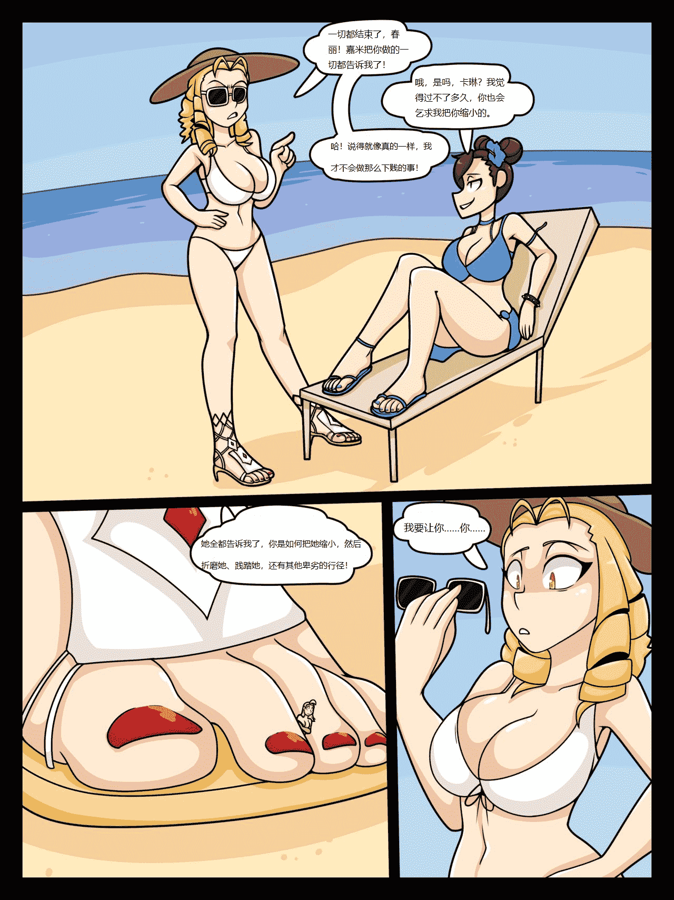

# 【翻译】Street fighters things

作者：比那名居天子

TID：27192

<title>1</title> <link href="../Styles/Style.css" type="text/css" rel="stylesheet">

# 1

*本帖最後由 比那名居天子 於 2020-4-16 23:03 編輯*

本来想过一阵子再更新，但是恰好在EX上看到了一本不错的短篇，虽然画风不太习惯，但是剧情真的很有趣，于是就随手翻译了，顺便求知情人透露这个短漫的作者是谁以及哪里可以看到其他作品。另外，这篇短漫是我首次尝试不考虑作者原用词而是以句子大意为主，自行修改原句用词以求更好的阅读体验的翻译尝试，几乎每句话的用词都与原文中有大量出入，也想请大家看一看是这样的翻译好，还是继续维持原来的路线比较好。 
链接：已失效 <ignore_js_op>

**1.jpg** *(416.34 KB, 下載次數: 6)*

[下載附件](forum.php?mod=attachment&aid=NzkyNzl8ZmIyYzVjZjR8MTYwMzg0MDU4OXwxODIzMHwyNzE5Mg%3D%3D&nothumb=yes)

2019-8-3 09:20 上傳

预览图</ignore_js_op> 

<title>2</title> <link href="../Styles/Style.css" type="text/css" rel="stylesheet">

# 2

> [asd0251314 發表於 2019-8-6 22:08](https://giantessnight.com/gnforum2012/forum.php?mod=redirect&goto=findpost&pid=411839&ptid=27192)
> d站好像可以看到

作者是哪位呢？