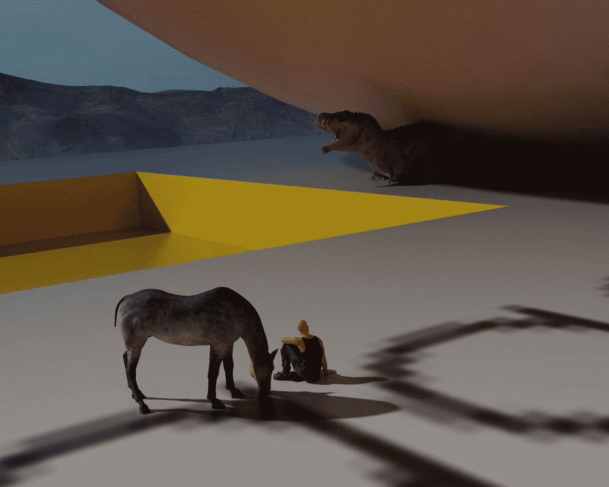

# 【翻译】史前之旅（图配文）（6.10更新13-18）

作者：杏仁味酥饼

TID：26961

 

# 1

*本帖最後由 杏仁味酥饼 於 2019-6-10 23:47 編輯*

原作者：D站daniel3gp

这位作者我个人认为是D站3d女巨人建模方面的顶级大佬，他的作品人物细节十分丰富，故事可读性很强，最重要的是尺寸差距让人十分过瘾.jpg)《史前之旅》（《Prehistoric Journey》）系列是他的最新作品，我在翻译的过程中尽量使每一句话读起来通顺，个别语意不通之处还望海涵0" />0" />另外我会争取持续更新的

01 <ignore_js_op>

**dd7c6j2-59e0426b-2327-4ee3-85a0-ab5f9272e848.png** *(4.84 MB, 下載次數: 13)*

[下載附件](forum.php?mod=attachment&aid=Nzg3ODZ8ZWFkYWYzMjJ8MTYwMzg0MjYyMnwxODIzMHwyNjk2MQ%3D%3D&nothumb=yes)

2019-6-9 15:40 上傳

艾玛(18岁，图片中间)的父亲尼可·费舍尔博士，是位伟大的科学家，非常富有。他发明了一台时间旅行机器，他做出这台机器只是为了他的另一项仍在开发中的发明，一个生长装置。费舍尔对这个想法很感兴趣，他已经有一个该装置的原型，并需要测试它。这就是为什么他想利用他的时间旅行机器。他不需要任何人，尤其是任何政府，注意到他的发明，因为他担心它会像原子弹一样被滥用来伤害人们。而且这种生长装置比以往任何武器都要强大得多。

时间旅行机器的工作原理如下:-你只能回到过去。如果你回到了过去，你不能通过改变过去的任何事情来改变现在。因为它打开了另一条时间线，就像费舍尔博士说的那样。例如，如果你回到100年前，从那一刻起就有两个宇宙。一个是你在100年前到达的地方，另一个是你出生并且没有人来过100年前的地方。而且费舍尔博士的时间旅行机器有能力在不同的时间线之间穿越。这意味着费舍尔博士可以在新的时间范围内做任何他想做的事情，并且在我们的世界里，没有人会注意到它。费舍尔博士很想试验他的第一个（生长装置）原型，但必须有人留在他的实验室，在实验结束后监控团队返程情况。因为他不相信很多人，所以他是唯一对这份工作提出质疑的人。艾玛发现后，她开始说服她的父亲让她领导实验并回到过去。她父亲不想让她做这件事，因为与之相关的危险。但是艾玛有很多很好的论据:-他可以信任她。她在每一门科学方面都很有天赋，尤其是在物理方面。如果他不让她做那件事，她会对他非常失望的，因为爱玛会认为他不相信她的本事，这并不是真的，而她只是用它作为一个论据。艾玛回到了7200万年前，昆顿紧随其后(右起，33岁)，前SAS成员，在所有情况下保护艾玛和赞德(左起，31岁)，美国陆军出身，生存技能高超。在这次旅行中，他们是费舍尔博士能想到的艾玛最好的两个伙伴，因为昆顿很可靠，他从艾玛12岁起就认识她，而且赞德的父亲是费舍尔博士的老朋友。他们到达后，艾玛开始看风景，这是一片很大的沙漠，遥远的大山环绕着他们。他们带来了两匹艾玛的马在需要的情况下用作代步工具，因为他们不能带上一辆车，因为如果里面有很多金属，就会导致时间旅行出现问题。02<ignore_js_op>

**dd7c85v-1c3e54b7-52df-44f3-a401-8f7803745f27.png** *(7.1 MB, 下載次數: 4)*

[下載附件](forum.php?mod=attachment&aid=Nzg3ODd8ODQ2ODJhMzR8MTYwMzg0MjYyMnwxODIzMHwyNjk2MQ%3D%3D&nothumb=yes)

2019-6-9 15:40 上傳

艾玛在观察环境的时候注意到两个遥远的黑点，但一直朝着他们的方向前进。当黑暗的东西靠近时，马开始焦虑起来。然后昆顿确定了这些是什么东西。file:///C:\Users\ADMINI~1\AppData\Local\Temp\ksohtml\wps9B4F.tmp.png昆顿:“艾玛躲在我后面，那是巨大的食肉动物!”艾玛:“哦，天哪，它们看起来像霸王龙，但它们更大。”昆顿:“看起来他们的皮肤很厚，而我只有一支小口径卡宾枪，我不确定我能不能让它们受伤。”赞德:“我们现在应该停止这次旅行!”艾玛:“不可能!我们为此做了一年多的准备。我有另一个处理这种情况的方法。用那个生长装置瞄准我。”赞德:“我们不知道如果我这么做会发生什么，算了吧!”艾玛:“照我说的做，他们变得更近了!”设置为50倍，然后按下START。快 !”所以当赞德开始设置这种生长装置的时候，恐龙越来越近了……03<ignore_js_op>

**prehistoric_journey_0_2_by_daniel3gp_dd7cfpx-pre.jpg** *(114.13 KB, 下載次數: 3)*

[下載附件](forum.php?mod=attachment&aid=Nzg3ODh8NjM3YzIxOTZ8MTYwMzg0MjYyMnwxODIzMHwyNjk2MQ%3D%3D&nothumb=yes)

2019-6-9 15:41 上傳

就在片刻之后，昆顿开始向它们开枪，他的恐惧成为了现实。他的战术步枪的小口径子弹没法有效穿透那些食肉动物厚厚的皮肤。赞德现在把这个生长装置对准了艾玛，艾玛准备好了，她脱下裤子和鞋子，因为金属在生长射线下可能会导致问题，就像在时间旅行中一样。file:///C:\Users\ADMINI~1\AppData\Local\Temp\ksohtml\wps9B50.tmp.png04<ignore_js_op>

**prehistoric_journey_04_by_daniel3gp_dd7klvy-pre.jpg** *(57.67 KB, 下載次數: 1)*

[下載附件](forum.php?mod=attachment&aid=Nzg3ODl8MThjYmFlNmR8MTYwMzg0MjYyMnwxODIzMHwyNjk2MQ%3D%3D&nothumb=yes)

2019-6-9 15:41 上傳

在艾玛成长的过程中，赞德仍然被两头恐龙追赶。他注意到艾玛并不是唯一一个在生长射线下变大的东西，当她脱下裤子时，掉下来的一个u盘也在变大，而且变大得比预期的还要快。赞德唯一的生存机会就是爬上那个正在变大的U盘，希望恐龙不够快，而且到了那里就再也爬不上去了。当詹德跳上U盘的金属部分之后，file:///C:\Users\ADMINI~1\AppData\Local\Temp\ksohtml\wps9B61.tmp.png一只恐龙咬住了他的衬衫并把它撕掉了，但他可以逃脱。当U盘停止生长，他意识到他有了一会儿喘息时间，因为恐龙被困在金属部分。当他寻找艾玛的时候，他不敢相信自己的眼睛。他所看到的让他忘记了仍然在他身边危险的的恐龙，它们中的一头正在设法跳上他所在的平面。另一个人也注意到了让赞德感到惊奇的事情。赞德一直被一匹马跟着，现在马正在害怕地盯着它们的主人。05<ignore_js_op>

**prehistoric_journey_05_by_daniel3gp_dd7knmw-pre.jpg** *(43.28 KB, 下載次數: 2)*

[下載附件](forum.php?mod=attachment&aid=Nzg3OTB8MTcyNjllNjR8MTYwMzg0MjYyMnwxODIzMHwyNjk2MQ%3D%3D&nothumb=yes)

2019-6-9 15:41 上傳

赞德看到的是艾玛巨大的身体。这远远超过了增长50倍。什么地方出了问题……file:///C:\Users\ADMINI~1\AppData\Local\Temp\ksohtml\wps9B62.tmp.png06<ignore_js_op>

**prehistoric_journey_06_by_daniel3gp_dd7kobc-pre.jpg** *(51.28 KB, 下載次數: 2)*

[下載附件](forum.php?mod=attachment&aid=Nzg3OTF8NThkMjJlNmN8MTYwMzg0MjYyMnwxODIzMHwyNjk2MQ%3D%3D&nothumb=yes)

2019-6-9 15:42 上傳

艾玛的身高是原来的5000倍，和U盘一样。file:///C:\Users\ADMINI~1\AppData\Local\Temp\ksohtml\wps9B63.tmp.png造成这一切的原因是费舍尔博士的计算失误。</ignore_js_op>  

# 2

> [libido 發表於 2019-6-8 17:37](https://giantessnight.com/gnforum2012/forum.php?mod=redirect&goto=findpost&pid=407030&ptid=26961)

> 图片挂了......

> 是不是上传格式不正确？

是啊，好模糊

请问怎样上传高清图片呢？还望大佬指教

 

# 3

> [王正念 發表於 2019-6-8 20:36](https://giantessnight.com/gnforum2012/forum.php?mod=redirect&goto=findpost&pid=407041&ptid=26961)

> 圖片完全無法顯示出來~

请问大佬是图片格式的问题吗？

 

# 4

> [葬儀社 發表於 2019-6-8 22:06](https://giantessnight.com/gnforum2012/forum.php?mod=redirect&goto=findpost&pid=407047&ptid=26961)

> https://www.deviantart.com/daniel3gp

> 

> 是這個作者啊.純論女角模組的確做得賊好(奶大顏值又超高

我上传了啊，而且刚发出去的时候还是正常的，还望大佬明示

 

# 5

*本帖最後由 杏仁味酥饼 於 2019-6-9 15:38 編輯*

昨天因为图片上传的问题搞出了一个大乌龙，让诸位见笑了在大佬的指点下，已经更正了错误

显示不出来的图片日后我会在百度网盘里分享的

话不多说，直接上图

07

<ignore_js_op>

**prehistoric_journey_07_by_daniel3gp_dd7kon8-pre.jpg** *(53.91 KB, 下載次數: 2)*

[下載附件](forum.php?mod=attachment&aid=Nzg3ODB8ZTEyOTcwYzF8MTYwMzg0MjYyMnwxODIzMHwyNjk2MQ%3D%3D&nothumb=yes)

2019-6-9 15:36 上傳

当艾玛意识到发生了什么事时，她哑口无言，但她很快就想起来她的两个同伴现在仍然处于危险之中。08<ignore_js_op>

**prehistoric_journey_08_by_daniel3gp_dd85ohl-pre.jpg** *(55.32 KB, 下載次數: 2)*

[下載附件](forum.php?mod=attachment&aid=Nzg3ODF8OGY2ODIwNDZ8MTYwMzg0MjYyMnwxODIzMHwyNjk2MQ%3D%3D&nothumb=yes)

2019-6-9 15:36 上傳

当艾玛试图找到她的同伴时，她注意到了地上小小的U盘。她跪下来凑近看……

09<ignore_js_op>

**prehistoric_journey_09_by_daniel3gp_dd89on8-pre.jpg** *(38.95 KB, 下載次數: 2)*

[下載附件](forum.php?mod=attachment&aid=Nzg3ODJ8NWUyNzAwOWV8MTYwMzg0MjYyMnwxODIzMHwyNjk2MQ%3D%3D&nothumb=yes)

2019-6-9 15:37 上傳

当艾玛认出U盘上的小点是什么时，她和之前的赞德一样惊讶。但恰恰相反，在她看来，赞德现在小得出奇，就连恐龙在她看来也像蚂蚁。她迅速行动来解救赞德，而他还在地面上盯着她看……10<ignore_js_op>

**prehistoric_journey_10_by_daniel3gp_dd8gcpj-pre.jpg** *(29.91 KB, 下載次數: 2)*

[下載附件](forum.php?mod=attachment&aid=Nzg3ODN8YTg2ZDgwZDR8MTYwMzg0MjYyMnwxODIzMHwyNjk2MQ%3D%3D&nothumb=yes)

2019-6-9 15:37 上傳

艾玛提起U盘，用她巨大的指尖挡住了恐龙。赞德在被追赶后坐下来休息了一会儿，仍然对现在发生的事情感到困惑。艾玛的指尖现在充满了他的整个视野。

11

<ignore_js_op>

**prehistoric_journey_11_by_daniel3gp_dd8u1s4-pre.jpg** *(37.75 KB, 下載次數: 2)*

[下載附件](forum.php?mod=attachment&aid=Nzg3ODR8ZTRjN2UzMzF8MTYwMzg0MjYyMnwxODIzMHwyNjk2MQ%3D%3D&nothumb=yes)

2019-6-9 15:37 上傳

赞德仍然被眼前的景象惊呆了。对他来说，这种感觉非常超现实。

12

<ignore_js_op>

**prehistoric_journey_12_by_daniel3gp_dd8u2am-fullview.jpg** *(169.94 KB, 下載次數: 2)*

[下載附件](forum.php?mod=attachment&aid=Nzg3ODV8YmQzNDhhN2Z8MTYwMzg0MjYyMnwxODIzMHwyNjk2MQ%3D%3D&nothumb=yes)

2019-6-9 15:38 上傳

正当赞德试图理解眼下的情况的时候，艾玛却开始享受这种比任何山峰都更高的视角。

 

# 6

> [回梦游仙 發表於 2019-6-9 22:58](https://giantessnight.com/gnforum2012/forum.php?mod=redirect&goto=findpost&pid=407156&ptid=26961)

> 作者大大原作者的文章怎么找啊只有图

D站里每张图片往下拉就有

 

# 7

今天更新13-18

看来这位作者的建模是真的很对我们的胃口

不过说实话我觉得今天这几张图亮点不多……

13

<ignore_js_op></ignore_js_op> **dd8u2wk-4c5f99a1-4e44-4a64-b1c0-db3cb2fda5a0.png** *(3.39 MB, 下載次數: 27)*

[下載附件](forum.php?mod=attachment&aid=Nzg4MDV8N2JiYWQwMWZ8MTYwMzg0MjYyMnwxODIzMHwyNjk2MQ%3D%3D&nothumb=yes)

2019-6-10 23:14 上傳 

但是当艾玛环顾四周的时候，恐龙挣脱了出来，经过短暂的困惑，它又开始追捕赞德和那匹马。14<ignore_js_op></ignore_js_op> **prehistoric_journey_14_by_daniel3gp_dd8u3hg-fullview.jpg** *(86.33 KB, 下載次數: 2)*

[下載附件](forum.php?mod=attachment&aid=Nzg4MDZ8MzY1MzNkNWN8MTYwMzg0MjYyMnwxODIzMHwyNjk2MQ%3D%3D&nothumb=yes)

2019-6-10 23:18 上傳 艾玛只是无法用她巨大的手指感受到恐龙，因此她没有注意到它又自由了。15<ignore_js_op></ignore_js_op> **prehistoric_journey_15_by_daniel3gp_dd8u3qy-150.jpg** *(3.4 KB, 下載次數: 2)*

[下載附件](forum.php?mod=attachment&aid=Nzg4MDd8ZGY5NWJmMTJ8MTYwMzg0MjYyMnwxODIzMHwyNjk2MQ%3D%3D&nothumb=yes)

2019-6-10 23:21 上傳 赞德在逃命的过程中觉得他要完了。16<ignore_js_op></ignore_js_op> **dd8uy03-eaf4b42a-a38c-4a90-9a85-cdfccded7ece.png** *(4.12 MB, 下載次數: 27)*

[下載附件](forum.php?mod=attachment&aid=Nzg4MDh8MGZhMTdjNWN8MTYwMzg0MjYyMnwxODIzMHwyNjk2MQ%3D%3D&nothumb=yes)

2019-6-10 23:24 上傳 与此同时另一头恐龙还被困在艾玛的手指甲上。17<ignore_js_op></ignore_js_op> **prehistoric_journey_17_by_daniel3gp_dd8uyj6-fullview.jpg** *(214.41 KB, 下載次數: 3)*

[下載附件](forum.php?mod=attachment&aid=Nzg4MDl8OWYyMDBiODl8MTYwMzg0MjYyMnwxODIzMHwyNjk2MQ%3D%3D&nothumb=yes)

2019-6-10 23:25 上傳 艾玛之前把它捡了起来，这样它就不能跳上赞德所在的那部分U盘。18<ignore_js_op></ignore_js_op> **prehistoric_journey_18_by_daniel3gp_dd8uyy3-fullview.jpg** *(133.4 KB, 下載次數: 3)*

[下載附件](forum.php?mod=attachment&aid=Nzg4MTB8ZWEyYmU2MTN8MTYwMzg0MjYyMnwxODIzMHwyNjk2MQ%3D%3D&nothumb=yes)

2019-6-10 23:27 上傳 霸王龙身体僵硬，因为艾玛把它吓坏了，因为它是侏罗纪生物，对此（人类）没有感觉。附：尺寸比较<ignore_js_op></ignore_js_op> **sizecomparison_by_daniel3gp_dd8yr9d-pre.jpg** *(88.26 KB, 下載次數: 4)*

[下載附件](forum.php?mod=attachment&aid=Nzg4MTF8ODA4ZDViMjF8MTYwMzg0MjYyMnwxODIzMHwyNjk2MQ%3D%3D&nothumb=yes)

2019-6-10 23:27 上傳 从左到右依次为：艾玛、一种大型食草恐龙？赞德、南美霸王龙、北美霸王龙、恐爪龙因为艾玛的身高是正常身高的5000倍，她的体重是2019年全球人口总体重的19倍多。在99%的海洋覆盖区域，她站在海底的同时头却可以露出水面。</ignore_js_op></ignore_js_op></ignore_js_op></ignore_js_op></ignore_js_op></ignore_js_op></ignore_js_op></ignore_js_op></ignore_js_op></ignore_js_op></ignore_js_op>