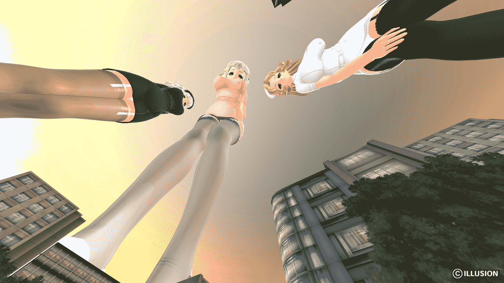

# 【自制】三色护士

作者：stgpoco

TID：19887

<title>1</title> <link href="../Styles/Style.css" type="text/css" rel="stylesheet">

# 1

50倍、1000倍。
缩小病院的护士小姐在巡房(城？)

好久没做图了，这次主要验证一下《后宫伴侣》的改造，没怎么摆造型和取镜头╮(╯_╰)╭
个人觉得I社作品中这部的画风非常美(¯﹃¯)

链接：[http://pan.baidu.com/s/1dDIzTqp](http://pan.baidu.com/s/1dDIzTqp) 密码：59l8

预览图
<title>2</title> <link href="../Styles/Style.css" type="text/css" rel="stylesheet">

# 2

 <ignore_js_op>[20151002145716141.png](forum.php?mod=attachment&aid=NTQ2ODN8NzZlYTE2NjF8MTYwMzg2MzYxNXwxODIzMHwxOTg4Nw%3D%3D&nothumb=yes) *(1.76 MB, 下載次數: 262)*

[下載附件](forum.php?mod=attachment&aid=NTQ2ODN8NzZlYTE2NjF8MTYwMzg2MzYxNXwxODIzMHwxOTg4Nw%3D%3D&nothumb=yes)

2015-10-2 15:15 上傳  

</ignore_js_op> <title>3</title> <link href="../Styles/Style.css" type="text/css" rel="stylesheet">

# 3

> [dhl7457 發表於 2015-10-2 15:22](https://giantessnight.com/gnforum2012/forum.php?mod=redirect&goto=findpost&pid=270112&ptid=19887)
> 提取码错误啊，大哥，你这让人怎么搞

说提取码错误的请再次检查提取码输入的对不对。
我自己试了，没问题的。

话说提取码不是都复制粘贴么？怎么会有错误。。。
<title>4</title> <link href="../Styles/Style.css" type="text/css" rel="stylesheet">

# 4

> [archer 發表於 2015-10-2 16:11](https://giantessnight.com/gnforum2012/forum.php?mod=redirect&goto=findpost&pid=270118&ptid=19887)
> 楼主这个是怎样做出来的呀 求教学

我现在已经跑外地去了，一时半会解答不了了，sorry…
<title>5</title> <link href="../Styles/Style.css" type="text/css" rel="stylesheet">

# 5

> [xnr 發表於 2015-10-2 18:35](https://giantessnight.com/gnforum2012/forum.php?mod=redirect&goto=findpost&pid=270128&ptid=19887)
> 小人视角感觉鱼眼拉伸的十分夸张
> 
> 另外能否做出自由探索的空间？类似U3D那样的？能带有移动模型的就基本达 ...

是的，我为了尽量拉长透视效果，所以把鱼眼拉伸拉到了最大

这个基本和猎狼引擎差不多，没有触碰体积。
这个目前改造的远不如猎狼成熟…
<title>6</title> <link href="../Styles/Style.css" type="text/css" rel="stylesheet">

# 6

> [kuazhang 發表於 2015-10-11 16:19](https://giantessnight.com/gnforum2012/forum.php?mod=redirect&goto=findpost&pid=271085&ptid=19887)
> 这个视角看上去腿长的有些违和了

其实你要真的到这么巨大的护士脚旁抬头看上去的话，差不多就是这样。。。想想站在摩天大楼下面向上看的景象……