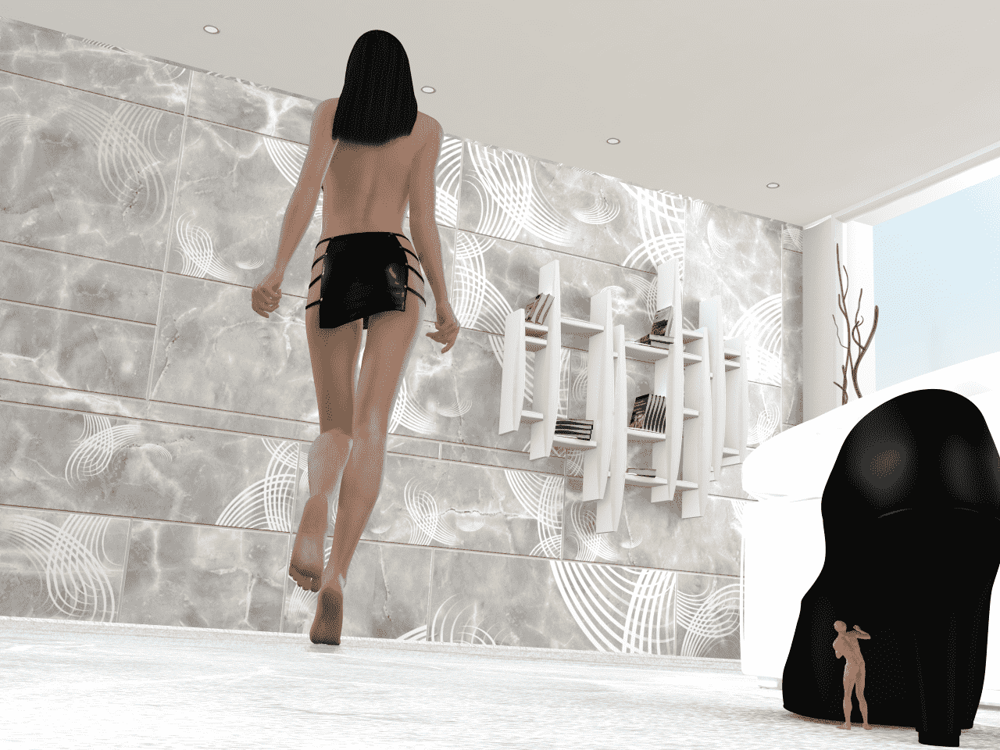
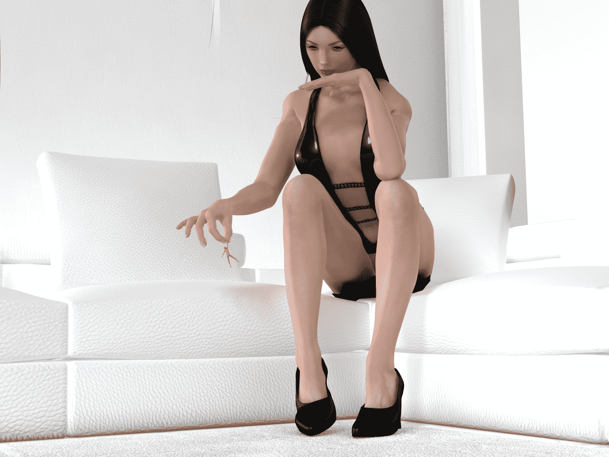

# 【自制】两张poser制作图

作者：aabbccdd

TID：18593

<title>1</title> <link href="../Styles/Style.css" type="text/css" rel="stylesheet">

# 1

*本帖最後由 aabbccdd 於 2015-3-1 15:13 編輯*

啊啦啊啦，大家好久不见呐！
话说学生党的寒假都快过去了，才抽空做了两张图，真抱歉呐~
这两张图还是依然沿用poser的自带渲染制作（其实是不知道有其他的渲染工具)
动作和视角都模仿了在其他网站上的poser大神的作品，小的在此膜拜跪舔
总之，请大家随便看看啦
（PS：请不要吐槽图片太少了）
<ignore_js_op>

**01.png** *(1.34 MB, 下載次數: 16)*

[下載附件](forum.php?mod=attachment&aid=NTA3Mzh8M2Q3ODgxZjZ8MTYwMzg2NjI1NnwxODIzMHwxODU5Mw%3D%3D&nothumb=yes)

“天哪，她可真大！”

2015-3-1 15:00 上傳

<ignore_js_op>

**02.png** *(1.34 MB, 下載次數: 13)*

[下載附件](forum.php?mod=attachment&aid=NTA3Mzl8MTBjZDEwMmV8MTYwMzg2NjI1NnwxODIzMHwxODU5Mw%3D%3D&nothumb=yes)

“我该怎么处置你这个小东西呢？”

2015-3-1 15:00 上傳

<title>2</title> <link href="../Styles/Style.css" type="text/css" rel="stylesheet">

# 2

> [langborghini 發表於 2015-3-1 17:27](https://giantessnight.com/gnforum2012/forum.php?mod=redirect&goto=findpost&pid=247801&ptid=18593)
> 楼主上中学还是大学呀，poser用的是啥版本呀

上大学呢所以在校期间也不会做poser图啦（原因你懂的）
我的poser用的是2014版的，网上应该很好下载的</ignore_js_op></ignore_js_op>