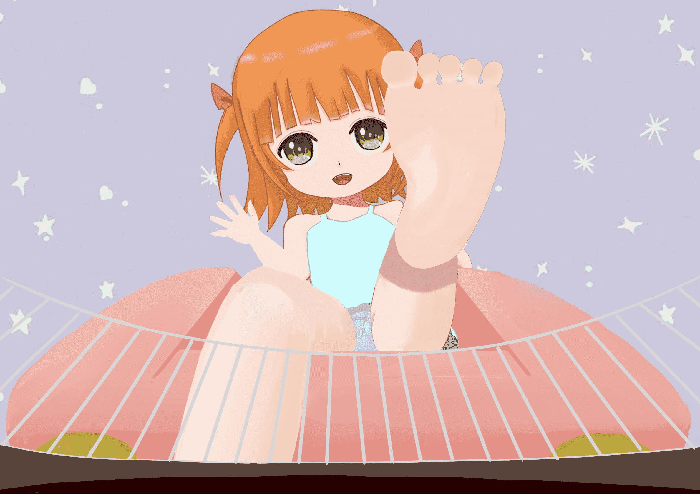

# 【草稿】再见

作者：琉璃

TID：29555

<title>1</title> <link href="../Styles/Style.css" type="text/css" rel="stylesheet">

# 1

还没有精细化，感觉画的好烂啊。人体感觉崩得够厉害的，这种姿势各个部分的大小真的很难控制。想营造出比较小的小孩子，所以脑袋大小有点夸张。
<ignore_js_op>

**[2020.9] 稚幼枫的笼子.jpg** *(190.13 KB, 下載次數: 0)*

[下載附件](forum.php?mod=attachment&aid=ODUzMzB8ZTRjYTc0NDN8MTYwMzgyNTIzMnwxODIzMHwyOTU1NQ%3D%3D&nothumb=yes)

2020-9-27 20:53 上傳</ignore_js_op>