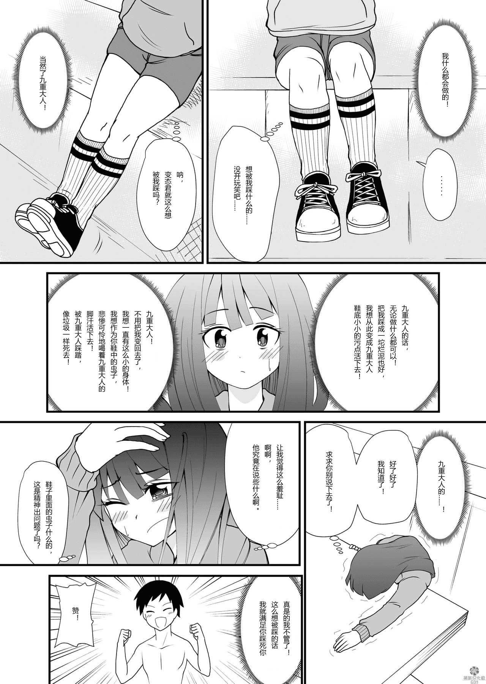
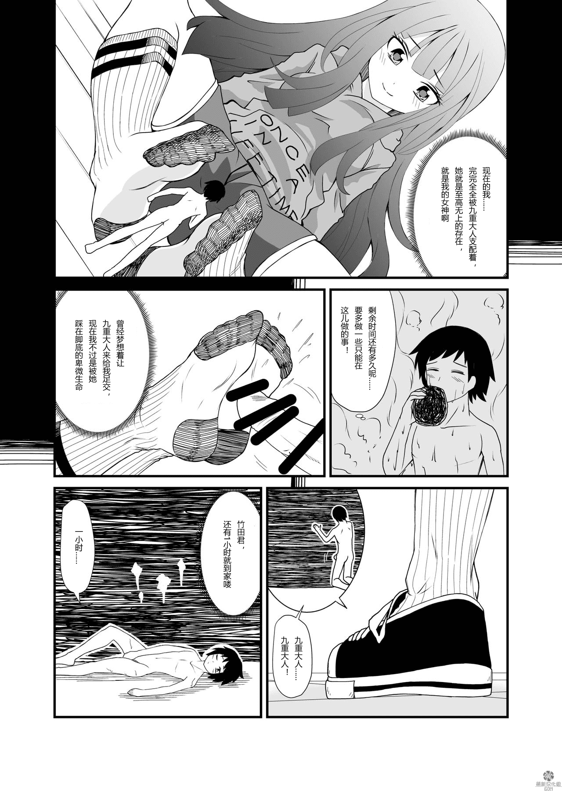
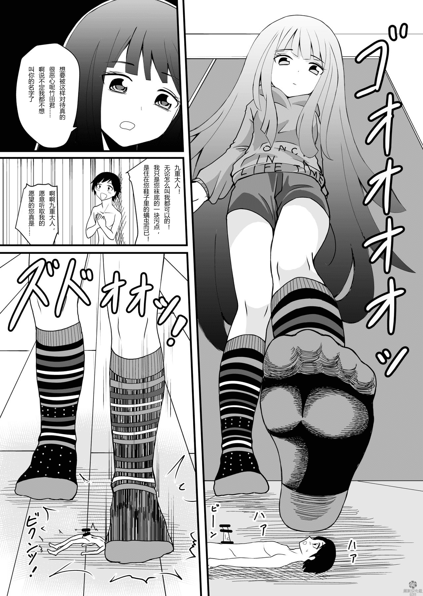

# 【萌新汉化组】Shivharu的In shoe Jou下篇汉化

作者：wyh9284908

TID：28505

<title>1</title> <link href="../Styles/Style.css" type="text/css" rel="stylesheet">

# 1

*本帖最後由 wyh9284908 於 2020-4-17 03:02 編輯*

Shivharu漫画的下篇汉化。因为之前看到很多论坛上的朋友很想看这个漫画的下部，因此也把它给汉化了。这里非常感谢朝雾绘梨花的翻译与润色工作，如果不是她想要汉化这部漫画，我们估计最近也不会动工就是了。如果想要支持作者的话，可以去他的购买网站上购买漫画。作者的网站链接是：[https://shivharu.booth.pm/](https://shivharu.booth.pm/)

mega网盘下载链接：[https://mega.nz/file/lzYn1aTJ#Iv ... K80sua8EMe8yyINMcPI](https://mega.nz/file/lzYn1aTJ#Ivw0uXe1Zib-rmG545S-1n3jK80sua8EMe8yyINMcPI)
百度网盘链接: [https://pan.baidu.com/s/1C3UQDLvp6qvV0XbkQhJqIA](https://pan.baidu.com/s/1C3UQDLvp6qvV0XbkQhJqIA) 提取码: gqqk

压缩包解压密码：Shivharu

<ignore_js_op>

**1.jpg** *(651.16 KB, 下載次數: 0)*

[下載附件](forum.php?mod=attachment&aid=ODI0NjN8ZDJiY2ZlZmV8MTYwMzgzMzE0MXwxODIzMHwyODUwNQ%3D%3D&nothumb=yes)

2020-4-16 17:04 上傳

<ignore_js_op>

**8.jpg** *(613.61 KB, 下載次數: 0)*

[下載附件](forum.php?mod=attachment&aid=ODI0NjR8ZjgxMzhkNDV8MTYwMzgzMzE0MXwxODIzMHwyODUwNQ%3D%3D&nothumb=yes)

2020-4-16 17:04 上傳

<ignore_js_op>

**6.jpg** *(603.14 KB, 下載次數: 0)*

[下載附件](forum.php?mod=attachment&aid=ODI0NjV8OWFkZWRiY2V8MTYwMzgzMzE0MXwxODIzMHwyODUwNQ%3D%3D&nothumb=yes)

2020-4-16 17:04 上傳

<ignore_js_op>

**29.jpg** *(537.2 KB, 下載次數: 0)*

[下載附件](forum.php?mod=attachment&aid=ODI0Njd8ZTEyNDgyMzd8MTYwMzgzMzE0MXwxODIzMHwyODUwNQ%3D%3D&nothumb=yes)

2020-4-16 17:04 上傳

<ignore_js_op>

**16.jpg** *(555.83 KB, 下載次數: 0)*

[下載附件](forum.php?mod=attachment&aid=ODI0NjZ8MThjMmRjMDF8MTYwMzgzMzE0MXwxODIzMHwyODUwNQ%3D%3D&nothumb=yes)

2020-4-16 17:04 上傳

<ignore_js_op>

**30.jpg** *(657 KB, 下載次數: 0)*

[下載附件](forum.php?mod=attachment&aid=ODI0Njh8MWE0OTdkYWN8MTYwMzgzMzE0MXwxODIzMHwyODUwNQ%3D%3D&nothumb=yes)

2020-4-16 17:05 上傳</ignore_js_op></ignore_js_op></ignore_js_op></ignore_js_op></ignore_js_op></ignore_js_op>