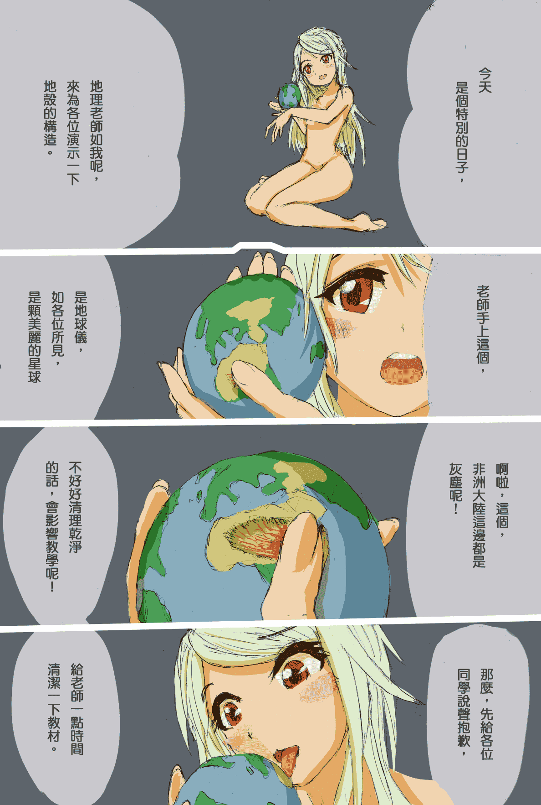
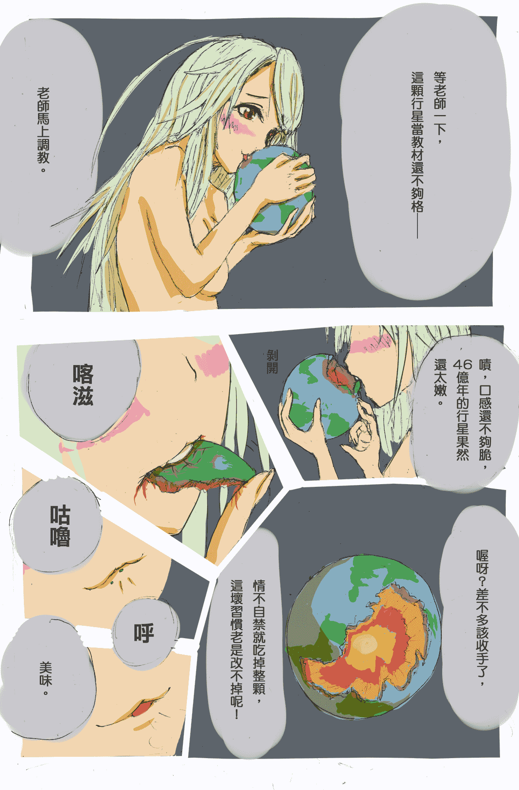
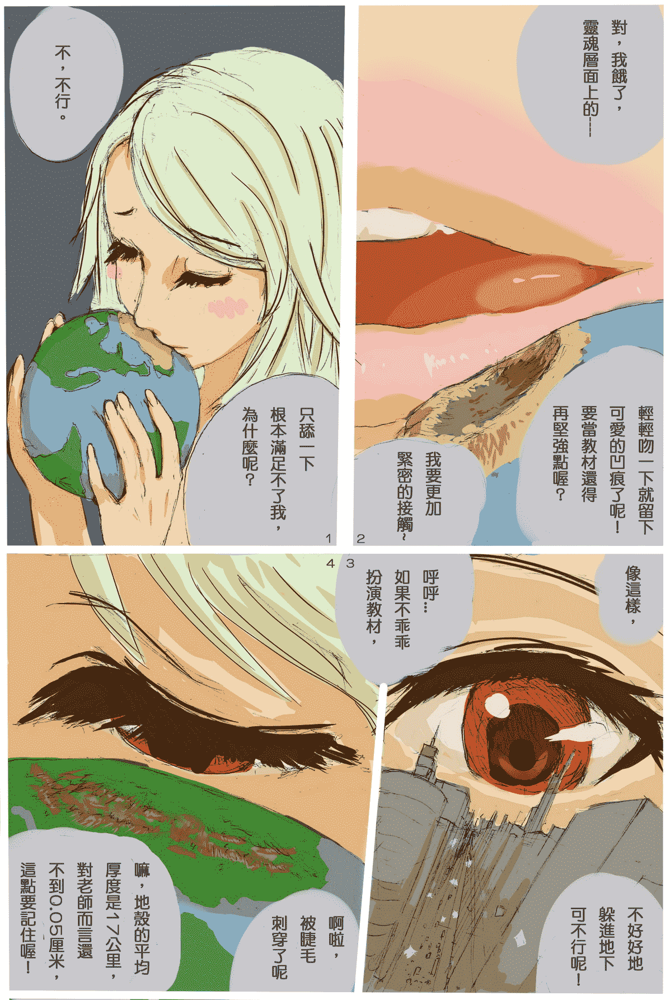
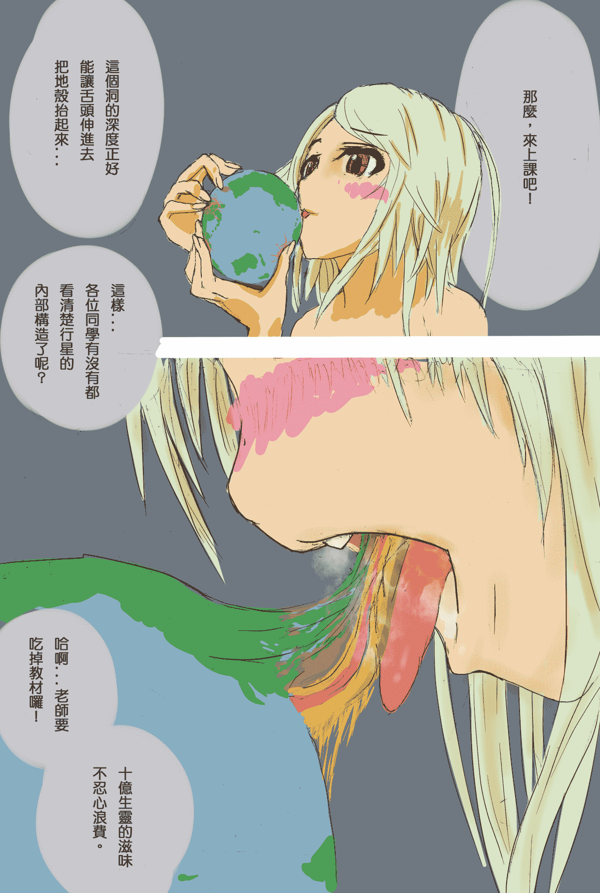
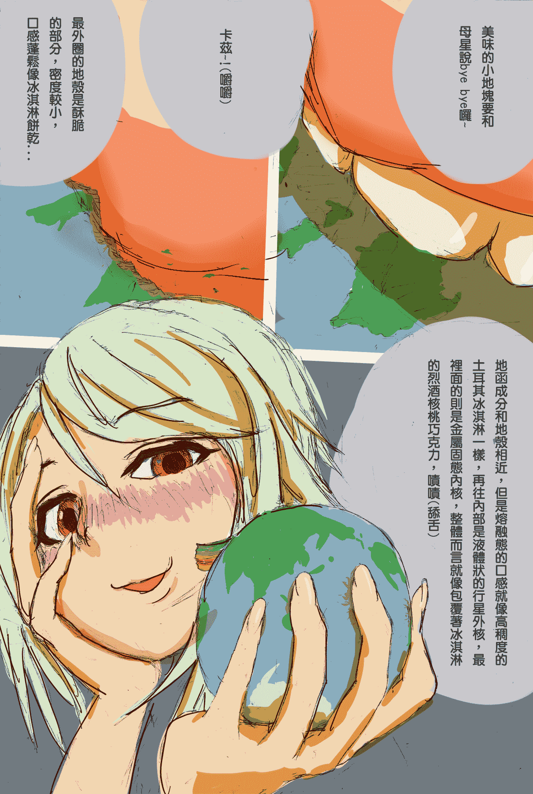

# 《行星食用手扎》-Giga,全彩草稿，3月19日更新第五張

作者：無邊落木

TID：21087

<title>1</title> <link href="../Styles/Style.css" type="text/css" rel="stylesheet">

# 1

*本帖最後由 無邊落木 於 2017-3-19 16:12 編輯*

靈感來源是某個老掉牙的笑話：---------------------
某日，上課鐘剛響，蹬著紅色高跟鞋的老師踩出叩叩的聲響踏進教室，
她走到講桌前，不經意地摸了一下放在桌上的地球儀，

「都是灰塵...」她皺起眉頭，搓掉手指上的塵土後，不滿地用指節敲敲桌面，俯身低頭對著坐在講桌後的小值日生開口：
「你們多久沒掃這教室了？地球儀都積這麼多灰塵！」

「老師，」小值日生仰起頭，無辜的眼神直盯著女老師--不過小值日生只看得到她豐滿的胸部--小聲地說道
「妳摸的地方是撒哈拉沙漠...」
---------------------

因為記不太清楚內容，所以無某小改編了一下，總之大意是這樣。

這次把教室帶到太空，地球儀換成真正的星球，
至於小值日生替換成誰呢...？無某就先不破梗了。

畫了幾張草稿，原本要全部上完色再發表，但眼下愈來愈忙，就算不上墨線直接上色還是不大擠得出時間，不確定什麼時候才有空，只好畫一張算一張了。

主標題《行星食用手扎》，副標題《外太空的地理課》，換言之，接下來的劇情會以課堂的形勢發展下去，

那麼，
<ignore_js_op>

**W2658p1.jpg** *(979.37 KB, 下載次數: 85)*

[下載附件](forum.php?mod=attachment&aid=NjEzNDN8ZTJhMWJiOGF8MTYwMzgyODQ1MXwxODIzMHwyMTA4Nw%3D%3D&nothumb=yes)

2016-5-15 22:04 上傳

<ignore_js_op>

**W2658p2.jpg** *(1.04 MB, 下載次數: 56)*

[下載附件](forum.php?mod=attachment&aid=NjE2Nzl8Yjg5OGQyYzB8MTYwMzgyODQ1MXwxODIzMHwyMTA4Nw%3D%3D&nothumb=yes)

2016-6-8 01:26 上傳

<ignore_js_op>

**W2658p3.jpg** *(604.83 KB, 下載次數: 48)*

[下載附件](forum.php?mod=attachment&aid=NjIzOTl8YmI5OGEzMGZ8MTYwMzgyODQ1MXwxODIzMHwyMTA4Nw%3D%3D&nothumb=yes)

2016-7-18 18:56 上傳

<ignore_js_op>

**W2658p4.jpg** *(417.16 KB, 下載次數: 37)*

[下載附件](forum.php?mod=attachment&aid=NjM4NjR8NjQxOTA4Mzl8MTYwMzgyODQ1MXwxODIzMHwyMTA4Nw%3D%3D&nothumb=yes)

2016-9-4 14:04 上傳

<ignore_js_op>

**W2658p5.jpg** *(554.14 KB, 下載次數: 40)*

[下載附件](forum.php?mod=attachment&aid=NjcyOTV8MTA0YTM0NGZ8MTYwMzgyODQ1MXwxODIzMHwyMTA4Nw%3D%3D&nothumb=yes)

2017-3-19 16:11 上傳

未來更新也會貼在首頁

<title>2</title> <link href="../Styles/Style.css" type="text/css" rel="stylesheet">

# 2

*本帖最後由 無邊落木 於 2016-5-16 00:00 編輯*

> [foronly 發表於 2016-5-15 22:42](https://giantessnight.com/gnforum2012/forum.php?mod=redirect&goto=findpost&pid=293784&ptid=21087)
> 噢！这个创意非常棒嘛=3=
> 看起来很带感！话说回来标题是“行星”的话也会有其他行星的吗0 0
> 那或许人类科技 ...

構想裡有其它的行星登場，因為地理課實在有太多的事情可以講了~

不過地球就可以玩很久囉!
說到太空殖民地的互動，這個嘛...其實已經畫完了，就在上面刊物資訊中提到當日會場會帶去的14頁草稿中，描述的是巨大少女與戒指狀的殖民地(也是戒指般的大小)的互動。<title>3</title> <link href="../Styles/Style.css" type="text/css" rel="stylesheet">

# 3

第二張更新！

話說上面有人提到VORE，這個...本篇目前不打算畫VORE屬性，雖然標題用了"食用"兩字。
嘛，老壇友也許會有這種感覺：關於標題，無某一向想到什麼就下什麼，內容卻擦邊而過~<title>4</title> <link href="../Styles/Style.css" type="text/css" rel="stylesheet">

# 4

更新第三張~

編排上有點問題，原本對白應該是橫式的，上色後改成直式了，所以blabla...

總之，順著時針看吧！<title>5</title> <link href="../Styles/Style.css" type="text/css" rel="stylesheet">

# 5

更新第四張~

預先畫的草稿只夠再更新一張了，神哪多給點時間吧！<title>6</title> <link href="../Styles/Style.css" type="text/css" rel="stylesheet">

# 6

*本帖最後由 無邊落木 於 2017-3-19 16:18 編輯*

半年不見新搞啦，更新第五張~

這坑目前就這麼深，最近開始畫之前本子的梗了(見簽名檔)，

不過礙於工作產速一直拉不上來...</ignore_js_op></ignore_js_op></ignore_js_op></ignore_js_op></ignore_js_op>