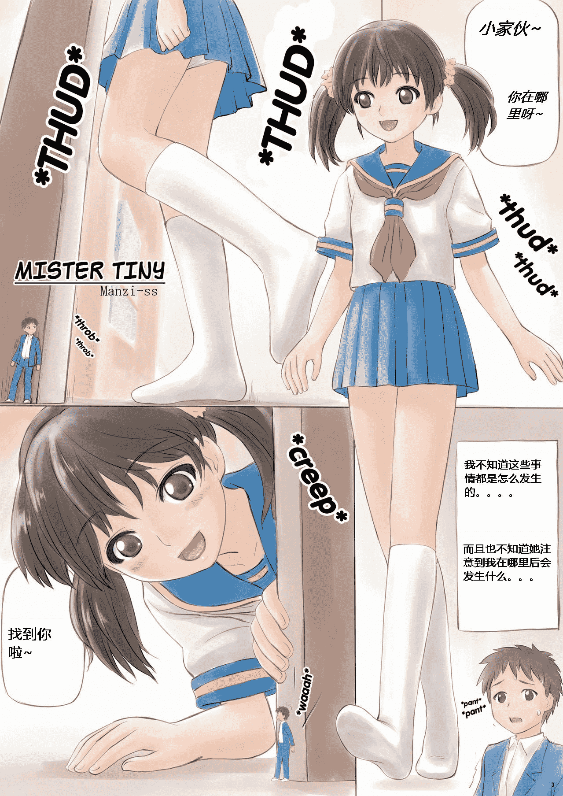

# 【资源没了请删╭(°A°`)╮】翻译Manzi-ss的Mister Tiny

作者：jack369605

TID：16929

 

# 1

*本帖最後由 jack369605 於 2017-1-23 17:39 編輯*

楼主也找不到资源了，╭(°A°`)╮请管理员删了，这是个坟！！！ 

# 2

<ignore_js_op>[3.jpg.jpg](forum.php?mod=attachment&aid=NDMxNzN8ZjRjYTQ2NTh8MTYwMzg1ODU1MnwxODIzMHwxNjkyOQ%3D%3D&nothumb=yes) *(303 KB, 下載次數: 90)*

[下載附件](forum.php?mod=attachment&aid=NDMxNzN8ZjRjYTQ2NTh8MTYwMzg1ODU1MnwxODIzMHwxNjkyOQ%3D%3D&nothumb=yes)

2014-5-24 17:50 上傳  

</ignore_js_op>  

# 3

> [shendanxiaogui 發表於 2014-5-24 18:45](https://giantessnight.com/gnforum2012/forum.php?mod=redirect&goto=findpost&pid=223203&ptid=16929)

> _(:зゝ∠)_机翻有点严重...请继续加油↖(^ω^)↗

这个不是机翻，还是咱英文功底不好啊，不过单词还是懂的。其实很多句子都是拿捏了很久的，果然英译汉就是直白

 

# 4

> [1031304332 發表於 2014-5-24 19:47](https://giantessnight.com/gnforum2012/forum.php?mod=redirect&goto=findpost&pid=223223&ptid=16929)

> 楼主给我原版，我试着为你翻译一下

日文原版只有一张，gb有英文的

 

# 5

> [餃子 發表於 2014-5-24 19:01](https://giantessnight.com/gnforum2012/forum.php?mod=redirect&goto=findpost&pid=223207&ptid=16929)

> 不是【小傢伙】吧，原文ちいさいおじさん應該是小小的大叔。。。manzi說是個【把小小的大叔吃掉就會 ...

翻译也不一定要那么严格嘛，小家伙貌似比小小的大叔来的亲切（话说原版真是小小的大叔吗，那还只是个少年啊）

 

# 6

> [超级新手 發表於 2014-5-25 02:56](https://giantessnight.com/gnforum2012/forum.php?mod=redirect&goto=findpost&pid=223259&ptid=16929)

> 不错，这漫画真心不错，楼主翻译的也不错，就是漫画短了点！

虽然短，还真是完整的，貌似是从某SS漫画上摘取下来的，因为页码是3,4,5,6,7

 

# 7

> [jiachufan1 發表於 2014-5-31 13:46](https://giantessnight.com/gnforum2012/forum.php?mod=redirect&goto=findpost&pid=223616&ptid=16929)

> gb 是什么网站？ 比EX 绅士 还要屌？

giantessbooru,别告诉我你不知道

 

# 8

> [圣骑帕拉丁 發表於 2017-1-23 16:11](https://giantessnight.com/gnforum2012/forum.php?mod=redirect&goto=findpost&pid=321241&ptid=16929)

> 不不不不，链接没了

我知道，╭(°A°`)╮而且早就知道了，但重点是我也找不到资源了…╭(°A°`)╮，这是个坟╭(°A°`)╮