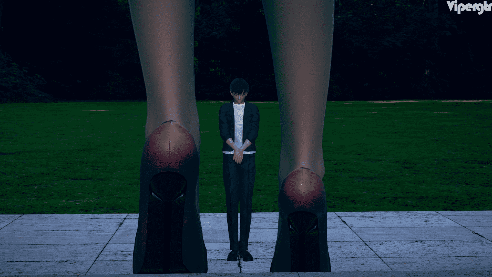
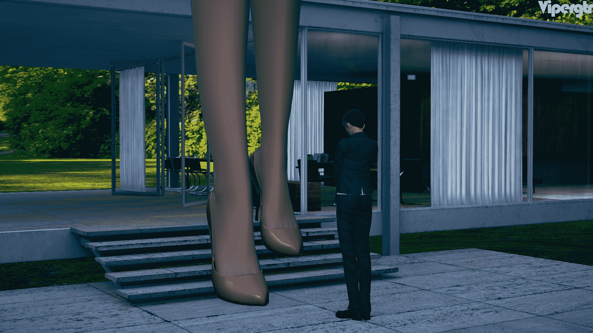
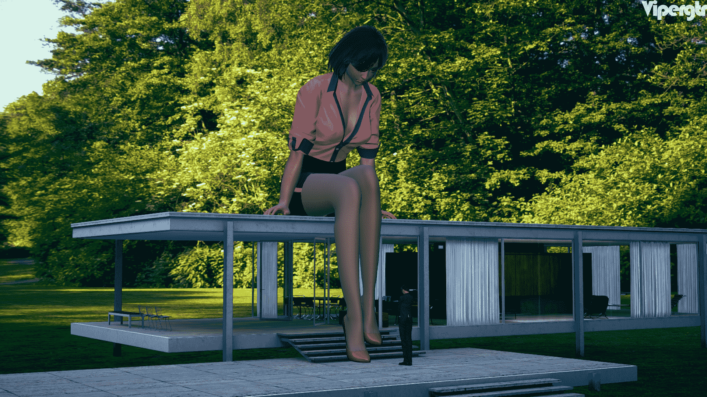
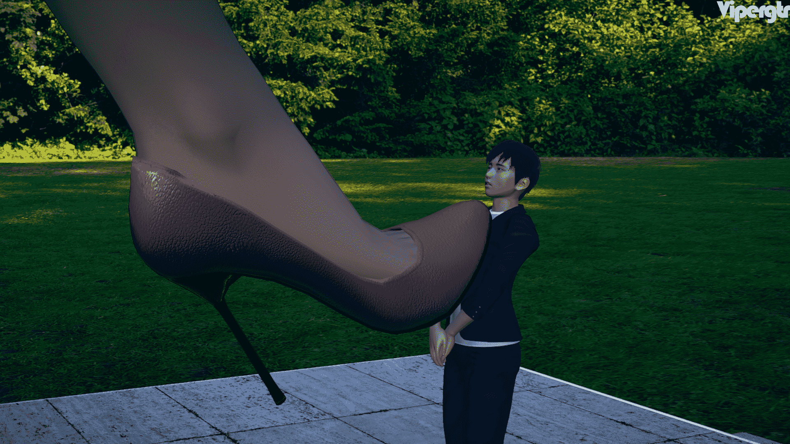
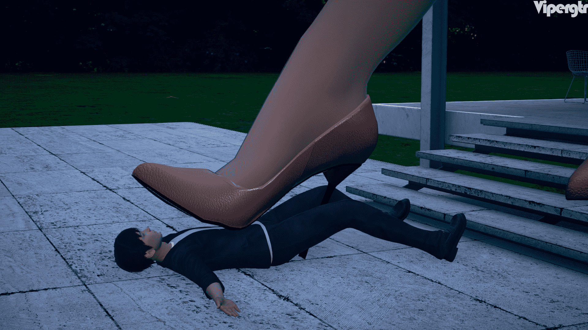
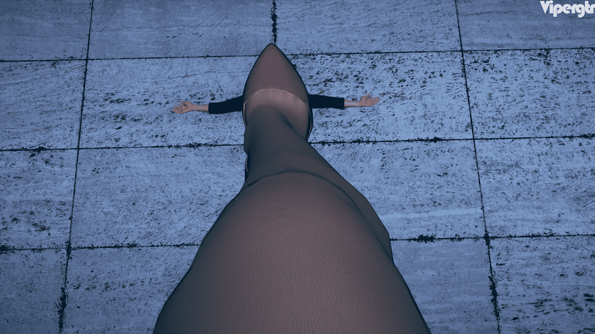
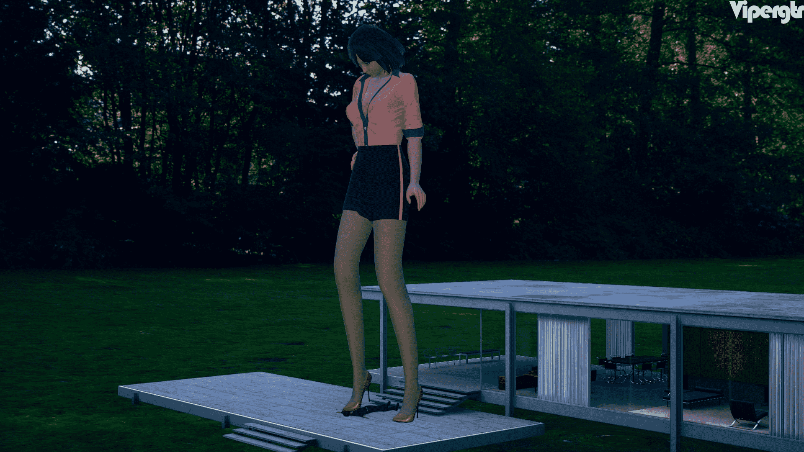

# 《迟到》——试制HS2原欲+高跟+肉丝+12图+无字

作者：vipergtr

TID：29105

<title>1</title> <link href="../Styles/Style.css" type="text/css" rel="stylesheet">

# 1

    用I社的新作HS2原欲试制一下，很多东西继续摸索中。几张图懒得加对话了，剧情设定很简单，新员工因搞错地址导致错过公司拓展后被人事部美女踩踏。

<ignore_js_op>

**01.png** *(1.87 MB, 下載次數: 11)*

[下載附件](forum.php?mod=attachment&aid=ODQwMDh8M2I1MjY4MGF8MTYwMzgyNzg2NnwxODIzMHwyOTEwNQ%3D%3D&nothumb=yes)

2020-7-20 01:33 上傳

<ignore_js_op>

**02.png** *(2.15 MB, 下載次數: 13)*

[下載附件](forum.php?mod=attachment&aid=ODQwMDl8Mzc2YTZlOGV8MTYwMzgyNzg2NnwxODIzMHwyOTEwNQ%3D%3D&nothumb=yes)

2020-7-20 01:34 上傳

<ignore_js_op>

**03.png** *(1.78 MB, 下載次數: 8)*

[下載附件](forum.php?mod=attachment&aid=ODQwMTB8NGU3MjM1ZDh8MTYwMzgyNzg2NnwxODIzMHwyOTEwNQ%3D%3D&nothumb=yes)

2020-7-20 01:34 上傳

<ignore_js_op>

**04.png** *(3.05 MB, 下載次數: 13)*

[下載附件](forum.php?mod=attachment&aid=ODQwMTF8ZGZlMzBkZjF8MTYwMzgyNzg2NnwxODIzMHwyOTEwNQ%3D%3D&nothumb=yes)

2020-7-20 01:34 上傳

<ignore_js_op>

**05.png** *(2.66 MB, 下載次數: 11)*

[下載附件](forum.php?mod=attachment&aid=ODQwMTJ8NDA3NDcyNjJ8MTYwMzgyNzg2NnwxODIzMHwyOTEwNQ%3D%3D&nothumb=yes)

2020-7-20 01:35 上傳

<ignore_js_op>

**06.png** *(1.22 MB, 下載次數: 12)*

[下載附件](forum.php?mod=attachment&aid=ODQwMTN8NGQyMWY1N2F8MTYwMzgyNzg2NnwxODIzMHwyOTEwNQ%3D%3D&nothumb=yes)

2020-7-20 01:35 上傳

<ignore_js_op>

**07.png** *(2.4 MB, 下載次數: 8)*

[下載附件](forum.php?mod=attachment&aid=ODQwMTR8ZTY2ZGUwZTF8MTYwMzgyNzg2NnwxODIzMHwyOTEwNQ%3D%3D&nothumb=yes)

2020-7-20 01:36 上傳

<ignore_js_op>

**08.png** *(3.52 MB, 下載次數: 7)*

[下載附件](forum.php?mod=attachment&aid=ODQwMTV8ODJhM2Y4NTZ8MTYwMzgyNzg2NnwxODIzMHwyOTEwNQ%3D%3D&nothumb=yes)

2020-7-20 01:36 上傳

<ignore_js_op>

**09.png** *(1.08 MB, 下載次數: 10)*

[下載附件](forum.php?mod=attachment&aid=ODQwMTZ8ODc3NDBmZGN8MTYwMzgyNzg2NnwxODIzMHwyOTEwNQ%3D%3D&nothumb=yes)

2020-7-20 01:36 上傳

<ignore_js_op>

**10.png** *(2.57 MB, 下載次數: 9)*

[下載附件](forum.php?mod=attachment&aid=ODQwMTd8MTE2NTgyMzV8MTYwMzgyNzg2NnwxODIzMHwyOTEwNQ%3D%3D&nothumb=yes)

2020-7-20 01:37 上傳

<ignore_js_op>

**11.png** *(2.04 MB, 下載次數: 12)*

[下載附件](forum.php?mod=attachment&aid=ODQwMTh8NTUyMmM4ZDZ8MTYwMzgyNzg2NnwxODIzMHwyOTEwNQ%3D%3D&nothumb=yes)

2020-7-20 01:37 上傳

<ignore_js_op>

**12.png** *(2.49 MB, 下載次數: 7)*

[下載附件](forum.php?mod=attachment&aid=ODQwMTl8MmM0MjE3MDh8MTYwMzgyNzg2NnwxODIzMHwyOTEwNQ%3D%3D&nothumb=yes)

2020-7-20 01:38 上傳

<title>2</title> <link href="../Styles/Style.css" type="text/css" rel="stylesheet">

# 2

> [nhbnfn 發表於 2020-7-20 07:56](https://giantessnight.com/gnforum2012/forum.php?mod=redirect&goto=findpost&pid=442316&ptid=29105)
> v大作品百看不厌 如果能加上光照就好了 这样和背景能稍微匹配一点。。

按照地图情况，人物处在阴影中，而且主光源来自背后的阳光，如果人物正面很亮的话，看起来肯定会突兀。
<title>3</title> <link href="../Styles/Style.css" type="text/css" rel="stylesheet">

# 3

> [nhbnfn 發表於 2020-7-20 11:46](https://giantessnight.com/gnforum2012/forum.php?mod=redirect&goto=findpost&pid=442330&ptid=29105)
> v大说的对 我还是欠缺考虑了 每次都想着把光全打在人物身上 却忽略了环境光线的因素
> ...

    是滴，环境光必须要考虑进去，有时候可能感觉不像铺满光那么明亮，但是要综合整体场景来看，比如下边这两张，A图看似很清晰，但B图相对更真实一些。
<ignore_js_op>

**a.png** *(2.01 MB, 下載次數: 2)*

[下載附件](forum.php?mod=attachment&aid=ODQwMjB8ZTljNTcwZTB8MTYwMzgyNzg2NnwxODIzMHwyOTEwNQ%3D%3D&nothumb=yes)

2020-7-20 13:18 上傳

<ignore_js_op>

**b.png** *(2 MB, 下載次數: 2)*

[下載附件](forum.php?mod=attachment&aid=ODQwMjF8MzM0ZGFiODF8MTYwMzgyNzg2NnwxODIzMHwyOTEwNQ%3D%3D&nothumb=yes)

2020-7-20 13:18 上傳</ignore_js_op></ignore_js_op></ignore_js_op></ignore_js_op></ignore_js_op></ignore_js_op></ignore_js_op></ignore_js_op></ignore_js_op></ignore_js_op></ignore_js_op></ignore_js_op></ignore_js_op></ignore_js_op>