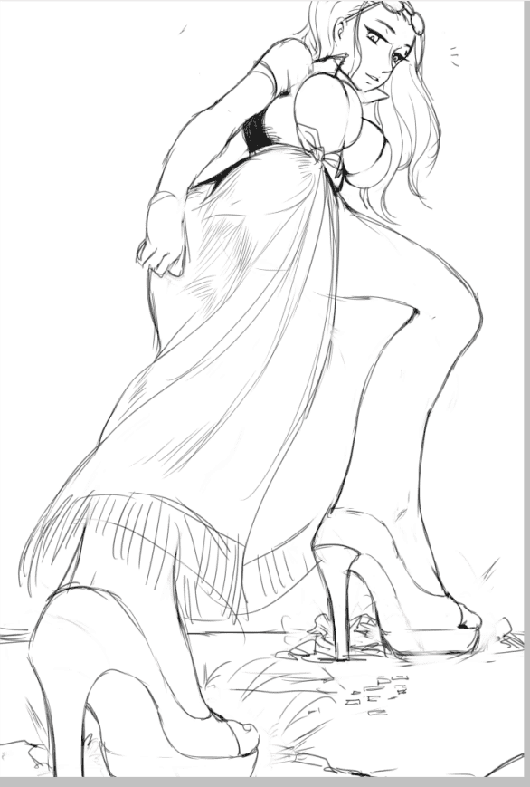
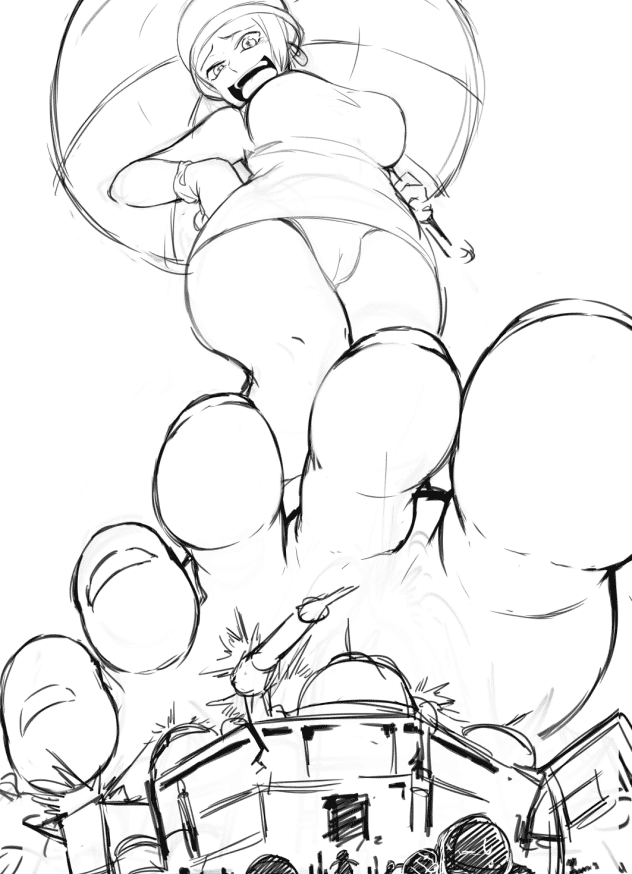

# 【配图】海贼王的脑补画面

作者：hte222

TID：22658

<title>1</title> <link href="../Styles/Style.css" type="text/css" rel="stylesheet">

# 1

看完[http://giantessnight.com/gnforum ... p;extra=&page=1](http://giantessnight.com/gnforum2012/forum.php?mod=viewthread&tid=22640&extra=&page=1) 翻译的小说，忍不住脑补了下罗宾被舰队攻击的部分，就是罗宾的设定太温柔有点可惜了，这么好的玩具居然不玩玩，尤其这个大小的互动，不知道还有没有其他没发现的外文神作

**QQ图片20170221225217.png** *(79.03 KB, 下載次數: 0)*
[下載附件](http://giantessnight.com/gnforum2012/forum.php?mod=attachment&aid=NjY5ODJ8N2YyODI3YmN8MTQ4NzY5MTM5MHwxNTl8MjI2NDA%3D&nothumb=yes)
22 分鐘前 上傳

<ignore_js_op>

**QQ图片20170221225217.png** *(79.03 KB, 下載次數: 1)*

[下載附件](forum.php?mod=attachment&aid=NjY5ODR8MGZkNWY3M2F8MTYwMzg1NzMzNXwxODIzMHwyMjY1OA%3D%3D&nothumb=yes)

2017-2-21 23:36 上傳

不过海贼王里我最喜欢的还是情人节，凭什么仅仅是分支能变重的吨压果实是七武海的干部能变轻的飘飘果实干脆成了传说级大海贼啊，我全能的重量之果根本不服啊，想想情人节变大多好，可以调节体重想不想踩死小人全凭意志。
“咦，这就受不了了么，我才只用了一亿分之一的体重呢，要不要再此刻恢复呢，我都不敢使用变重的能力呢，要不你们小岛沉入海中就没有玩具了呢”
<ignore_js_op>

**QQ图片20170221230220.png** *(98 KB, 下載次數: 1)*

[下載附件](forum.php?mod=attachment&aid=NjY5ODV8ZDg4NWYyYmZ8MTYwMzg1NzMzNXwxODIzMHwyMjY1OA%3D%3D&nothumb=yes)

2017-2-21 23:36 上傳

<title>2</title> <link href="../Styles/Style.css" type="text/css" rel="stylesheet">

# 2

> [michael10611 發表於 2017-2-22 08:29](https://giantessnight.com/gnforum2012/forum.php?mod=redirect&goto=findpost&pid=324416&ptid=22658)
> 畫很棒~~~~~話說你也畫個白星公主瘩~~~~

美脚的不打算出，连腿玩年都不能的就更没意思了</ignore_js_op></ignore_js_op>