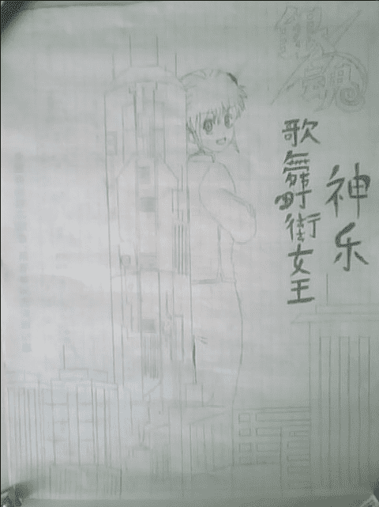

# 【银魂同人】歌舞伎町女王神乐

作者：zsd

TID：10473

 

# 1

好久没发过手绘了，不晓得技术退步没有.......

1.

<ignore_js_op>

**mcju.jpg** *(47.6 KB, 下載次數: 0)*

[下載附件](forum.php?mod=attachment&aid=MjUwMTl8OWQ4MDVkNzl8MTYwMzg3NjcxMXwxODIzMHwxMDQ3Mw%3D%3D&nothumb=yes)

2011-6-26 19:20 上傳

2.背景看过银魂的都知道吧（看过银魂还不知道的可以去死了），江户最高的建筑物塔米纳鲁。

神马最高建筑，高的过我们的神乐女王么

<ignore_js_op>

**mbzi.jpg** *(40.56 KB, 下載次數: 0)*

[下載附件](forum.php?mod=attachment&aid=MjUwMjB8MTZhY2I4MjV8MTYwMzg3NjcxMXwxODIzMHwxMDQ3Mw%3D%3D&nothumb=yes)

2011-6-26 19:20 上傳

效果不好看这张

<ignore_js_op>

**moyq.jpg** *(40.45 KB, 下載次數: 0)*

[下載附件](forum.php?mod=attachment&aid=MjUwMjF8MmZhNGJlMzF8MTYwMzg3NjcxMXwxODIzMHwxMDQ3Mw%3D%3D&nothumb=yes)

2011-6-26 19:20 上傳

啊啊，好像是一样高

3.这次可没神乐高了

神乐酱，当心别把它当成美味棒吃掉了

<ignore_js_op>

**kyhj.jpg** *(40.72 KB, 下載次數: 0)*

[下載附件](forum.php?mod=attachment&aid=MjUwMjJ8NjFjMDA2ZjV8MTYwMzg3NjcxMXwxODIzMHwxMDQ3Mw%3D%3D&nothumb=yes)

2011-6-26 19:20 上傳

4.这次是真正的女王了

将地球玩弄于指尖的巨大女王

<ignore_js_op>

**qvbv.jpg** *(62.84 KB, 下載次數: 0)*

[下載附件](forum.php?mod=attachment&aid=MjUwMjN8ZGM4NDY0MTF8MTYwMzg3NjcxMXwxODIzMHwxMDQ3Mw%3D%3D&nothumb=yes)

2011-6-26 19:20 上傳

5.呃.....这个应该是.......

《三年Z组 银八老师》的同人吧

PS:第一行字（注意从右往左）最后少了一个“呦”

PS的PS：有没有发现这个动作曾经出现过，去我过去的手绘里找吧

<ignore_js_op>

**krdo.jpg** *(46.95 KB, 下載次數: 0)*

[下載附件](forum.php?mod=attachment&aid=MjUwMjR8MWFiYTlmOWV8MTYwMzg3NjcxMXwxODIzMHwxMDQ3Mw%3D%3D&nothumb=yes)

2011-6-26 19:20 上傳

 

# 2

> 原帖由 *毒蛋白* 於 2011-6-26 22:50 發表 

> 我去……这么大的神乐酱……

> 全地球的人都不够吃啊……

> 那种边抠鼻屎，然后随手把人扔进充满醋昆布的嘴里……

> ……太糟糕了（捂脸

那个.......你好像把神乐酱想得太糟糕了.......

和黑社会打架都不杀人的神乐酱不会吃人吧......

既然是女王应该可以控制自己的身高吧</ignore_js_op></ignore_js_op></ignore_js_op></ignore_js_op></ignore_js_op></ignore_js_op>