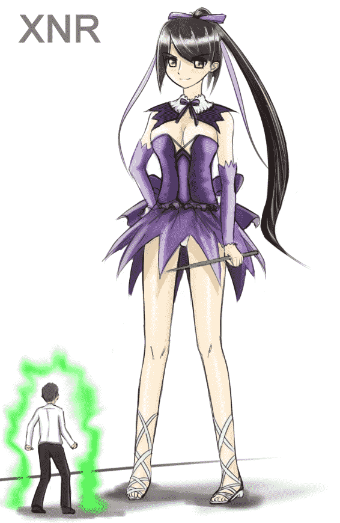
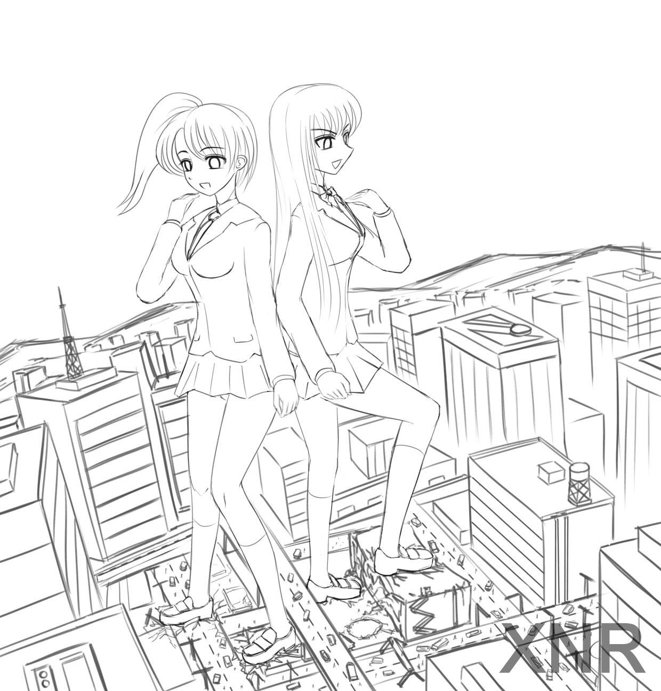

# [雙子盃] XNRの坑爹投稿

作者：xnr

TID：10625

 

# 1

但丁提醒我明晚就截止评分了，所以才匆忙把半成品发上来，很坑爹，抱歉。

针对活动主题的两张图：

<ignore_js_op>

**RS1-2.jpg** *(157.23 KB, 下載次數: 1)*

[下載附件](forum.php?mod=attachment&aid=MjU2Mjh8ZGVjNTQ1YzV8MTYwMzg3NTA4N3wxODIzMHwxMDYyNQ%3D%3D&nothumb=yes)

2011-7-19 21:21 上傳

没时间看魔法少女，不甚了解，就随便画了一个，在QQ群里应某同好的要求，画了mini-gts，身高约8米。

<ignore_js_op>

**GC01-3.jpg** *(586.85 KB, 下載次數: 2)*

[下載附件](forum.php?mod=attachment&aid=MjU2Mjl8MWFjMThjMGF8MTYwMzg3NTA4N3wxODIzMHwxMDYyNQ%3D%3D&nothumb=yes)

2011-7-19 21:21 上傳

未上色的半成品，不解释了。 

# 2

> 原帖由 *wongvict* 於 2011-7-19 22:38 發表 

> 第一張是Shining heart的マキシマ・エンフィールド。

> 

> 第二張是縮小學園，沒有錯吧

> [以建築物對照的話，這裡巨大化100倍；遊戲中的結局 ...

W兄眼神很犀利，两点全都回答正确！

注：之所以说坑爹还有另一层意思，不仅仅是为了活动而画的图，这次画的《缩》确实是按游戏中传统的100倍尺寸差来画的，所以。。。你懂的。 

# 3

> 原帖由 *miniboy* 於 2011-12-18 11:42 發表 

> 着么快半年了还没上色呀

> 难道就是为了活动画的？

1\. 已经上色了，你没去看而已。

2\. 并非为了活动而画，而是为了今后出漫画作准备。 

# 4

> 原帖由 *miniboy* 於 2011-12-18 11:54 發表 

> 画就要画精品呀

> 不要只求数量不求质量的说

我一直是少而精的出图，难道你都看不见吗？不去调查就没有发言权。</ignore_js_op></ignore_js_op>