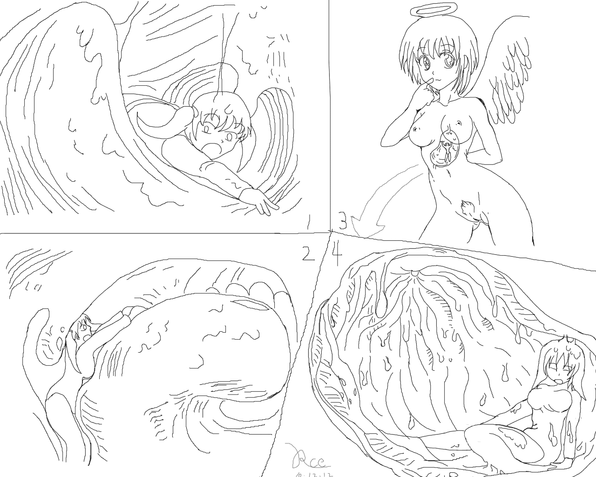

# 【鼠标流临摹加原创】VORE系（偶终于深入了？）

作者：rce

TID：8858

<title>1</title> <link href="../Styles/Style.css" type="text/css" rel="stylesheet">

# 1

实际上是临摹80%，原创20%
临摹的是Karbo的作品。顺便改了一下个人觉得有点不太和谐的地方。
然后4张东西集合成了一个类似于漫画的东西。
只是因为没有灵感然后想学学K大的画风。还是鼠标画的。涂色什么的不要期望，虽然有可能去实验用。
献上。

注意：已经说明是临摹为主了哦！而既然改了点。勉强算是同人的类型了吧。

[http://giantessnight.com/gnforum ... =page%3D1#pid120967](http://giantessnight.com/gnforum/viewthread.php?tid=8861&pid=120967&page=1&extra=page%3D1#pid120967)
这是写的配合该图的文章哦~~下了不少功夫哦。也是第一次在这里临时发挥写。坑什么的那货。
懒散女神1
这名很囧啥的。
啊啊啊啊，今天第一次深入就出图文好累啊……

点击看大图图片

[ *本帖最後由 rce 於 2010-12-12 15:43 編輯* ]<title>2</title> <link href="../Styles/Style.css" type="text/css" rel="stylesheet">

# 2

 <ignore_js_op>[1.jpg](forum.php?mod=attachment&aid=MjIyMDh8ZWQwYTQxNGF8MTYwMzg3ODU0MHwxODIzMHw4ODU4&nothumb=yes) *(544.62 KB, 下載次數: 2)*

[下載附件](forum.php?mod=attachment&aid=MjIyMDh8ZWQwYTQxNGF8MTYwMzg3ODU0MHwxODIzMHw4ODU4&nothumb=yes)

2010-12-12 11:16 上傳  

閱讀權限: **10**

</ignore_js_op> <title>3</title> <link href="../Styles/Style.css" type="text/css" rel="stylesheet">

# 3

> 原帖由 *1055348297* 於 2010-12-12 11:28 發表 
> 为啥设置权限理？，难道不想让大众看吗

不太高啦，仅仅是不让那些灌水帝伸手党看而已~~<title>4</title> <link href="../Styles/Style.css" type="text/css" rel="stylesheet">

# 4

> 原帖由 *xnr* 於 2010-12-12 11:26 發表 
> 鼠标帝。。。期望有一天能成为手绘帝。

哎呀，这个首先要克服钱再次克服钱然后是克服钱的问题之后才能解决一小部分……
然后要克服对手绘板的恐惧对手绘流的饥渴克服鼠绘流对背叛者的裁决……
总的来说就是……很难吧……大概……<title>5</title> <link href="../Styles/Style.css" type="text/css" rel="stylesheet">

# 5

调低至10~~仅仅防止伸手党和冰冻……<title>6</title> <link href="../Styles/Style.css" type="text/css" rel="stylesheet">

# 6

> 原帖由 *Dante* 於 2010-12-12 12:36 發表 
> .
> 感謝樓主讓我們見識到，何謂滑鼠的無限潛能。
> 
> 對樓主終於捨身踏入我等的領域，更感到無比激動。
> 
> 看來只要滑鼠還存在的一天，樓主的活躍永遠可以期待！

不保证时间不保证数量，但由于是鼠标嘛， 为了与手绘党PK，质量还是要做到的。<title>7</title> <link href="../Styles/Style.css" type="text/css" rel="stylesheet">

# 7

不，鼠标时黑土……