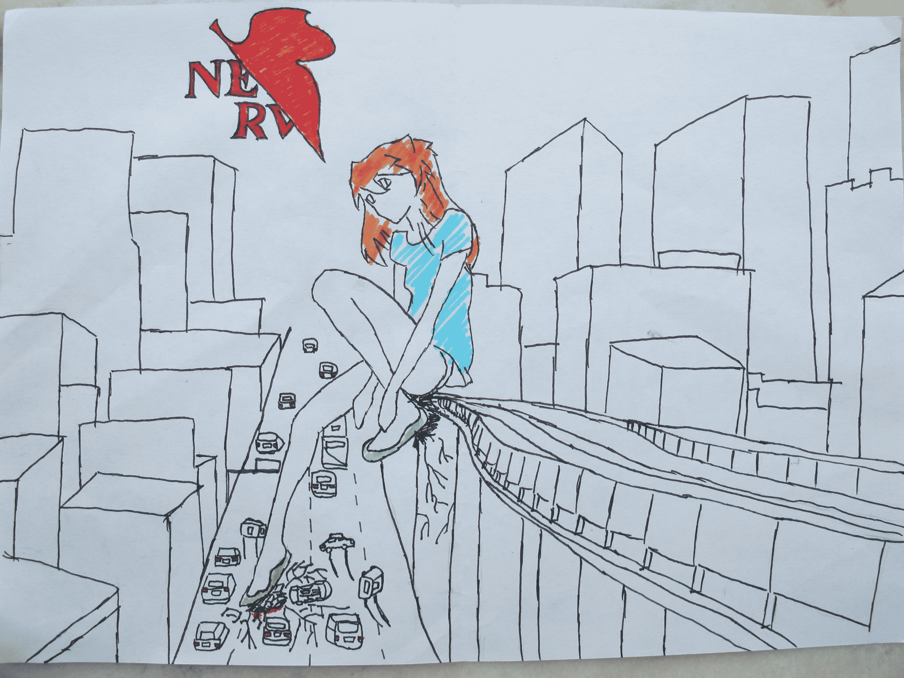
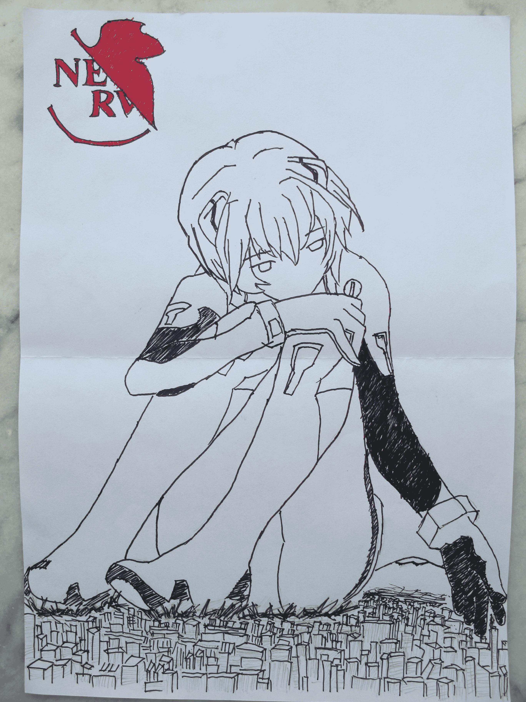
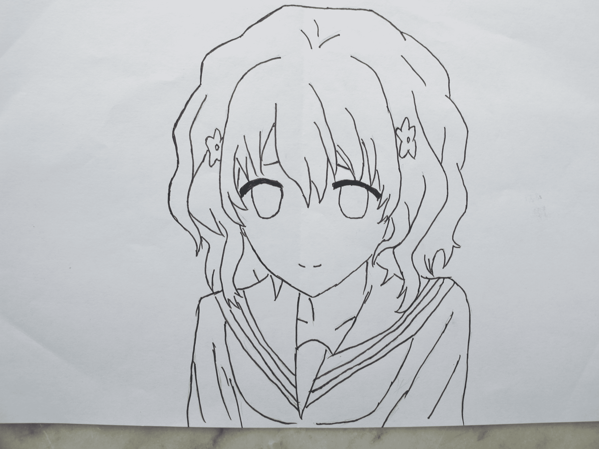

# 0128的畫 叁

作者：0128

TID：10754

 

# 1

由衷感謝各位的點擊！

這是不負責任的畫，只為了趕日期圖個紀念意義……

淩波麗那副是先前填的水性筆……

明日香那副太便當……

從找圖片→草稿→草圖→水性筆勾線

整個只用了不到一個半小時……好吧，這只是為了湊日子而作……

最後，在下复制過DANTE大人的頭像，隨即問我那些“日本動漫的同學”（好吧，我都不知道怎麼形容他們……）……好吧，我估計他們搜索都不用經過大腦……原來是花開伊吕波，好吧，我什麼都不知道，只知道——哎呦~那位MM不錯喲~（或許，其實，可能，是因為在下真的幾乎不看日本動漫，所以一看到MM——嗯！應該是正常？……）

——找圖片~下一位就是你了——

就這樣……

在此感謝各位的點擊！~ 

# 2

這就是不負責……

趕日期……

草草了事…… 

# 3

<ignore_js_op>[IMG_1814.JPG](forum.php?mod=attachment&aid=MjU4MDN8NWQ5MzA4YTR8MTYwMzg3NjMzMnwxODIzMHwxMDc1NA%3D%3D&nothumb=yes) *(2.05 MB, 下載次數: 5)*

[下載附件](forum.php?mod=attachment&aid=MjU4MDN8NWQ5MzA4YTR8MTYwMzg3NjMzMnwxODIzMHwxMDc1NA%3D%3D&nothumb=yes)

2011-8-10 17:41 上傳  

</ignore_js_op> <ignore_js_op>[旋&#36716; IMG_1815.JPG](forum.php?mod=attachment&aid=MjU4MDR8N2YyOGM4NDF8MTYwMzg3NjMzMnwxODIzMHwxMDc1NA%3D%3D&nothumb=yes) *(2.02 MB, 下載次數: 1)*

[下載附件](forum.php?mod=attachment&aid=MjU4MDR8N2YyOGM4NDF8MTYwMzg3NjMzMnwxODIzMHwxMDc1NA%3D%3D&nothumb=yes)

2011-8-10 17:41 上傳  

</ignore_js_op> <ignore_js_op>[IMG_1816.JPG](forum.php?mod=attachment&aid=MjU4MDV8YmQ5YWQ3ZmR8MTYwMzg3NjMzMnwxODIzMHwxMDc1NA%3D%3D&nothumb=yes) *(1.5 MB, 下載次數: 1)*

[下載附件](forum.php?mod=attachment&aid=MjU4MDV8YmQ5YWQ3ZmR8MTYwMzg3NjMzMnwxODIzMHwxMDc1NA%3D%3D&nothumb=yes)

2011-8-10 17:41 上傳  

話說我真的不知道女主角叫什麼耶！~

</ignore_js_op>  

# 4

在抱怨網速的同時……上傳每次都這麼慢~

最後一副只是一個……叫什麼好呢？

下一次反正就會與她有關吧~

下一次一定會慢慢的，仔細的了

但是就是不知道是什麼時候了

請大家！~

多多包含

多多指教~！！ 

# 5

謝謝~

其實在下也不是没有想過用電繪

在下的同學有一些就繪制的很好~

但是在下先前說過

真的没有那麼多時間

所以

就用最原始也最容易上手操作的純筆繪了~ 

# 6

原来叫緒花来着……

这个……

其实就是照着画，大家都能画好的，只要打好草稿的比例~