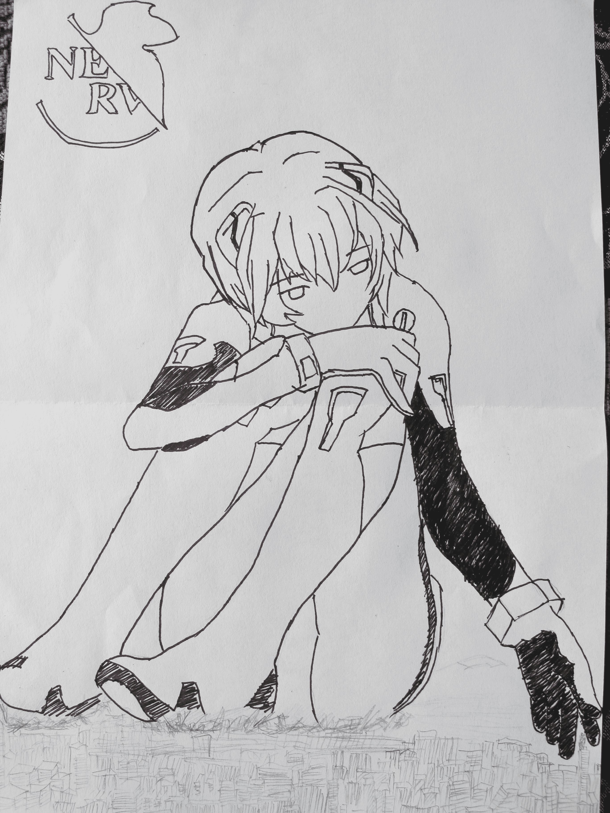
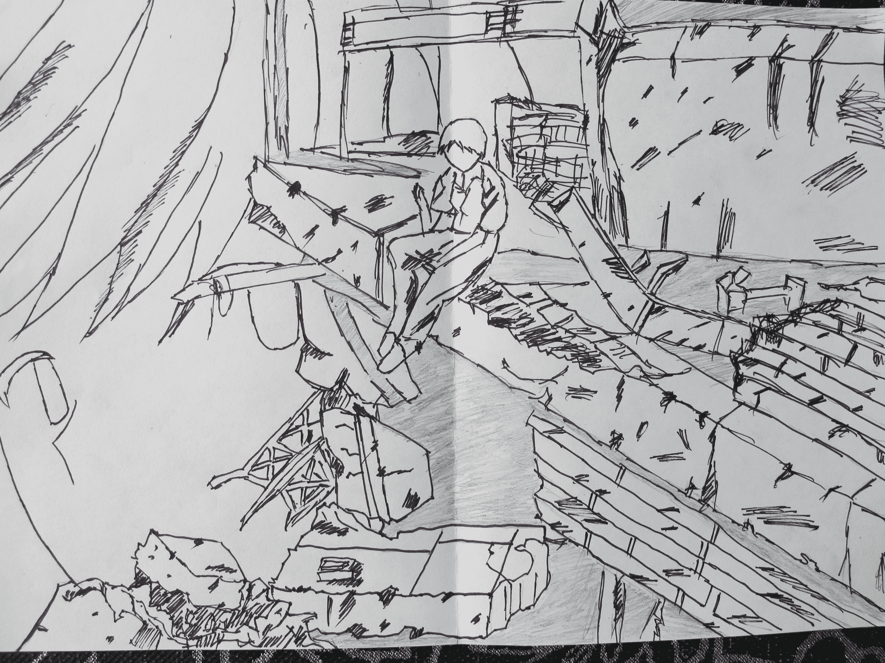

# 0128的畫 貳

作者：0128

TID：10666

<title>1</title> <link href="../Styles/Style.css" type="text/css" rel="stylesheet">

# 1

由衷感謝各位的點擊！

言簡意賅——一定要言簡意賅~！

這兩幅——只有兩張——是新世紀福音戰士中的淩波麗（“三無少女”）——對不起E…君了在下現在還没有水平，答應的事情不算話，這個，真的很抱歉~！

然後呢，在下先頭找範圖找了良久，草圖亦繪制了很久，但是使用最後的水性筆的時候——卻狂草了一番……
已經等不下去了……本來想把自己最好的一面呈獻給大家的……

只有兩幅……這個……好累……

各位大人高抬貴手，在下先前說的還有手繪的…………
就推遲到明年暑假了（但願那時升完學後會用無比快樂的心情繪制……）

今後所有的畫，都用 “0128的畫” ——壹——貳… 當作題目好了，這樣在下也不必去起名字，大家也會漸漸知道0128就是那個畫的不怎麼樣的…………
在下恳请各位不要转载，那样子太丢人了啦~

到此為止，請各位多多包含在最後繪制階段的狂草………………

[ *本帖最後由 0128 於 2011-7-26 12:10 編輯* ]<title>2</title> <link href="../Styles/Style.css" type="text/css" rel="stylesheet">

# 2

這個……
一如既往，照片都很清晰(都是由在下调的曝光，快门，感光……）~

請大家點擊大圖！（上次忘記了……）

[ *本帖最後由 0128 於 2011-7-26 12:20 編輯* ]<title>3</title> <link href="../Styles/Style.css" type="text/css" rel="stylesheet">

# 3

 <ignore_js_op>[旋&#36716; IMG_1731.JPG](forum.php?mod=attachment&aid=MjU2NzB8NjMxNzU0OTR8MTYwMzg3NjI1OHwxODIzMHwxMDY2Ng%3D%3D&nothumb=yes) *(2.29 MB, 下載次數: 16)*

[下載附件](forum.php?mod=attachment&aid=MjU2NzB8NjMxNzU0OTR8MTYwMzg3NjI1OHwxODIzMHwxMDY2Ng%3D%3D&nothumb=yes)

2011-7-26 11:34 上傳  

</ignore_js_op> <ignore_js_op>[IMG_1734.JPG](forum.php?mod=attachment&aid=MjU2NzF8YzIzNTI1MTR8MTYwMzg3NjI1OHwxODIzMHwxMDY2Ng%3D%3D&nothumb=yes) *(2.73 MB, 下載次數: 1)*

[下載附件](forum.php?mod=attachment&aid=MjU2NzF8YzIzNTI1MTR8MTYwMzg3NjI1OHwxODIzMHwxMDY2Ng%3D%3D&nothumb=yes)

2011-7-26 11:34 上傳  

</ignore_js_op> <title>4</title> <link href="../Styles/Style.css" type="text/css" rel="stylesheet">

# 4

那个，其实没有用那个水性笔勾CITY，其实怕勾不好，还有一点偷懒！~

暑假还长对吧~还有时间，对吧~没问题的，对吧！~

所以，下一次发图（这段时间，绘图上瘾中……）就补上好了！~<title>5</title> <link href="../Styles/Style.css" type="text/css" rel="stylesheet">

# 5

凌波丽很受欢迎么？
明日香的下次就换一张成丽好拉！~
敢达上的MM的确不是很多，就在压缩一下了~

机体，机体在第一张的手下的建筑屋顶~——初号机的说~~<title>6</title> <link href="../Styles/Style.css" type="text/css" rel="stylesheet">

# 6

在下的水平，只是初级入门加上业余的酱油加上小学&中一的仅仅能口胡在下班上的一部分同学的水品，需要的努力与汗水……
在专业的真正的绘师面前，简直不值一提……
要加入梦幻团队………………

噢~楼上原来是WTMAN~<title>7</title> <link href="../Styles/Style.css" type="text/css" rel="stylesheet">

# 7

为什么要和 女神 有关呢？~

为什么这个贴要比先前的那两个更胜一筹呢~
这是个问题……
期待下一次的解答~……

感谢各位~！