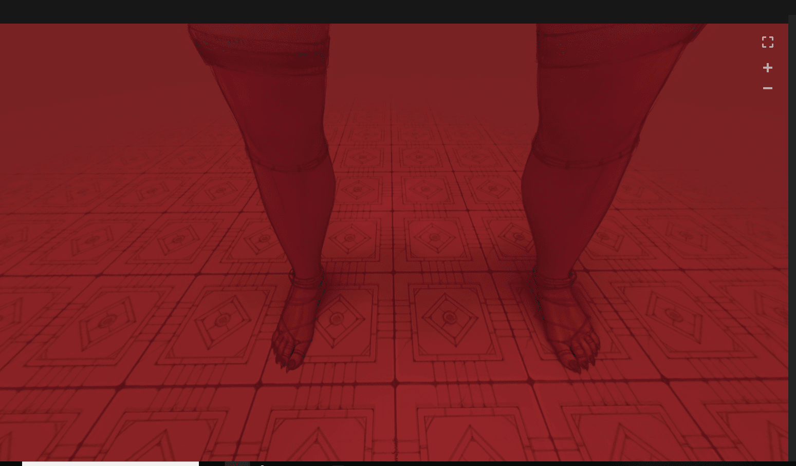

# A站360°全景画

作者：1291626994

TID：27279

 

# 1

A站网址：全景画，需要翻墙，，----------------  [https://www.artstation.com/artwork/gv6aP](https://www.artstation.com/artwork/gv6aP) 

# 2

<ignore_js_op>[QQ截图20190820163030.png](forum.php?mod=attachment&aid=Nzk0NTR8MDk2MDVjOWV8MTYwMzg0MDM3MHwxODIzMHwyNzI3OQ%3D%3D&nothumb=yes) *(1.04 MB, 下載次數: 14)*

[下載附件](forum.php?mod=attachment&aid=Nzk0NTR8MDk2MDVjOWV8MTYwMzg0MDM3MHwxODIzMHwyNzI3OQ%3D%3D&nothumb=yes)

2019-8-20 16:32 上傳  

</ignore_js_op>  

# 3

> [回梦游仙 發表於 2019-8-20 16:51](https://giantessnight.com/gnforum2012/forum.php?mod=redirect&goto=findpost&pid=413117&ptid=27279)

> 感觉腿的分开角度有点大

图片往上拉就好了，应该是镜头感的原因