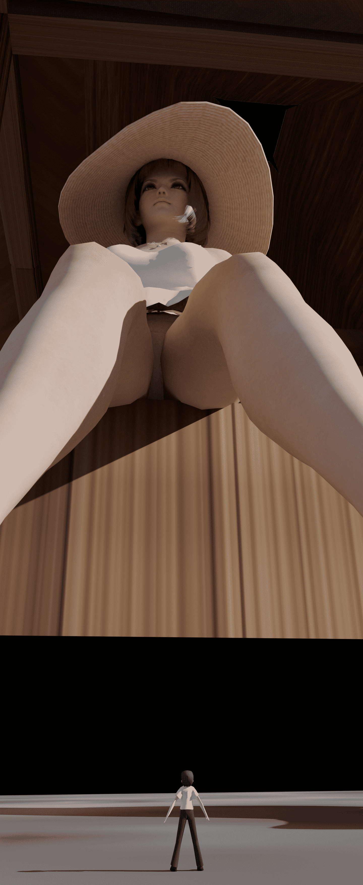

# Blender 續作....

作者：Cocytus

TID：28069

<title>1</title> <link href="../Styles/Style.css" type="text/css" rel="stylesheet">

# 1

這幾天來幾乎每天都在研究Blender
從MMD模型漸漸移到真人模型去了

<ignore_js_op>

**Export 2.png** *(5.05 MB, 下載次數: 1)*

[下載附件](forum.php?mod=attachment&aid=ODE0MTR8YTA0YTFmOGZ8MTYwMzgzNTY5MnwxODIzMHwyODA2OQ%3D%3D&nothumb=yes)

2020-2-16 14:53 上傳

<ignore_js_op>

**Cover.png** *(2.63 MB, 下載次數: 6)*

[下載附件](forum.php?mod=attachment&aid=ODE0MTN8ZjIwMjA4YzV8MTYwMzgzNTY5MnwxODIzMHwyODA2OQ%3D%3D&nothumb=yes)

2020-2-16 14:52 上傳

<ignore_js_op>

**CG1.png** *(5.87 MB, 下載次數: 1)*

[下載附件](forum.php?mod=attachment&aid=ODE0MTJ8YmI3ZmYxNDN8MTYwMzgzNTY5MnwxODIzMHwyODA2OQ%3D%3D&nothumb=yes)

2020-2-16 14:52 上傳

<ignore_js_op>

**Honoka Test5.jpg** *(600.93 KB, 下載次數: 1)*

[下載附件](forum.php?mod=attachment&aid=ODE0MTV8MjVkZDYyMGN8MTYwMzgzNTY5MnwxODIzMHwyODA2OQ%3D%3D&nothumb=yes)

2020-2-16 14:54 上傳

如果可以的話
可以繼續到Twitter Follow我一下：[https://twitter.com/CocytusXd](https://twitter.com/CocytusXd)
@CocytusXd

<title>2</title> <link href="../Styles/Style.css" type="text/css" rel="stylesheet">

# 2

 <ignore_js_op>[Honoka Test5.jpg](forum.php?mod=attachment&aid=ODE0MTZ8MjlkODA3OTl8MTYwMzgzNTY5MnwxODIzMHwyODA2OQ%3D%3D&nothumb=yes) *(600.93 KB, 下載次數: 2)*

[下載附件](forum.php?mod=attachment&aid=ODE0MTZ8MjlkODA3OTl8MTYwMzgzNTY5MnwxODIzMHwyODA2OQ%3D%3D&nothumb=yes)

2020-2-16 14:55 上傳  

</ignore_js_op> <title>3</title> <link href="../Styles/Style.css" type="text/css" rel="stylesheet">

# 3

> [lollollyt 發表於 2020-2-18 18:39](https://giantessnight.com/gnforum2012/forum.php?mod=redirect&goto=findpost&pid=426988&ptid=28069)
> 好吧 确实没有颜色。。。 FBX格式的没有上材质和颜色 OBJ的 材质颜色有问题。。 ...

建議使用XPS導入喔
他會叫你下載一個插件才能導入</ignore_js_op></ignore_js_op></ignore_js_op></ignore_js_op>