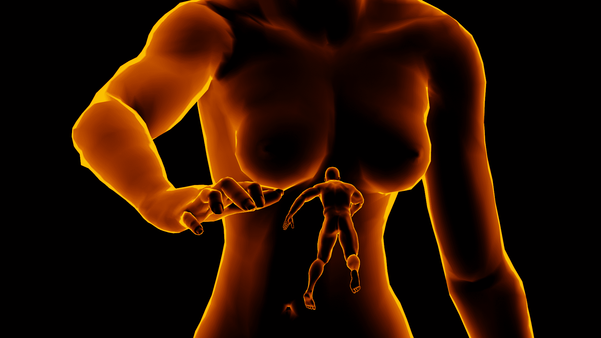

# Blender測試作圖

作者：3213213210

TID：27208

<title>1</title> <link href="../Styles/Style.css" type="text/css" rel="stylesheet">

# 1

Blender，一個免費開源的3D作圖軟體，最近推出了2.8更新(等了幾年終於啊)
上次我介紹的免費製造人類的Plug-in ( [https://giantessnight.com/gnforum2012/forum.php?mod=viewthread&tid=27027](https://giantessnight.com/gnforum2012/forum.php?mod=viewthread&tid=27027) )，
製作出來的人沒有頭髮和性器官
怎麼辦? 那就拍張不需要頭和性器官的照片吧
然後反正都在用自由度高的軟體了，不如試點炫砲的玩法
於是，參考網路上應用Emission的教學影片( [https://www.youtube.com/watch?v=8qKLkDr09Pk](https://www.youtube.com/watch?v=8qKLkDr09Pk) )，
做出了這個
<ignore_js_op>

**test.png** *(1.81 MB, 下載次數: 0)*

[下載附件](forum.php?mod=attachment&aid=NzkyOTV8NWUxYmRmOGJ8MTYwMzg0MDk0MnwxODIzMHwyNzIwOA%3D%3D&nothumb=yes)

2019-8-6 15:02 上傳

嗯，超普，而且腰扭得很不自然，不過初次作圖不用太苛刻
這張圖的Render(算圖、渲染)時間幾乎為零，爽爆
專案檔也送大家：[https://tinyurl.com/y4k29grb](https://tinyurl.com/y4k29grb)

Blender可以去官網下載，不過官網載超慢，建議直接從Steam抓
[https://store.steampowered.com/app/365670/Blender/](https://store.steampowered.com/app/365670/Blender/)
之後我應該會不定期丟圖上來傳教
大家準備好接受佈道了嗎

<title>2</title> <link href="../Styles/Style.css" type="text/css" rel="stylesheet">

# 2

> [回梦游仙 發表於 2019-8-6 21:34](https://giantessnight.com/gnforum2012/forum.php?mod=redirect&goto=findpost&pid=411833&ptid=27208)
> 这个小人是在里面吗？里面的话应该做不出这样的姿势吧

浮在空中 反正這個特效看起來本來就很像數位虛擬世界
<title>3</title> <link href="../Styles/Style.css" type="text/css" rel="stylesheet">

# 3

> [琳姐 發表於 2019-8-8 12:46](https://giantessnight.com/gnforum2012/forum.php?mod=redirect&goto=findpost&pid=411994&ptid=27208)
> bl，怎么做啊，渲染我也不懂

這張比較特別，簡單講就是設定讓模型會自己發光，然後直接輸出圖片就好
一般製圖的工作流是設置場景、設置角色、設置燈光然後再擺好幾個小時算圖，其實真的不難學，只是要很有耐心</ignore_js_op>