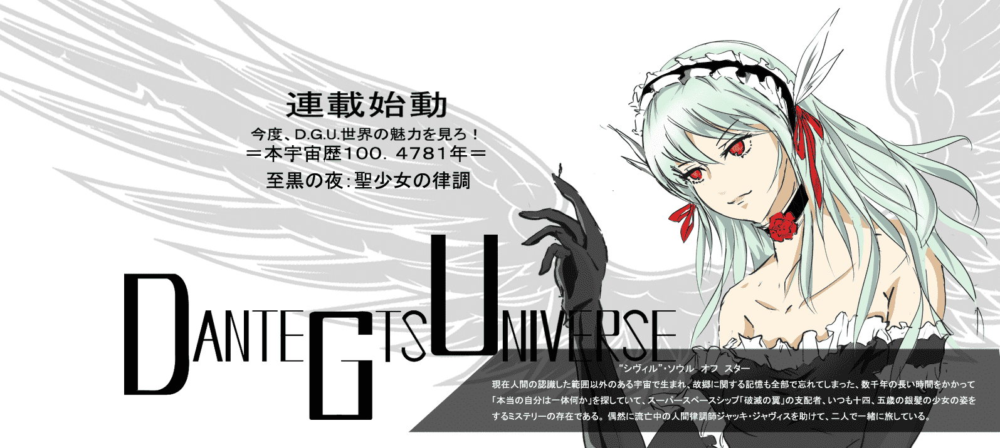

# D.G.U.世界養成計画に関する予想（ないには幻想？）

作者：kunoichi99

TID：14518

 

# 1

ＧＮの皆様・こんにちは！

また一年ぶりにご無沙汰しおります。今年の一月から留学の申し込むなどことがあいついで、短い暇さでもぜんぜんありません、、

ところが最近いよいよ全ておわりましたから、「漫画によってD.G.U.世界を養成することはどうだろか」そういう想念をたびたび考えてる。今創り出したことはただこの絵しかないのに、前回のいくらの荒削りなものを見直し、一部を描いています。

では、よろしくお願いいたします！

追記：絵のスタイルは誰かの作品によって創り出したが、皆様も大体ご存知ましたね:-)

 

# 2

<ignore_js_op>[cover.jpg](forum.php?mod=attachment&aid=MzQ2Njl8ZTRjMGI3YWJ8MTYwMzg3Mjc4MnwxODIzMHwxNDUxOA%3D%3D&nothumb=yes) *(462.44 KB, 下載次數: 35)*

[下載附件](forum.php?mod=attachment&aid=MzQ2Njl8ZTRjMGI3YWJ8MTYwMzg3Mjc4MnwxODIzMHwxNDUxOA%3D%3D&nothumb=yes)

2013-6-7 22:49 上傳  

</ignore_js_op>  

# 3

這一年一直在學日語所以一時手癢寫了上面亂七八糟的東西，沒想到會造成誤解。。先向A27452682君說聲抱歉啦。

這半年將近忙出翔的節奏，最近終於安頓先來，就想起來是不是改動筆填坑了，下午時候先把這張海報發給XNR兄過目了一下，關於D.G.U.世界的“養成”目前有點預想，不過還沒能和但大取得聯繫。按照以往來看應該還是十頁的小故事，隨著經驗的漸漸累積，逐漸對設計元素的疏密和控制有了一點點的理解，所以回過頭來看自己以前的東西總不禁汗顏，這次試著對希維爾的形象進行重調，爭取讓畫風更加細膩一些！ 

# 4

> karlchen0920 發表於 2013-6-16 23:16 

> （唔，楼主的头像为何有《五星物语》的即视感……）

> 

> 总之，真的是一个大惊喜。

惭愧惭愧。。

最近在参与给寺田本子出两幅插画的事儿。。此外手头还有一个破裂人形要做，估计动笔会在七月中旬

不会烂尾啦~