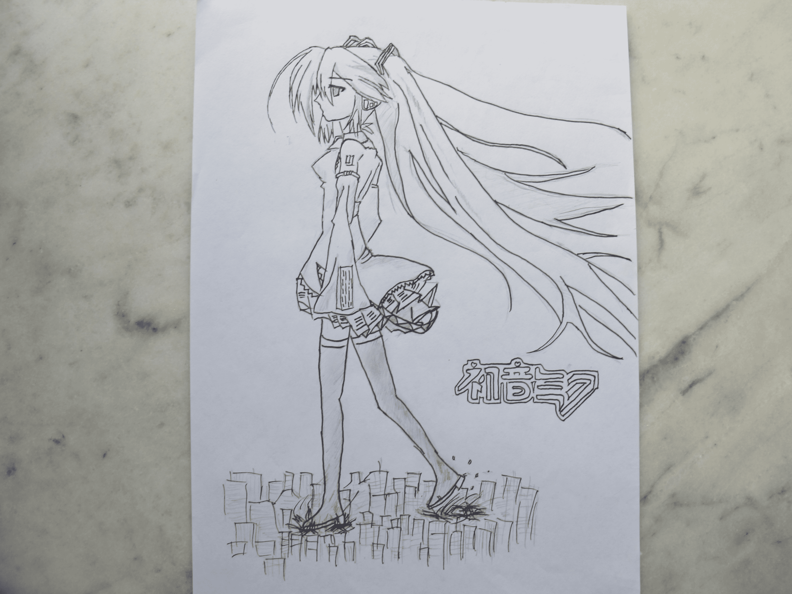
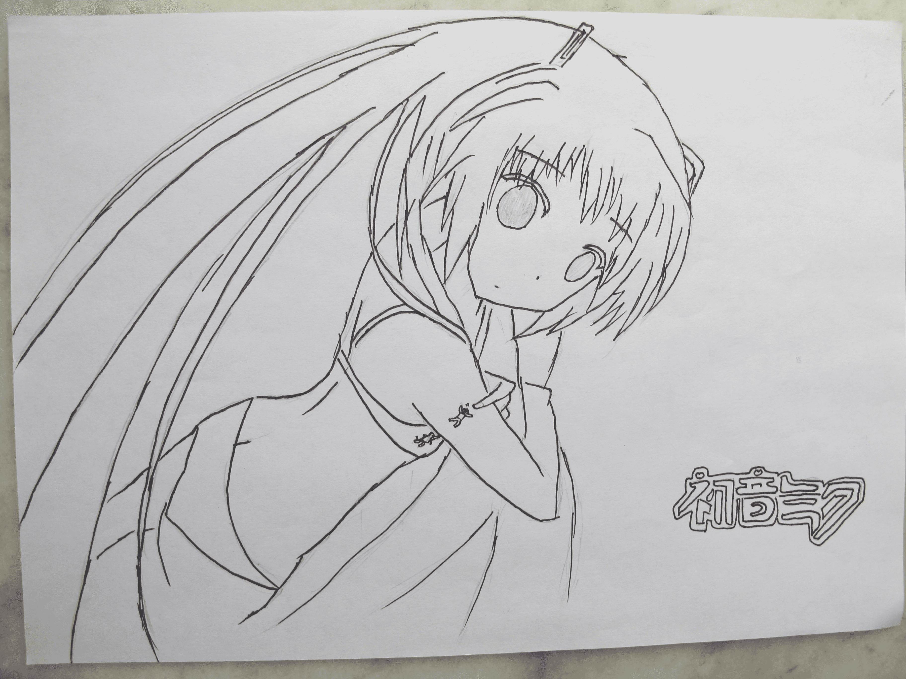
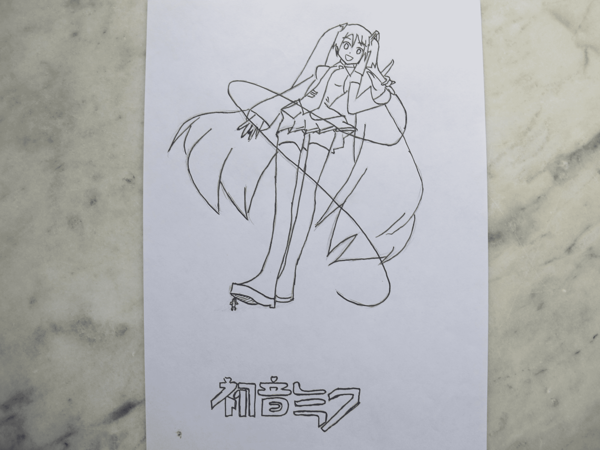
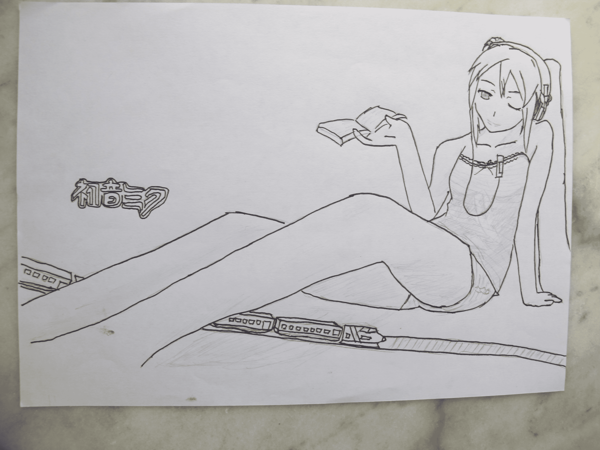
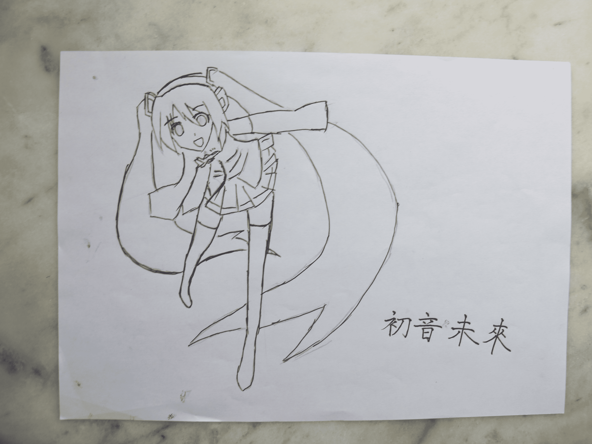
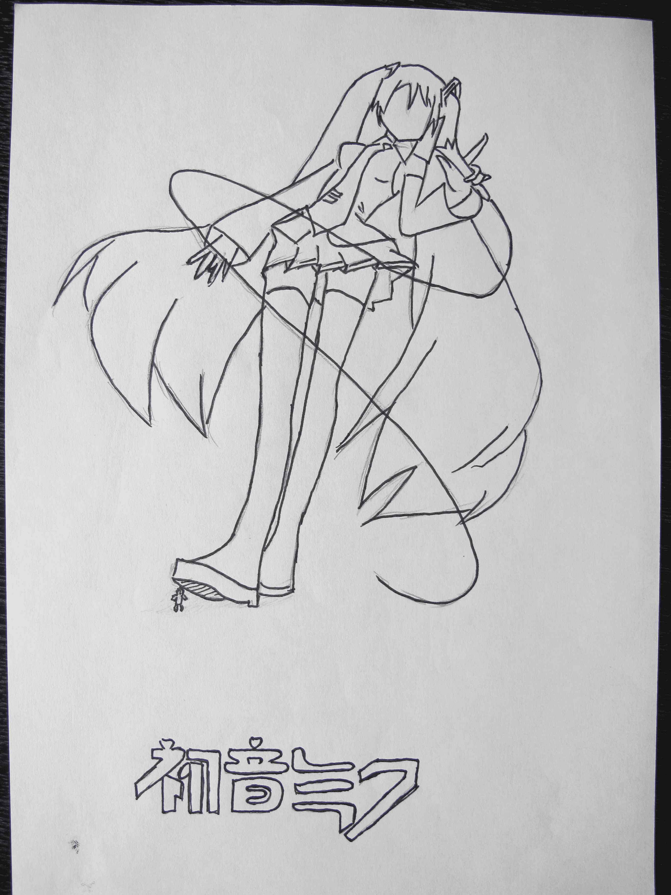
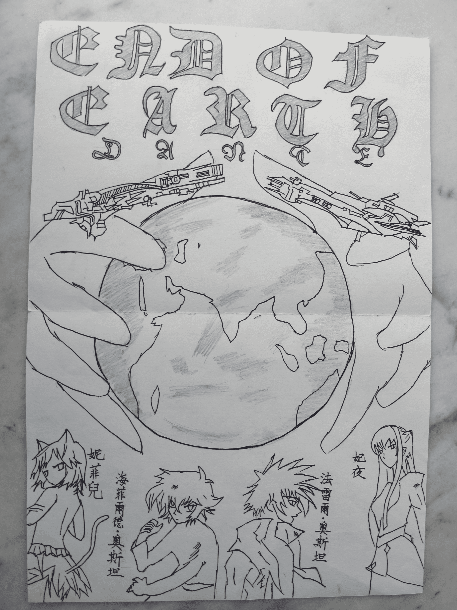

# EOE&未來之睛

作者：0128

TID：10616

 

# 1

未來之眼的困惑

這個不是重點

哎呦————！！痛~痛~痛……！！

搬着石頭砸自己的腳，真的好痛！（答應各位畫眼睛的事，連自己都没有身體力行一下，脱口就出——後悔中，但是DANTE大人說過“後悔就是背叛曾經的自己”我不能背叛，只能硬着頭皮上了！！）

少女水靈靈的大眼睛，自己真是駕馭不好！

首先，畫出臉部的分割線，找准眼睛的位置！！

位置實在太難找，一找錯，整個神態完全崩毁！！

確定眼睛的大小——難！！！

填充！！——這個我根本就不會了，直接什麼的鉛筆塗滿……

就這樣漫無邊際的尋尋覓覓，初音你的眼睛在何方…………

最後一張撿了個便宜，直接用作頭像了，哈哈哈哈哈哈哈哈——

不說了這個了——————————

這才是重點！！

有着個在下才敢在開一個新帖的……

在初二上學年，因為暑假又看了一遍EOE的緣故，突而心血來潮！有了一種畫一張海報或者是宣傳畫的念頭！

抓住念頭就不要放過！

大刀闊斧的開幹！

因為恰巧那時自己在看高達00，刹那·F·セイエイ這個人物還是比較符合我心中的莫扎特的，阿扎迪斯坦王国的玛丽娜·伊士麦，也很符合我想的妃夜，妮菲兒和法雷爾我也不想用以前自己的，在網上找着感覺走……

畫高達系列“起家”自己，還是怎麼的畫了兩艘魔艦——當然是滅十字和法雷爾那艘了，這個是自己憑借着映像畫的，然後地球（六十六蓋亞），手（或者是Hexagram和Asgard，天原和姬海娜，亦或是星魂菈碧斯的手……），哥特式的字體，只有這個在下比較滿意（模仿而已了），這幅海報不適用於整個EOE，只是單單適合於後來法雷爾出現那一段而已，要設計整個EOE，那個…………）

因為以前從來也没有設計過海報，家裏也没有現成的，再加上讀書期間，也不敢肆意妄為的上網，所以設計成這樣，又簡單，又没水平的，大家能理解麼？DANTE大人覺得怎麼樣呢？或許與您心中的大相徑庭吧？恩……恩……恩……我說完了？？

就這樣了吧！大家，積極地提出自己的意見或者是建議，在下會在今後的改進的！

謝謝各位的點擊！ 

# 2

以下為圖！

前為初音補上的眼睛，有一張已成為頭像…………

最後一張即為EOE! 

# 3

<ignore_js_op>[IMG_1654.JPG](forum.php?mod=attachment&aid=MjU2MTR8ZWMyOTdjZTd8MTYwMzg3NjQ0OHwxODIzMHwxMDYxNg%3D%3D&nothumb=yes) *(1.46 MB, 下載次數: 3)*

[下載附件](forum.php?mod=attachment&aid=MjU2MTR8ZWMyOTdjZTd8MTYwMzg3NjQ0OHwxODIzMHwxMDYxNg%3D%3D&nothumb=yes)

2011-7-18 19:55 上傳  

</ignore_js_op> <ignore_js_op>[IMG_1655.JPG](forum.php?mod=attachment&aid=MjU2MTV8MzBlNTAzOGN8MTYwMzg3NjQ0OHwxODIzMHwxMDYxNg%3D%3D&nothumb=yes) *(1.7 MB, 下載次數: 1)*

[下載附件](forum.php?mod=attachment&aid=MjU2MTV8MzBlNTAzOGN8MTYwMzg3NjQ0OHwxODIzMHwxMDYxNg%3D%3D&nothumb=yes)

2011-7-18 19:55 上傳  

</ignore_js_op> <ignore_js_op>[IMG_1656.JPG](forum.php?mod=attachment&aid=MjU2MTZ8NGRlY2YxYWN8MTYwMzg3NjQ0OHwxODIzMHwxMDYxNg%3D%3D&nothumb=yes) *(1.41 MB, 下載次數: 1)*

[下載附件](forum.php?mod=attachment&aid=MjU2MTZ8NGRlY2YxYWN8MTYwMzg3NjQ0OHwxODIzMHwxMDYxNg%3D%3D&nothumb=yes)

2011-7-18 19:55 上傳  

</ignore_js_op> <ignore_js_op>[IMG_1657.JPG](forum.php?mod=attachment&aid=MjU2MTd8ODkwNDRlMzl8MTYwMzg3NjQ0OHwxODIzMHwxMDYxNg%3D%3D&nothumb=yes) *(1.46 MB, 下載次數: 1)*

[下載附件](forum.php?mod=attachment&aid=MjU2MTd8ODkwNDRlMzl8MTYwMzg3NjQ0OHwxODIzMHwxMDYxNg%3D%3D&nothumb=yes)

2011-7-18 19:55 上傳  

</ignore_js_op> <ignore_js_op>[IMG_1659.JPG](forum.php?mod=attachment&aid=MjU2MTh8OWIwN2E1ZDB8MTYwMzg3NjQ0OHwxODIzMHwxMDYxNg%3D%3D&nothumb=yes) *(1.3 MB, 下載次數: 1)*

[下載附件](forum.php?mod=attachment&aid=MjU2MTh8OWIwN2E1ZDB8MTYwMzg3NjQ0OHwxODIzMHwxMDYxNg%3D%3D&nothumb=yes)

2011-7-18 19:55 上傳  

</ignore_js_op> <ignore_js_op>[旋&#36716; IMG_1640.JPG](forum.php?mod=attachment&aid=MjU2MTl8ZGM4N2IyZmN8MTYwMzg3NjQ0OHwxODIzMHwxMDYxNg%3D%3D&nothumb=yes) *(1.89 MB, 下載次數: 1)*

[下載附件](forum.php?mod=attachment&aid=MjU2MTl8ZGM4N2IyZmN8MTYwMzg3NjQ0OHwxODIzMHwxMDYxNg%3D%3D&nothumb=yes)

2011-7-18 19:55 上傳  

</ignore_js_op> <ignore_js_op>[旋&#36716; IMG_1652.JPG](forum.php?mod=attachment&aid=MjU2MjB8YTA2Zjc1Yjh8MTYwMzg3NjQ0OHwxODIzMHwxMDYxNg%3D%3D&nothumb=yes) *(2 MB, 下載次數: 1)*

[下載附件](forum.php?mod=attachment&aid=MjU2MjB8YTA2Zjc1Yjh8MTYwMzg3NjQ0OHwxODIzMHwxMDYxNg%3D%3D&nothumb=yes)

2011-7-18 19:55 上傳  

</ignore_js_op>  

# 4

狂草兄！！你太快了！！

話說每一次上傳圖片，為什麼都這麼慢慢的呢？

一張圖（照片）也就2MB而已……

[ *本帖最後由 0128 於 2011-7-18 19:58 編輯* ] 

# 5

作者最開心的事，就是看着同好的評論…………

“Dante<[danteliu99@gmail.com](mailto:danteliu99@gmail.com)> 20:37:15

「在初二上學年，因為暑假又看了一遍EOE的緣故」

我開始覺得我會被政府列為列管對象，戕害國家幼苗”

其實我在下一直都在隱身…

“緘默……不要插話，不要亂講話，靜靜地看着就行，現在這樣，今後也這樣”在QQ群這個方面，我一直這樣想着……

看着，其實，那時，我，真的，有點，如今，現在，內疚，悔意，刪除……

呃啊！語無倫次了……

家裏只有一台打印機，

這個用掃描儀，這個恐怕不行，

想想把這個拿到老爹辦公室，遞給老爸，老爸……然後會掃描麼…… 

# 6

另外，後面在下也會致力於創作手繪圖片（或者是把以前的繪制圖片翻出來改一改）

寫小說太難打字了，主要是使用電腦時間的有限，手繪的話就在那裏用手和鉛筆畫，至多用一下橡皮……

預計會在這個暑假再發一次，不出意外應該是敢達和新世紀福音戰士的……

這個暑假過去後，可能就不會在怎麼發圖了…… 

# 7

回 phone2345君 您能说清楚一点“其他的可能要注意比例”的哪些些比例呢？

在下在今后的画中好修改~ 

# 8

猫耳，这个……还是不行吧~

高达的就不管了……先解决EVA的，机体算了……

扫描机是老爹办公室的……在下……真的这个不是有勇气就能办好的……

其实，这些图都没有太强的画面感，没有带入性，单调乏味，更没有“实用”价值的。

所以……到此为止~