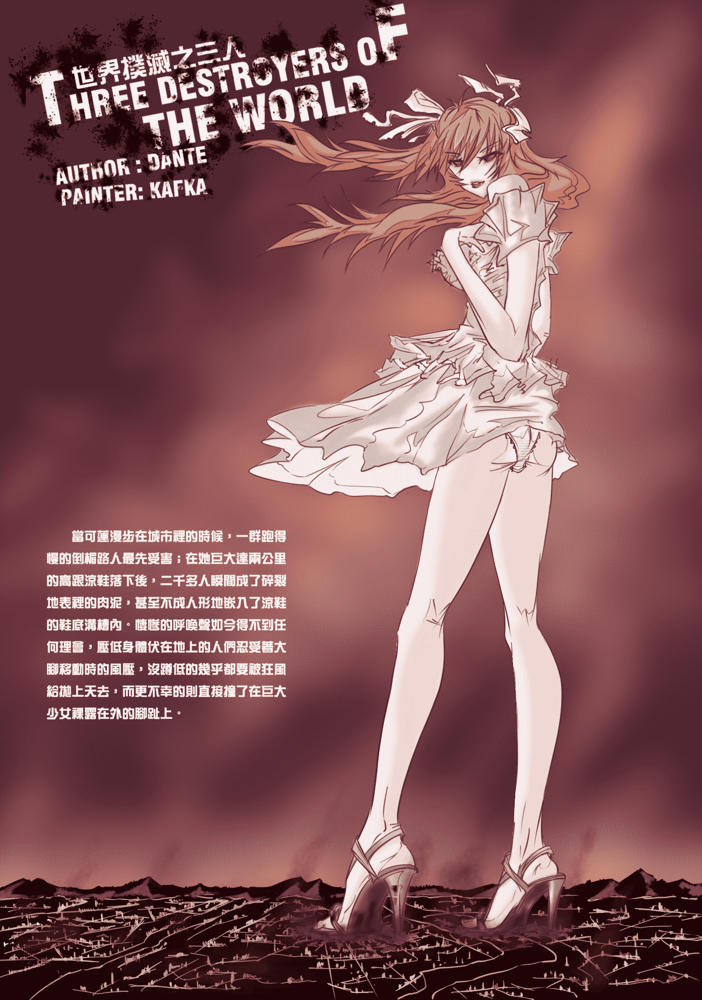
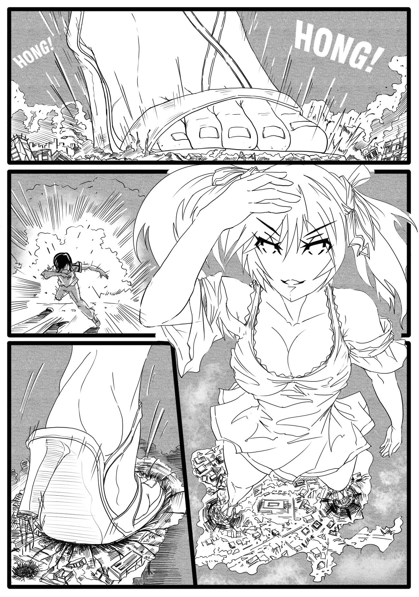
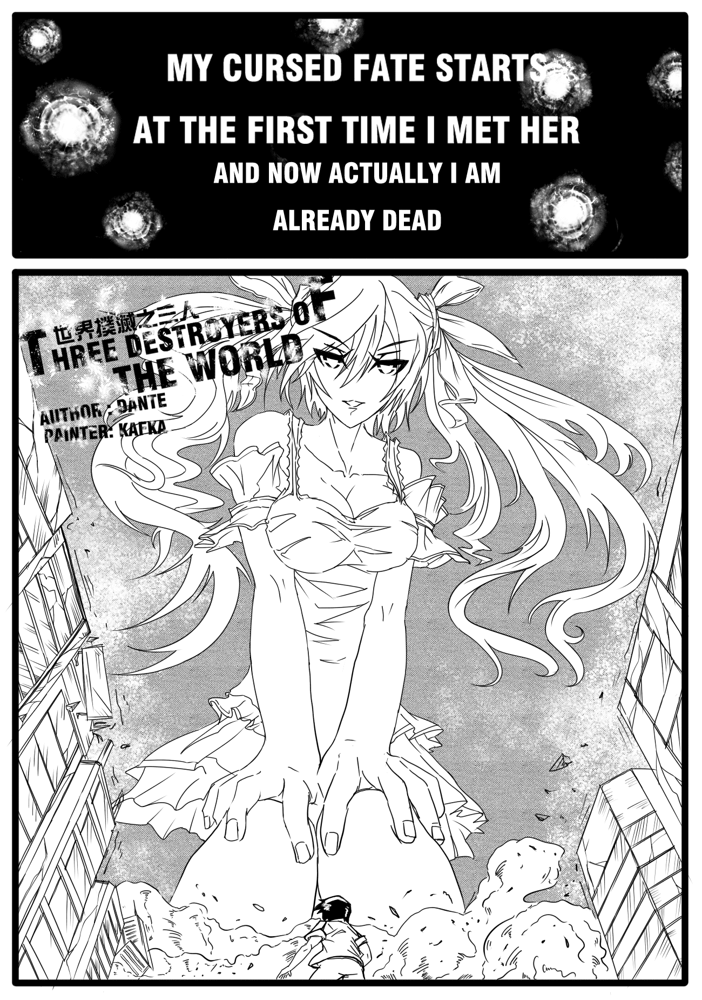
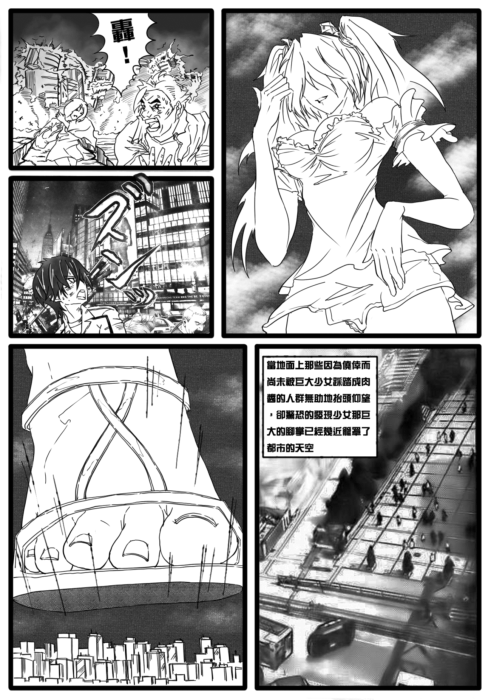
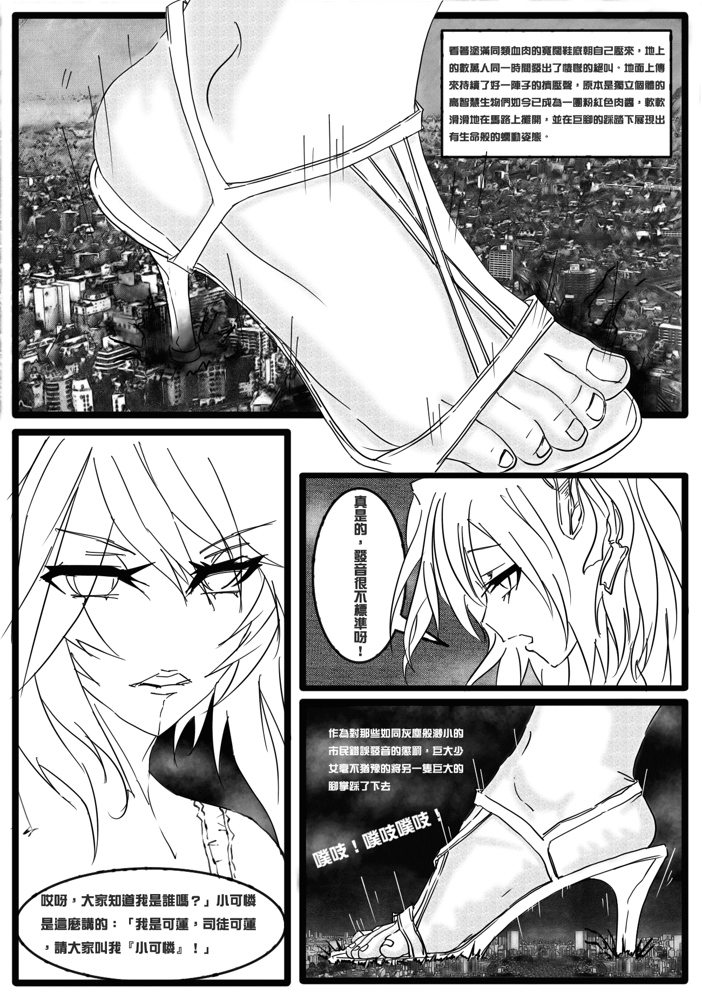
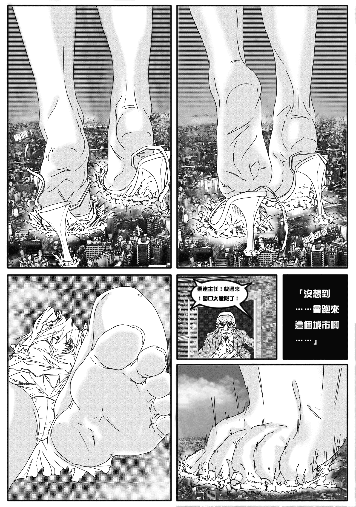
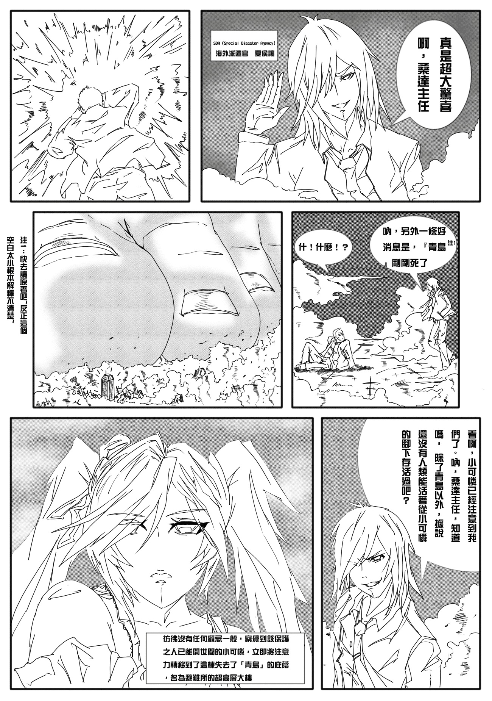
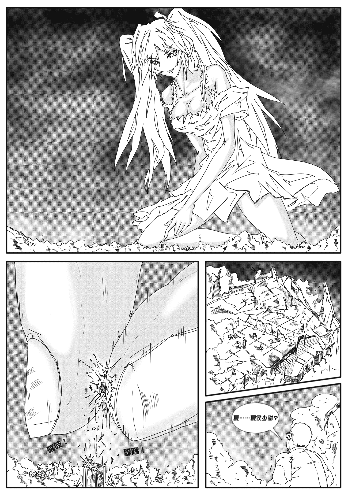

# Kafka DGU故事改編之【世界撲滅之三人】1月21日第三次更新

作者：kunoichi99

TID：9135

 

# 1

大家好！去年下半年以後由於一直在外地讀研，加上我的懶惰，曾經向V姐和但大還有大家許諾的DGU新故事改變的事情就一拖再拖直至今日，繁忙的一學期終於告一段落，家中又出了大事，回到長春后依然為十分忙碌，直到昨天才終於有時間了，得以翻一翻去年7月時候開始著手的改變的畫稿，思來想去終覺質量實在差強人意，不足以掛在網上銷售，再者假期短暫，無法保證一個假期的時間能否完成全部的故事，因此最後決定還是一如上次的《至黑之夜》一樣發在站裡，供大家指教。在這裡向V姐和但大再次道歉了！

在製作《世界》前我曾和但大在MSN上交流了關於人設和劇情等方面的問題，這個短篇會在這幾天陸續更新，只能保證最多每天1頁的速度，期望能夠保留DGU故事的原汁原味！

18日第一次更新两页 许久不画，手有些生疏了  19日第二次更新一頁與logo 21日第三次更新兩頁，劇情內容剛剛開始，很著急想把夏侯讓一邊忘我的在廢墟上如指揮樂團般手舞足蹈，小可憐一邊盡情的殺戮的場景畫出來。（背景音樂是命運交響曲嗎？夏侯讓有神谷娘娘的聲音嗎？）

<ignore_js_op>

**TITLE.jpg** *(165.5 KB, 下載次數: 39)*

[下載附件](forum.php?mod=attachment&aid=MjI4Njd8OTI3NTY0OTJ8MTYwMzgyNTg5NXwxODIzMHw5MTM1&nothumb=yes)

2011-1-19 20:44 上傳

<ignore_js_op>

**COVER.jpg** *(1.09 MB, 下載次數: 177)*

[下載附件](forum.php?mod=attachment&aid=MjI3ODJ8ZWFkZDExYTB8MTYwMzgyNTg5NXwxODIzMHw5MTM1&nothumb=yes)

2011-1-16 09:13 上傳

<ignore_js_op>

**2.jpg** *(1.53 MB, 下載次數: 157)*

[下載附件](forum.php?mod=attachment&aid=MjI3ODR8ZDVjOWYwYzB8MTYwMzgyNTg5NXwxODIzMHw5MTM1&nothumb=yes)

2011-1-16 09:13 上傳

<ignore_js_op>

**1.jpg** *(1.37 MB, 下載次數: 116)*

[下載附件](forum.php?mod=attachment&aid=MjI3ODN8YjIwZWZmMTV8MTYwMzgyNTg5NXwxODIzMHw5MTM1&nothumb=yes)

2011-1-16 09:13 上傳

<ignore_js_op>

**3.jpg** *(1.38 MB, 下載次數: 142)*

[下載附件](forum.php?mod=attachment&aid=MjI4NDZ8YjJjNjY2ODZ8MTYwMzgyNTg5NXwxODIzMHw5MTM1&nothumb=yes)

2011-1-18 21:52 上傳

<ignore_js_op>

**4.jpg** *(1.22 MB, 下載次數: 132)*

[下載附件](forum.php?mod=attachment&aid=MjI4NDd8MjBiYTI1Yzl8MTYwMzgyNTg5NXwxODIzMHw5MTM1&nothumb=yes)

2011-1-18 21:52 上傳

<ignore_js_op>

**5.jpg** *(1.6 MB, 下載次數: 127)*

[下載附件](forum.php?mod=attachment&aid=MjI4NjZ8Y2MxMDRjNDB8MTYwMzgyNTg5NXwxODIzMHw5MTM1&nothumb=yes)

2011-1-19 20:16 上傳

<ignore_js_op>

**6.jpg** *(1.35 MB, 下載次數: 152)*

[下載附件](forum.php?mod=attachment&aid=MjI5MDZ8ZTI0OTYyMzl8MTYwMzgyNTg5NXwxODIzMHw5MTM1&nothumb=yes)

2011-1-21 14:43 上傳

<ignore_js_op>

**7.jpg** *(1.62 MB, 下載次數: 136)*

[下載附件](forum.php?mod=attachment&aid=MjI5MDd8MGFhNGJhMTB8MTYwMzgyNTg5NXwxODIzMHw5MTM1&nothumb=yes)

2011-1-21 14:43 上傳

[ *本帖最後由 kunoichi99 於 2011-1-21 14:43 編輯* ] 

# 2

感謝大家對我的鼓勵！

我自己也希望能夠把這個故事完成到最後，因此我在試圖壓縮整個故事的篇幅，通過限制頁數來保證能夠最後完結（這是從畫至黑之夜時總結出的教訓，當然，如果時間允許我希望至黑之夜還能夠繼續畫出來，因為我非常喜歡那篇。）

給但大的小說配插圖正是我最近一直考慮的事情，當然，那需要在我和但大進行了充足的溝通之後。（給小說配插圖似乎比畫漫畫要相對更自由和容易一些吧！PS：最近有幸在路邊報刊亭舊雜誌里翻出了PIXIV的第一期季刊，十分開心！）

[ *本帖最後由 kunoichi99 於 2011-1-16 20:28 編輯* ] 

# 3

嗯，那個LOGO就是為網頁版製作的啦，嘿嘿</ignore_js_op></ignore_js_op></ignore_js_op></ignore_js_op></ignore_js_op></ignore_js_op></ignore_js_op></ignore_js_op></ignore_js_op>