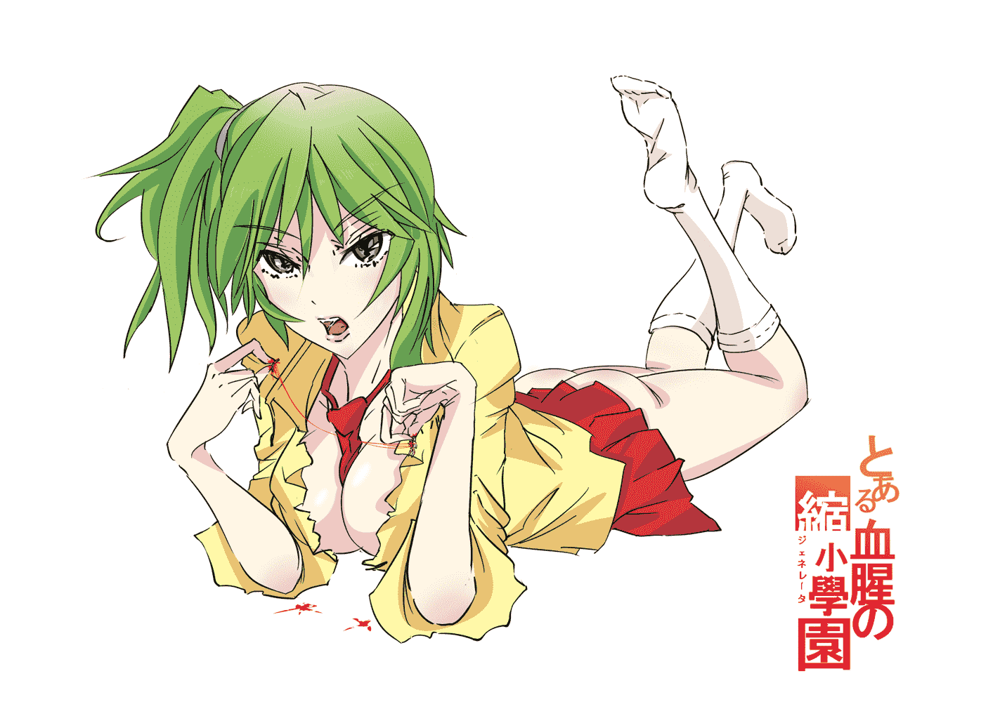

# Kafka【縮小學園】应援 2（繪裡香）

作者：kunoichi99

TID：10105

<title>1</title> <link href="../Styles/Style.css" type="text/css" rel="stylesheet">

# 1

今天上午一口氣把縮小學園通關啦！
這次畫的是綠毛少女繪裡香  這還是第一次畫吞食系的角色，因為對VORE完全無愛，所以我嘗試著加入一點獵奇的成份（這讓才好HIGH起來畫下去 ），好比吃魚的時候一些人喜歡直接把刺和肉一起嚼著吃，一些則喜歡把脊椎骨的大刺挑出來再吃一樣……嘛……  這幅畫就是這個意思啦……
套用Bilibili上面常用的彈幕“大家好 我是領帶君”
<ignore_js_op>

**&#32553;小&#23398;&#22253;-2.jpg** *(489.42 KB, 下載次數: 14)*

[下載附件](forum.php?mod=attachment&aid=MjQ0MDZ8NTE5OGMxNjl8MTYwMzg3MDczNnwxODIzMHwxMDEwNQ%3D%3D&nothumb=yes)

2011-5-6 18:41 上傳

<title>2</title> <link href="../Styles/Style.css" type="text/css" rel="stylesheet">

# 2

我……我就知道你們會說那是……龍鬚糖……
身材好才能為大家殺必死嘛~
XNR君可以搜一下 広島祐介 這個人，或者在PIVIX上搜Mebae這個作者
我一直很喜歡他的畫風，他的畫大都線條流暢、配色簡練，感覺也是P站現在比較流行的畫風，嘿嘿
明天畫成惠吧！</ignore_js_op>