# Kafka【至黑之夜Reload】第三夜 “改名Reload”啦！

作者：kunoichi99

TID：6643

<title>1</title> <link href="../Styles/Style.css" type="text/css" rel="stylesheet">

# 1

<ignore_js_op>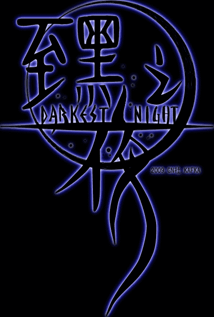

**至黑之夜LOGO.jpg** *(89.03 KB, 下載次數: 10)*

[下載附件](forum.php?mod=attachment&aid=MTcyNzl8OGVkNGE4NGN8MTYwMzg1NzUwMnwxODIzMHw2NjQz&nothumb=yes)

2010-2-10 21:18 上傳

“媽媽說看漫畫不留言是牛盲的行為！”
在XNR君強大作品的號召下，終於決定提起筆來把又又又（為什麼會有這麼多又呢……好奇怪）拖了很久的至黑之夜第三話給畫完了，筆法依舊很顯粗糙，網紙技術依舊在繼續磨練中，望諸君見諒。
    1月11日轟轟烈烈的考研“一年戰爭”終於結束了，在回家的動車組上蝸在角落里把但大的幾部小說又看了一遍，心情蠻愉悅的說~
   這一話我其實壓了好久猶豫放不放出來，因為在這一話中女主角希薇兒的性格發生了很大的改變，按照我個人的想法，她從“一開始就很溫柔”變成了“一開始防範心理很強很封閉，經過同爛好人般的賈維斯朝夕相處的磨合漸漸表露出了真實的內心”，但是這樣一來，一開始的希薇兒的性格就和但大的原文相去甚遠了，爲了掩飾內心的孤獨和不安而裝的很強勢，可以的欺負賈維斯君，不過最後還是回歸了，但是這個過程賈維斯君就要受苦了
   因此，由於在將來的故事線路同原文比有所擴充，情節方面發生了改變，我想從這一話起將名字改為《至黑之夜Reload》，這樣就算出現了敗筆也不會影響到原著本身，也算是爲了減少我自己寫故事流程時的不安吧。
    最後，我想說，畫漫畫還真是累死人的事情 。一般每當我要畫新一話時，首先要再讀幾遍原文的相關段落，然後在白紙上考慮分鏡稿（這個過程很有趣，但有時也很傷腦筋……），構思每個分鏡的臺詞，之後再根據分鏡稿在電腦上畫底稿，然後勾出線稿，上網紙，畫效果氣氛，畫對話泡泡，填寫臺詞，轉換分辨率和圖片格式，才算一頁稿子完成了。 這個過程很花時間，有時候畫得直噁心 ，但是一想到最後發稿時的喜悅心情，這些也就不算什麽了~說這些只是想吐一吐悶氣吧~（許願：賜給我一個助手吧賜給我一個助手吧賜給我一個助手吧……）
    最近很迷西尾維新！
    就這些啦，希望大家能喜歡這一話！預祝大家新春快樂！

                                                                                                 Kafka

[ *本帖最後由 kunoichi99 於 2010-2-10 21:29 編輯* ]<title>2</title> <link href="../Styles/Style.css" type="text/css" rel="stylesheet">

# 2

 <ignore_js_op>[1.jpg](forum.php?mod=attachment&aid=MTcyODB8NWNmMTc3MzR8MTYwMzg1NzUwMnwxODIzMHw2NjQz&nothumb=yes) *(392.13 KB, 下載次數: 160)*

[下載附件](forum.php?mod=attachment&aid=MTcyODB8NWNmMTc3MzR8MTYwMzg1NzUwMnwxODIzMHw2NjQz&nothumb=yes)

2010-2-10 21:18 上傳  

[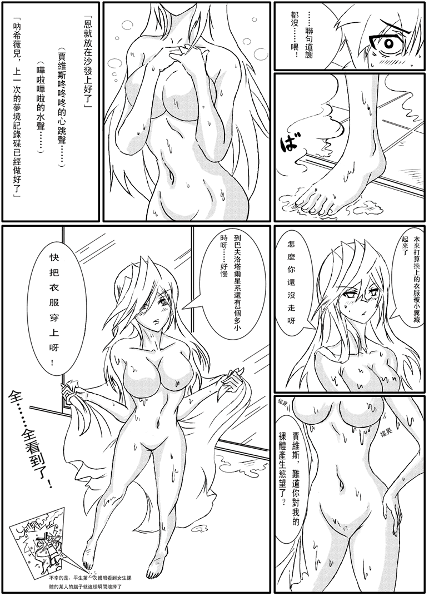](javascript:;)</ignore_js_op> <ignore_js_op>[2.jpg](forum.php?mod=attachment&aid=MTcyODF8OGFjOTc3NjB8MTYwMzg1NzUwMnwxODIzMHw2NjQz&nothumb=yes) *(380.55 KB, 下載次數: 152)*

[下載附件](forum.php?mod=attachment&aid=MTcyODF8OGFjOTc3NjB8MTYwMzg1NzUwMnwxODIzMHw2NjQz&nothumb=yes)

2010-2-10 21:18 上傳  

[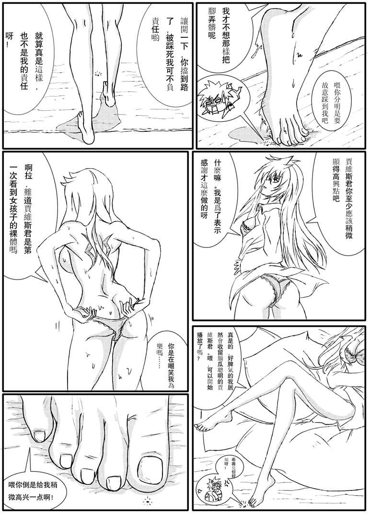](javascript:;)</ignore_js_op> <ignore_js_op>[3.jpg](forum.php?mod=attachment&aid=MTcyODJ8MGM0NzYwY2Z8MTYwMzg1NzUwMnwxODIzMHw2NjQz&nothumb=yes) *(480.77 KB, 下載次數: 130)*

[下載附件](forum.php?mod=attachment&aid=MTcyODJ8MGM0NzYwY2Z8MTYwMzg1NzUwMnwxODIzMHw2NjQz&nothumb=yes)

2010-2-10 21:18 上傳  

[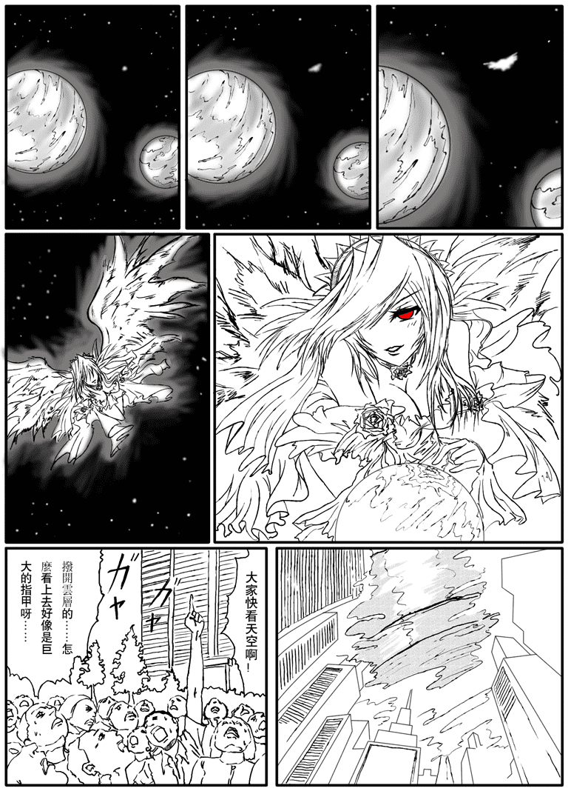](javascript:;)</ignore_js_op> <ignore_js_op>[4.jpg](forum.php?mod=attachment&aid=MTcyODN8M2IzNzM3OTZ8MTYwMzg1NzUwMnwxODIzMHw2NjQz&nothumb=yes) *(465.76 KB, 下載次數: 140)*

[下載附件](forum.php?mod=attachment&aid=MTcyODN8M2IzNzM3OTZ8MTYwMzg1NzUwMnwxODIzMHw2NjQz&nothumb=yes)

2010-2-10 21:18 上傳  

[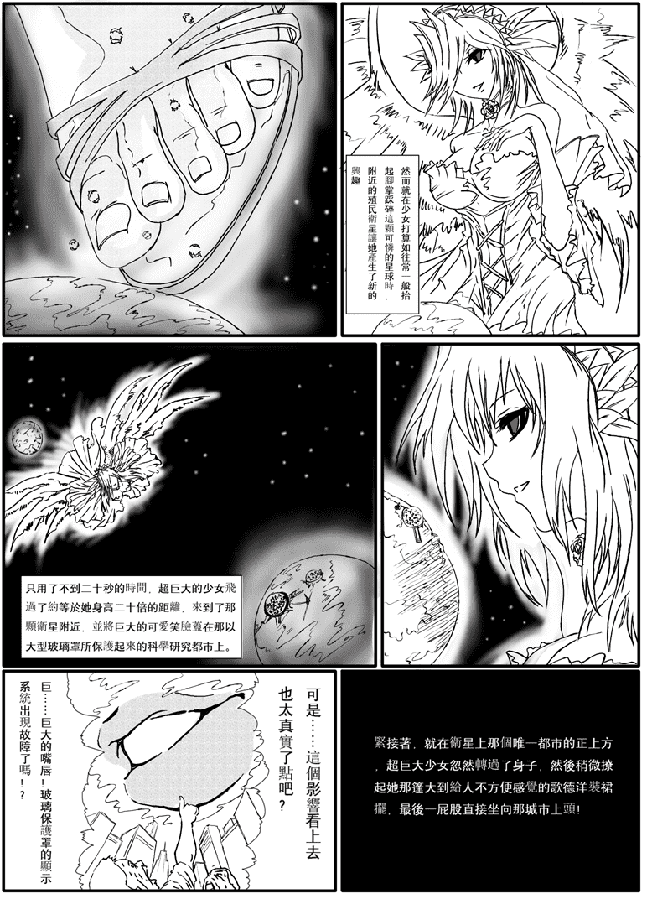](javascript:;)</ignore_js_op> <ignore_js_op>[5.jpg](forum.php?mod=attachment&aid=MTcyODR8ODg1ODMwNzZ8MTYwMzg1NzUwMnwxODIzMHw2NjQz&nothumb=yes) *(389.52 KB, 下載次數: 133)*

[下載附件](forum.php?mod=attachment&aid=MTcyODR8ODg1ODMwNzZ8MTYwMzg1NzUwMnwxODIzMHw2NjQz&nothumb=yes)

2010-2-10 21:18 上傳  

[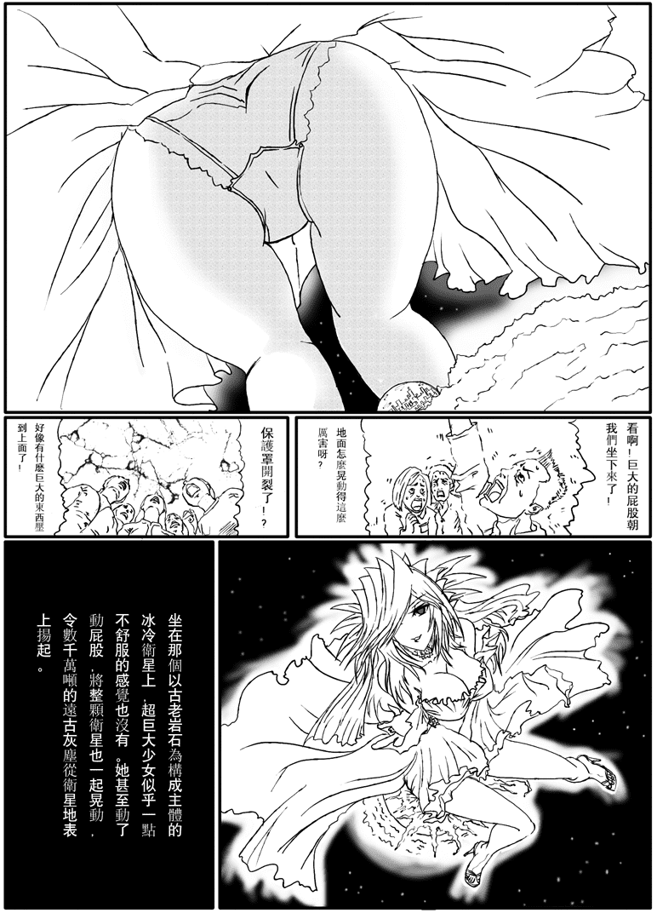](javascript:;)</ignore_js_op> <ignore_js_op>[6.jpg](forum.php?mod=attachment&aid=MTcyODV8Zjg1YTU0YmF8MTYwMzg1NzUwMnwxODIzMHw2NjQz&nothumb=yes) *(436.65 KB, 下載次數: 137)*

[下載附件](forum.php?mod=attachment&aid=MTcyODV8Zjg1YTU0YmF8MTYwMzg1NzUwMnwxODIzMHw2NjQz&nothumb=yes)

2010-2-10 21:18 上傳  

[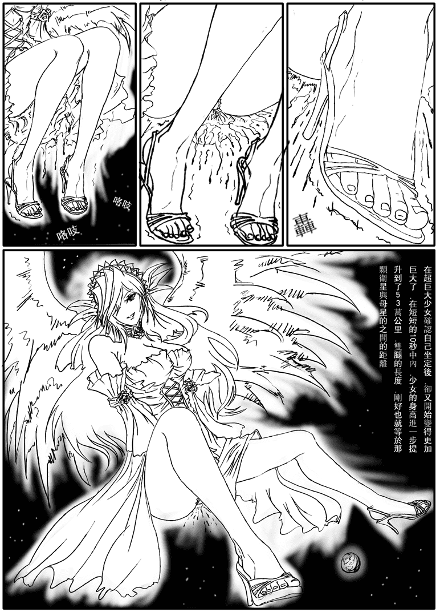](javascript:;)</ignore_js_op> <ignore_js_op>[7.jpg](forum.php?mod=attachment&aid=MTcyODZ8MjhiYTNiNmR8MTYwMzg1NzUwMnwxODIzMHw2NjQz&nothumb=yes) *(402.47 KB, 下載次數: 137)*

[下載附件](forum.php?mod=attachment&aid=MTcyODZ8MjhiYTNiNmR8MTYwMzg1NzUwMnwxODIzMHw2NjQz&nothumb=yes)

2010-2-10 21:18 上傳  

[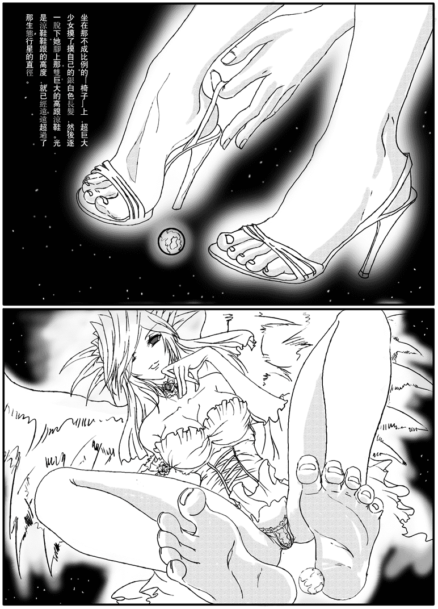](javascript:;)</ignore_js_op> <ignore_js_op>[8.jpg](forum.php?mod=attachment&aid=MTcyODd8ZTM2MmE0OTJ8MTYwMzg1NzUwMnwxODIzMHw2NjQz&nothumb=yes) *(426.21 KB, 下載次數: 167)*

[下載附件](forum.php?mod=attachment&aid=MTcyODd8ZTM2MmE0OTJ8MTYwMzg1NzUwMnwxODIzMHw2NjQz&nothumb=yes)

2010-2-10 21:18 上傳  

[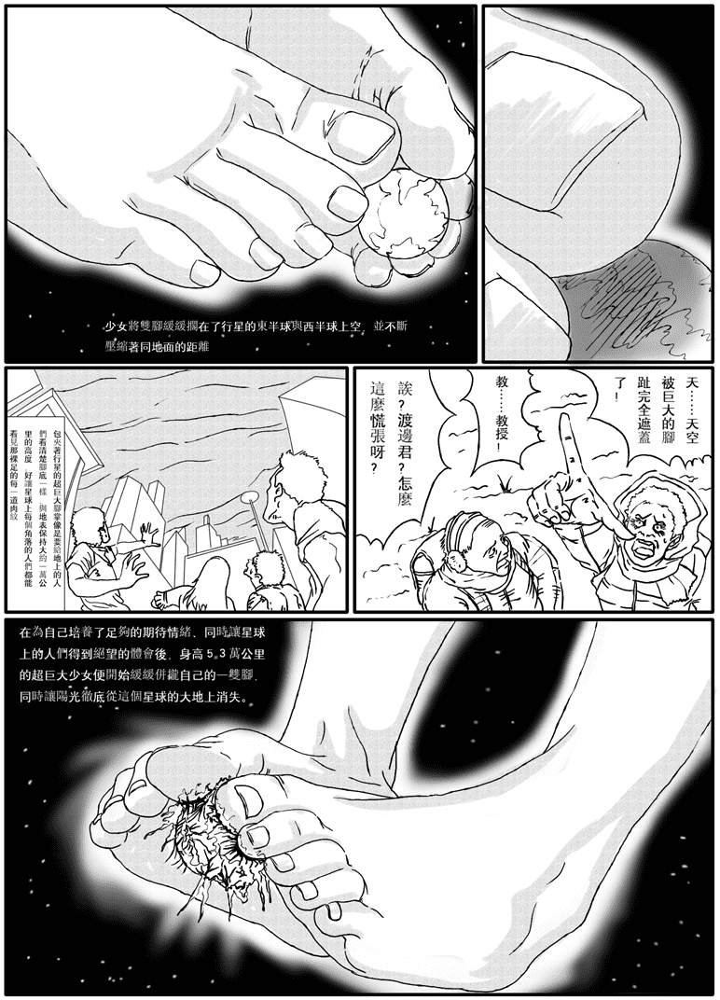](javascript:;)</ignore_js_op> <ignore_js_op>[9.jpg](forum.php?mod=attachment&aid=MTcyODh8ZGFlMGQxNTl8MTYwMzg1NzUwMnwxODIzMHw2NjQz&nothumb=yes) *(465.16 KB, 下載次數: 132)*

[下載附件](forum.php?mod=attachment&aid=MTcyODh8ZGFlMGQxNTl8MTYwMzg1NzUwMnwxODIzMHw2NjQz&nothumb=yes)

2010-2-10 21:18 上傳  

[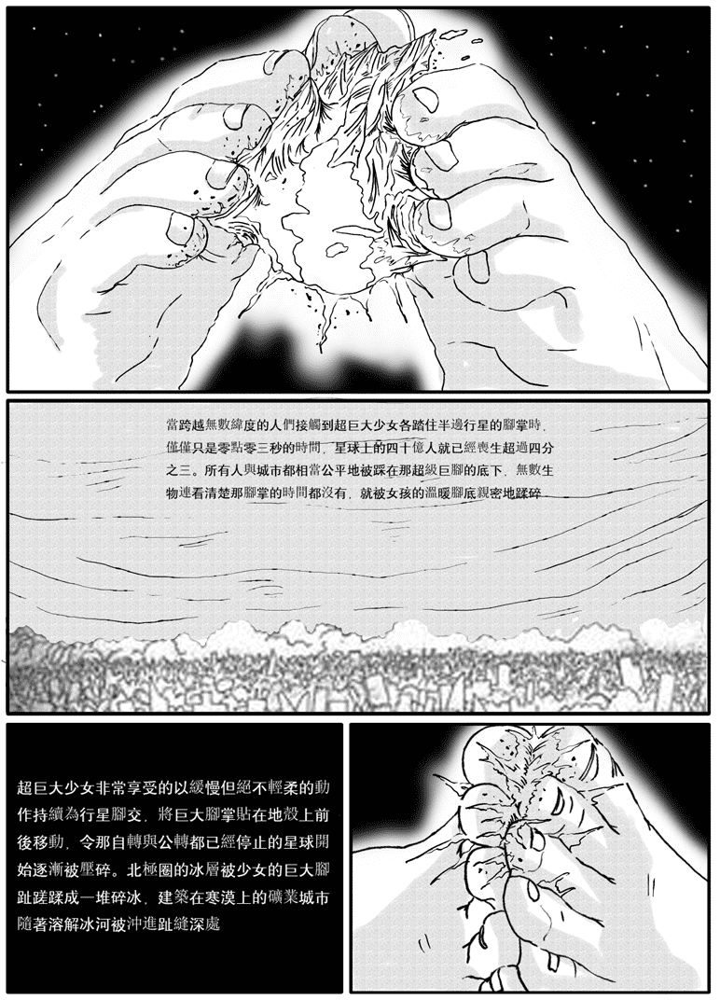](javascript:;)</ignore_js_op> <ignore_js_op>[10.jpg](forum.php?mod=attachment&aid=MTcyODl8ZjYzN2JiZTZ8MTYwMzg1NzUwMnwxODIzMHw2NjQz&nothumb=yes) *(645.35 KB, 下載次數: 138)*

[下載附件](forum.php?mod=attachment&aid=MTcyODl8ZjYzN2JiZTZ8MTYwMzg1NzUwMnwxODIzMHw2NjQz&nothumb=yes)

2010-2-10 21:18 上傳  

[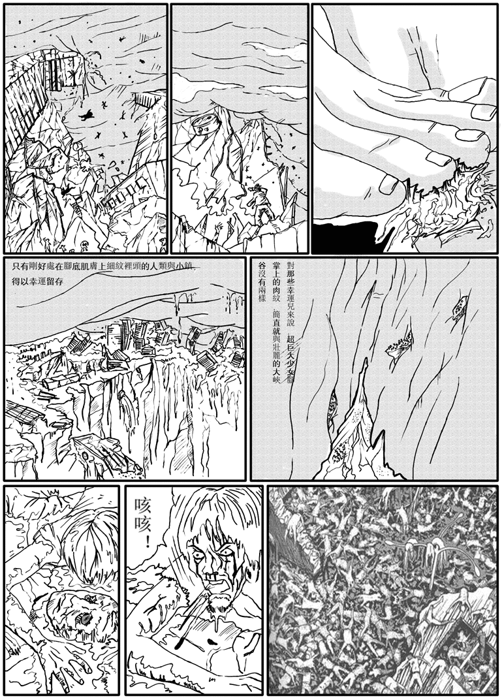](javascript:;)</ignore_js_op> <ignore_js_op>[11.jpg](forum.php?mod=attachment&aid=MTcyOTB8M2IxNjUxMGV8MTYwMzg1NzUwMnwxODIzMHw2NjQz&nothumb=yes) *(373.31 KB, 下載次數: 136)*

[下載附件](forum.php?mod=attachment&aid=MTcyOTB8M2IxNjUxMGV8MTYwMzg1NzUwMnwxODIzMHw2NjQz&nothumb=yes)

2010-2-10 21:27 上傳  

[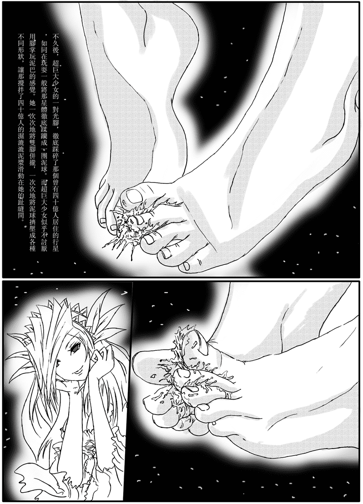](javascript:;)</ignore_js_op> <ignore_js_op>[12.jpg](forum.php?mod=attachment&aid=MTcyOTF8OGViYjcwZDF8MTYwMzg1NzUwMnwxODIzMHw2NjQz&nothumb=yes) *(400.74 KB, 下載次數: 163)*

[下載附件](forum.php?mod=attachment&aid=MTcyOTF8OGViYjcwZDF8MTYwMzg1NzUwMnwxODIzMHw2NjQz&nothumb=yes)

2010-2-10 21:18 上傳  

[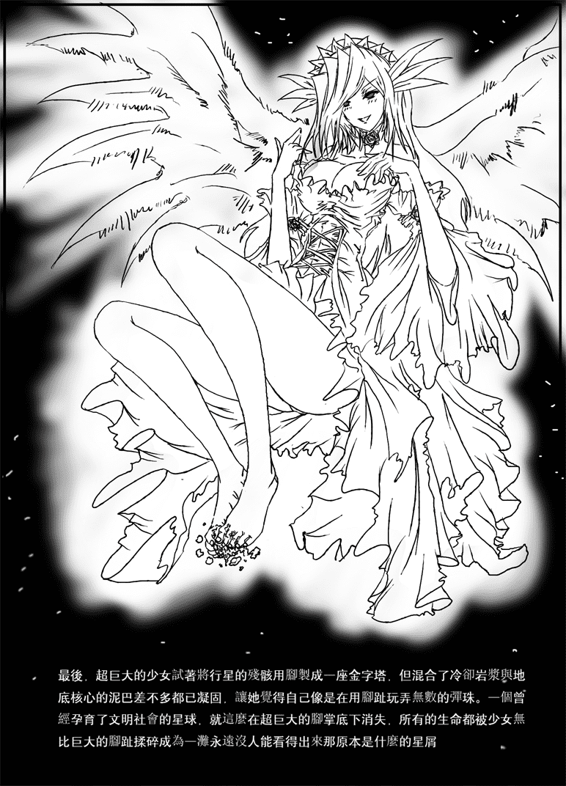](javascript:;)</ignore_js_op> <ignore_js_op>[13.jpg](forum.php?mod=attachment&aid=MTcyOTJ8NWU1YWNkMjN8MTYwMzg1NzUwMnwxODIzMHw2NjQz&nothumb=yes) *(386.71 KB, 下載次數: 150)*

[下載附件](forum.php?mod=attachment&aid=MTcyOTJ8NWU1YWNkMjN8MTYwMzg1NzUwMnwxODIzMHw2NjQz&nothumb=yes)

2010-2-10 21:18 上傳  

[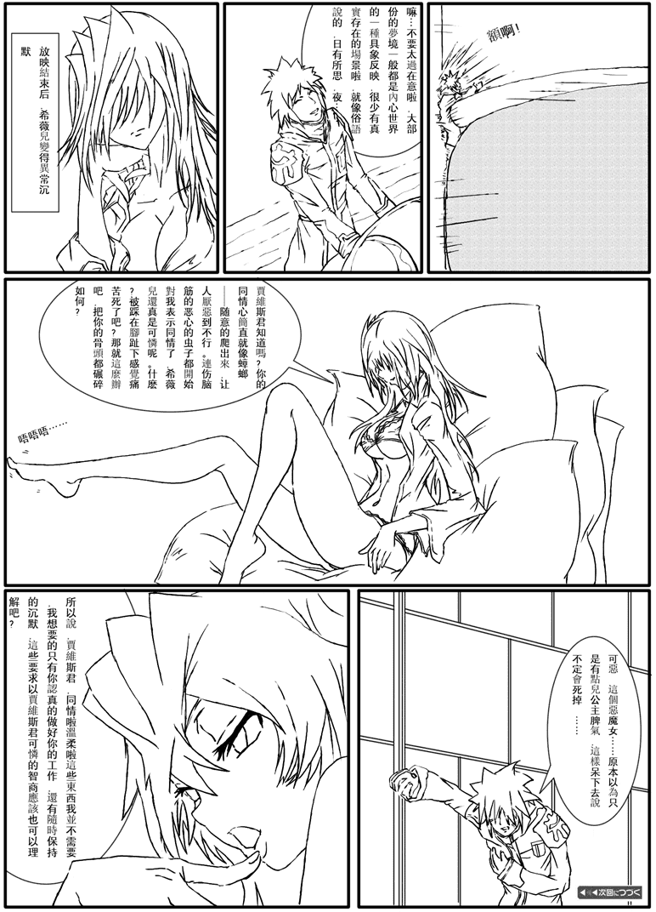](javascript:;)</ignore_js_op> <title>3</title> <link href="../Styles/Style.css" type="text/css" rel="stylesheet">

# 3

> 原帖由 *Dante* 於 2010-2-11 22:53 發表 
> .
> 這兩天事情多，一時竟把論壇忽略了。
> 未能在第一時間趕來替自己作品的改編漫畫版本表達支持，真是我年前最大的遺憾。
> 
> 首先，恭喜 Kafka 結束壯烈的一(考)年(研)戰(究)爭(所)，希望你有考取自己理想的 ...

但大終於浮出水面啦……恩關於私底下把但大的原作給改得面目全非。。。心裡一直過意不去。。。但大的心情和想法咱家是特別理解的啦！所以，其實但大對於我的想法有任何的反對觀點一定要和我說！（總感覺但大對我太過客氣了……）請一定要告訴我哦！因為我本身不是最初想出這個故事的人，所以在情節的架構上肯定比原作者差很遠~

下面是回復XNR君的：嗯嗯XNR君關於腳的畫法的指點真的是一針見血 明眼人一嘴就說出來了，這個問題我在畫完以後回過頭看的時候也意識到了！不過苦於手頭上白兔的作品太少了……除了CG17君給我傳的縮小學園的CG。。就沒了QQ
所以吶，我的潛臺詞是吧……哪位大大要是有呢……分享給某點兒。。嘿嘿
非常期待XNR君的漫畫！

下面是回復WJD醬的：其實真的不是嫌W醬慢什麽的啦……我那個短信的意思只是表面意思。。。 其實就是“我自己把第一頁弄完了”的表面意思。。
如果W醬還有興趣的話……下一話我會等圖全部描好以後再發給WJD醬的！（然後就把拖稿好久的責任全部推卸到某人身上 ）</ignore_js_op>