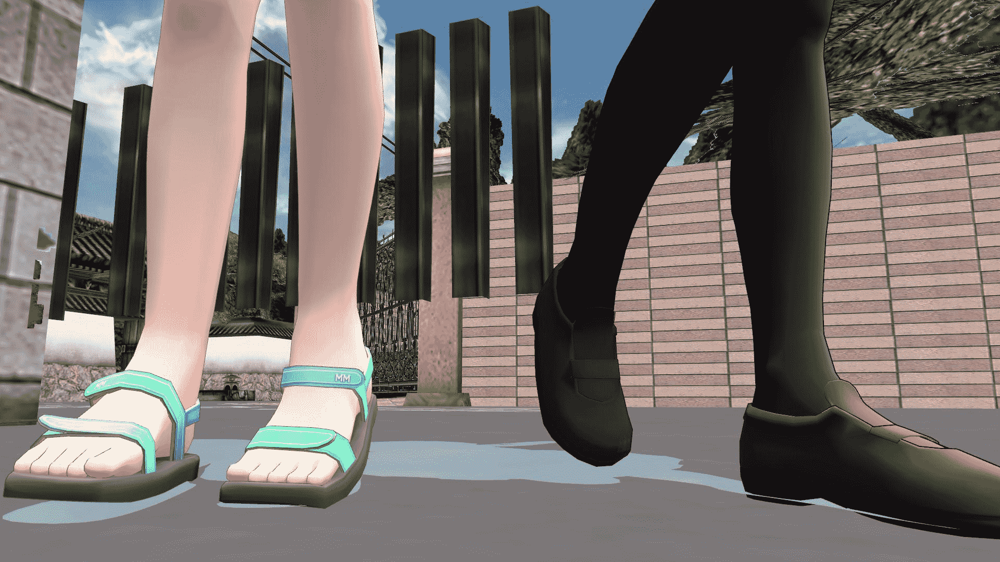
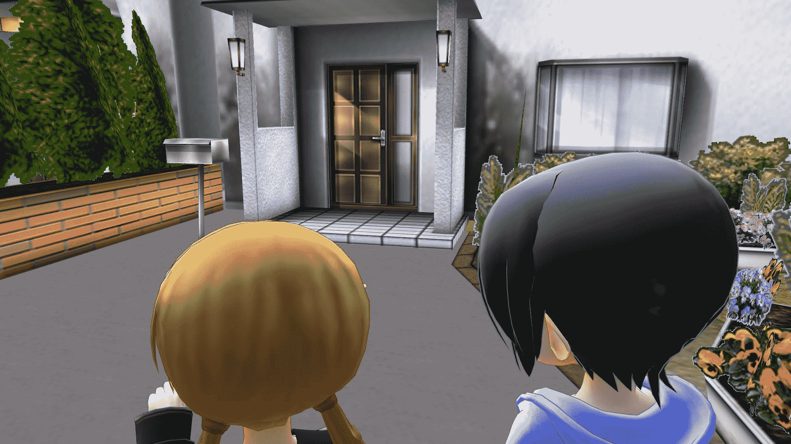
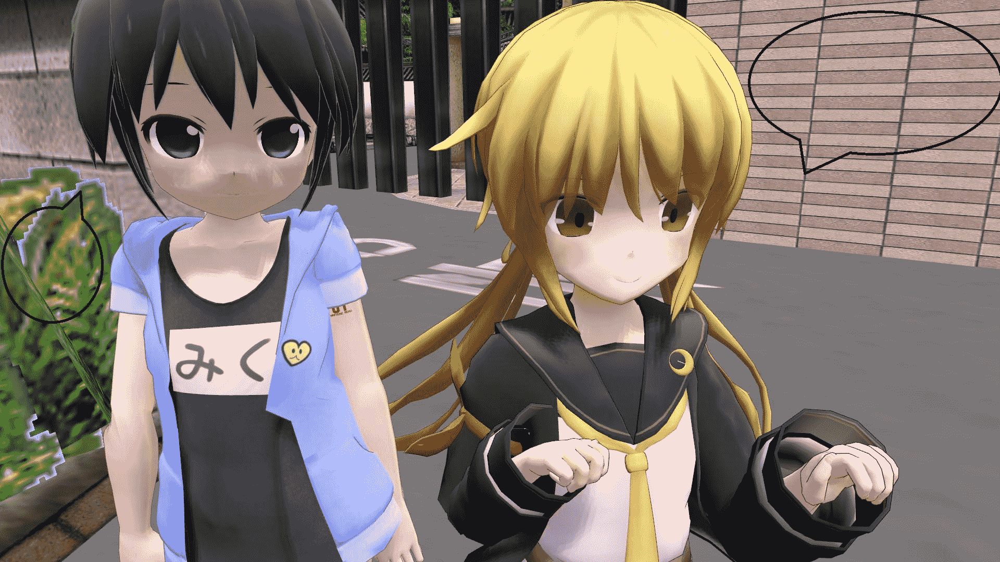
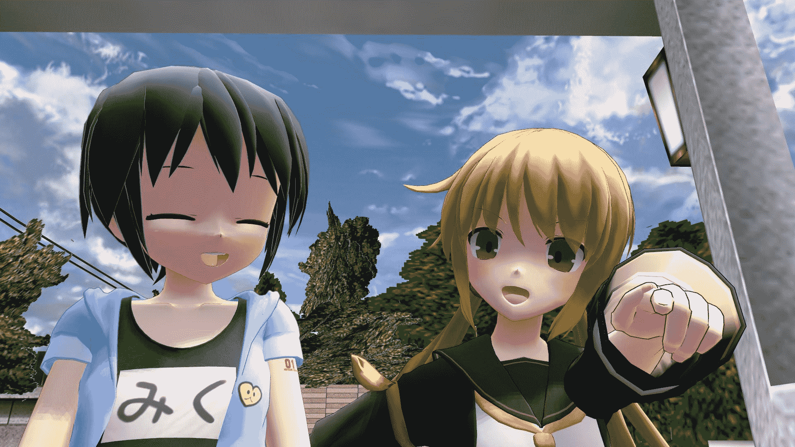
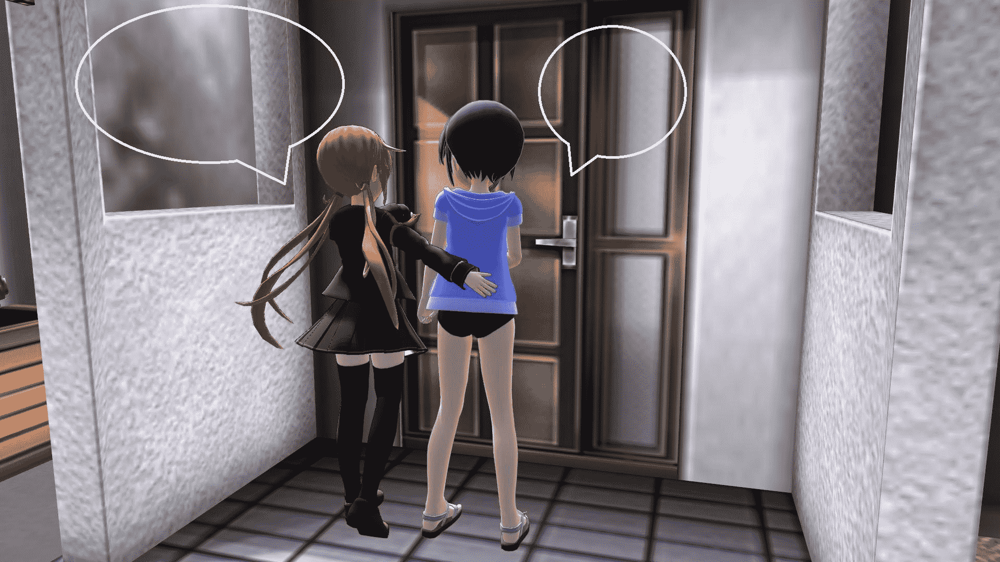

# MMD图求配台词，欢迎来投

作者：西呱

TID：22792

<title>1</title> <link href="../Styles/Style.css" type="text/css" rel="stylesheet">

# 1

简单配文法：把对话框内铺白，然后填词，后者用画图软件直接填字也可以，每层楼都是同一个场景，其中一个图带有对话框
<ignore_js_op>

**11.jpg** *(222.02 KB, 下載次數: 0)*

[下載附件](forum.php?mod=attachment&aid=NjczNDR8MjUzNjA2YWF8MTYwMzg1NzQwNXwxODIzMHwyMjc5Mg%3D%3D&nothumb=yes)

2017-3-21 12:57 上傳

<ignore_js_op>

**12.jpg** *(199.75 KB, 下載次數: 0)*

[下載附件](forum.php?mod=attachment&aid=NjczNDV8MGU5MGMyZjR8MTYwMzg1NzQwNXwxODIzMHwyMjc5Mg%3D%3D&nothumb=yes)

2017-3-21 12:58 上傳

<ignore_js_op>

**13.jpg** *(415.67 KB, 下載次數: 0)*

[下載附件](forum.php?mod=attachment&aid=NjczNDd8NGYyYjUxOGF8MTYwMzg1NzQwNXwxODIzMHwyMjc5Mg%3D%3D&nothumb=yes)

2017-3-21 12:58 上傳

<title>2</title> <link href="../Styles/Style.css" type="text/css" rel="stylesheet">

# 2

<ignore_js_op>

**2.jpg** *(213.45 KB, 下載次數: 0)*

[下載附件](forum.php?mod=attachment&aid=NjczNDh8YjY3NTMxOGF8MTYwMzg1NzQwNXwxODIzMHwyMjc5Mg%3D%3D&nothumb=yes)

2017-3-21 13:04 上傳

<ignore_js_op>

**22.jpg** *(313.22 KB, 下載次數: 1)*

[下載附件](forum.php?mod=attachment&aid=NjczNDl8NTNlZmM4YWZ8MTYwMzg1NzQwNXwxODIzMHwyMjc5Mg%3D%3D&nothumb=yes)

2017-3-21 13:04 上傳

<title>3</title> <link href="../Styles/Style.css" type="text/css" rel="stylesheet">

# 3

> [jy24310350 發表於 2017-3-21 13:54](https://giantessnight.com/gnforum2012/forum.php?mod=redirect&goto=findpost&pid=326750&ptid=22792)
> 没有后续内容，不知道剧情发展呀。
> 其实是不知道主人公名字。

miku和皋月，现在虽然有人回复，但是还没有人配台词<title>4</title> <link href="../Styles/Style.css" type="text/css" rel="stylesheet">

# 4

> [lwx1997 發表於 2017-3-21 18:21](https://giantessnight.com/gnforum2012/forum.php?mod=redirect&goto=findpost&pid=326773&ptid=22792)
> 感觉没有完整的故事，配字也只能是些“废话”吧
> a：终于到了
> a:赶紧开门吧，我都等不及了

我明白了，看来得再更几张图<title>5</title> <link href="../Styles/Style.css" type="text/css" rel="stylesheet">

# 5

> [dasers_100 發表於 2017-4-15 04:04](https://giantessnight.com/gnforum2012/forum.php?mod=redirect&goto=findpost&pid=329350&ptid=22792)
> 1\. ドオン(幻聽
> 2\. こ⬆️こ⬇️
> 3.はーい、どうぞ

大佬们我错了，等我这几天把后续做好再继续配吧。。我发现就这么几张图就发上来求配文简直哗众取宠了
数量太少，连开头都不算，还没有gts情节，我确实应该先做好一部分再发，而不是这样的开头</ignore_js_op></ignore_js_op></ignore_js_op></ignore_js_op></ignore_js_op>