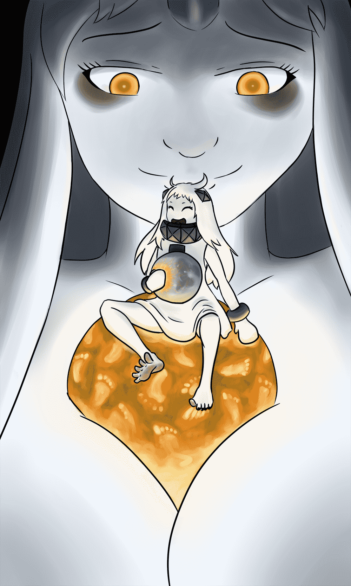

# Tera Hoppo, tera-er Wanko

作者：Crovenard

TID：25282

<title>1</title> <link href="../Styles/Style.css" type="text/css" rel="stylesheet">

# 1

Earth is not having the best day.

<ignore_js_op>

**hoppowanko.jpg** *(692.76 KB, 下載次數: 0)*

[下載附件](forum.php?mod=attachment&aid=NzI3MjR8YTZjNjIxZGJ8MTYwMzg0OTY0MHwxODIzMHwyNTI4Mg%3D%3D&nothumb=yes)

2018-6-5 03:17 上傳

<title>2</title> <link href="../Styles/Style.css" type="text/css" rel="stylesheet">

# 2

> [hyperbeats 發表於 2018-6-5 13:16](https://giantessnight.com/gnforum2012/forum.php?mod=redirect&goto=findpost&pid=377244&ptid=25282)
> 這個是艦隊collection的圖嗎?

是的，他们是北方栖姬和港湾栖姬.
<title>3</title> <link href="../Styles/Style.css" type="text/css" rel="stylesheet">

# 3

> [hyperbeats 發表於 2018-6-5 15:00](https://giantessnight.com/gnforum2012/forum.php?mod=redirect&goto=findpost&pid=377280&ptid=25282)
> 那兩個球是什麼？

月亮和地球。地球已经有更好的日子。</ignore_js_op>