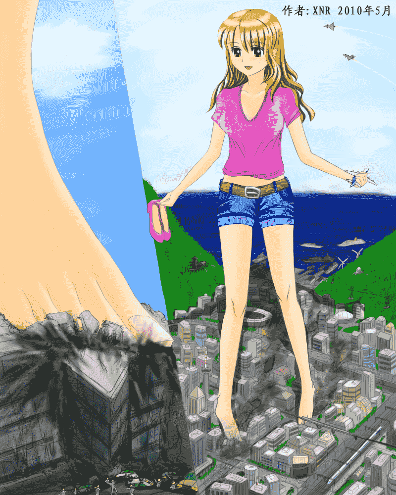
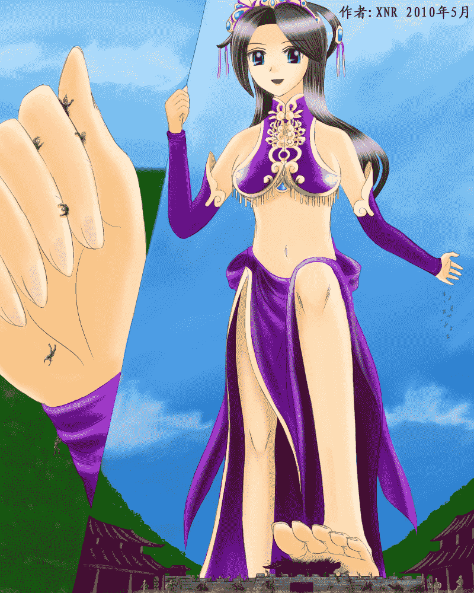
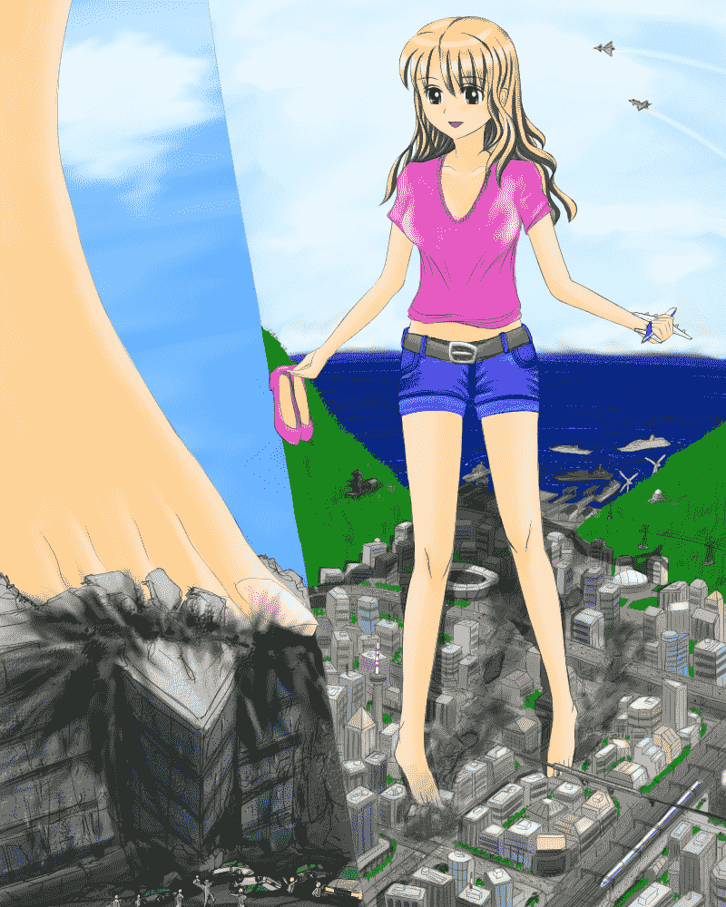
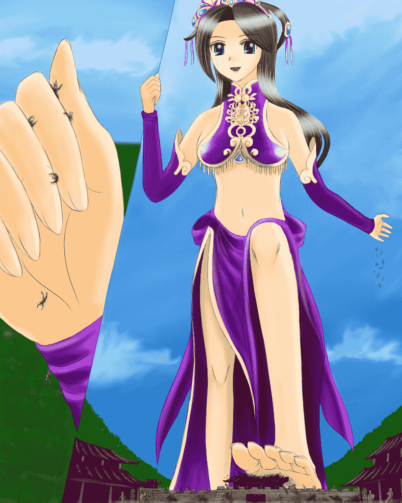

# XNR手绘两张MEGA-GTS

作者：xnr

TID：7870

<title>1</title> <link href="../Styles/Style.css" type="text/css" rel="stylesheet">

# 1

每天工作之余挤出半个小时的时间，断断续续的画了将近三个月。

本人是超巨大系GTS同好，不喜勿回。

图片很大，点击图片可看原尺寸大图。

请不要在细节上吹毛求疵，谢谢！
——————————————————————————————————————
《城市中的超巨大少女》

<ignore_js_op>

**G1-XNR.jpg** *(567.64 KB, 下載次數: 10)*

[下載附件](forum.php?mod=attachment&aid=MjA0NjV8MTU3YTZhMTF8MTYwMzg3ODY4NHwxODIzMHw3ODcw&nothumb=yes)

2010-5-16 14:51 上傳

《貂蝉の暴走》

<ignore_js_op>

**G2-XNR.jpg** *(479.85 KB, 下載次數: 5)*

[下載附件](forum.php?mod=attachment&aid=MjA0NjZ8ZDZiMjUwYjl8MTYwMzg3ODY4NHwxODIzMHw3ODcw&nothumb=yes)

2010-5-16 14:51 上傳

[ *本帖最後由 xnr 於 2010-5-16 17:19 編輯* ]<title>2</title> <link href="../Styles/Style.css" type="text/css" rel="stylesheet">

# 2

雖然只有兩張圖，但是考慮到付出的時間和精力，設置一個回復可見，不過分吧？

以下隱藏的是上面兩張圖片的無文字簽名之原圖，想收藏的就請留下您對作者的支持和鼓勵吧！請不要灌水哦！謝謝！

—————————————————————————————————————————————————
<ignore_js_op>

**G1-Original.jpg** *(561.08 KB, 下載次數: 5)*

[下載附件](forum.php?mod=attachment&aid=MjA0Njd8NmUyM2Q4YmZ8MTYwMzg3ODY4NHwxODIzMHw3ODcw&nothumb=yes)

2010-5-16 14:53 上傳

<ignore_js_op>

**G2-Original.jpg** *(472.78 KB, 下載次數: 4)*

[下載附件](forum.php?mod=attachment&aid=MjA0Njh8MjU3MzNlNTZ8MTYwMzg3ODY4NHwxODIzMHw3ODcw&nothumb=yes)

2010-5-16 14:53 上傳

[ *本帖最後由 hubert 於 2010-6-3 11:04 編輯* ]<title>3</title> <link href="../Styles/Style.css" type="text/css" rel="stylesheet">

# 3

城市确实画了很久，但是感觉画的不好，没有达到预期的效果。

另外，貂蝉是取自《真三国无双》游戏中的设计，你可以输入貂蝉百度或GOOGLE一下。
我把貂蝉原日本设计的服装稍微改造了一下，去掉了手部、腿部、足部这些“性感部位”的衣物遮挡。

总体来讲，我这两张mega-gts都是东方（中国）风格的，一古代，一现代，采取整体画面+局部特写，既要在总体上达到超巨大GTS震撼的效果，又要有充分的互动内容。

[ *本帖最後由 xnr 於 2010-5-16 15:50 編輯* ]<title>4</title> <link href="../Styles/Style.css" type="text/css" rel="stylesheet">

# 4

> 原帖由 *sssyyy* 於 2010-5-16 18:37 發表 
> x兄的作品我一向很喜欢 因为我也最爱超巨大的gts  但是相对于手绘的  我更喜欢真人ps的  其次是poser

1\. 论真实性真人最高，但是对素材要求也最高，如果不协调不自然就达不到效果。
2\. 手绘主要就是自由度高，能画出自己心中的理想画面（前提是有绘画功底）。
3\. 3D poser制作主要对硬件要求高，而且渲染很费时间，真实性和自由度都非常好，人物模型好的话就是精品。

[ *本帖最後由 xnr 於 2010-5-16 18:57 編輯* ]</ignore_js_op></ignore_js_op></ignore_js_op></ignore_js_op>