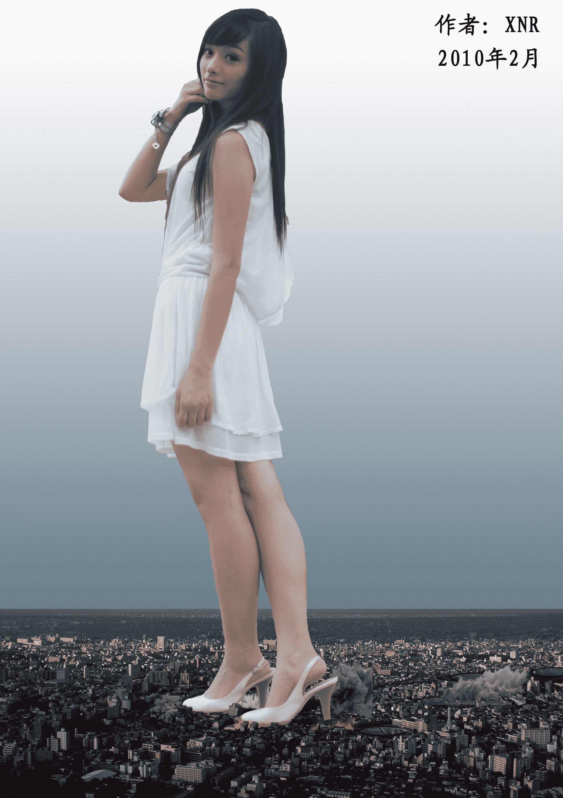
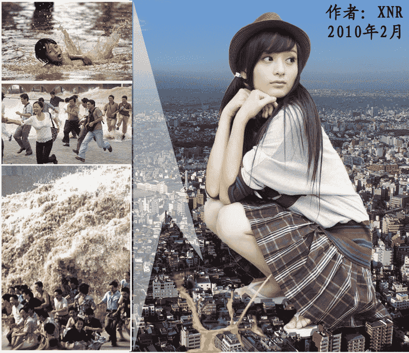

# XNR真人合成超巨大GTS

作者：xnr

TID：6599

<title>1</title> <link href="../Styles/Style.css" type="text/css" rel="stylesheet">

# 1

来自成都的姑娘：罗震环。

因为我是超巨大GTS的FANS，不喜欢的人请口下留情，谢谢。

本人的真人合成图，严禁转载和传播，请不要谈论与GTS无关的话题！谢谢合作！

这两张图都是高清大图，可打开欣赏。

第一张图比较注重细节，大家可以看看城市的地面，但是抠图有很多瑕疵，请见谅，谢谢。

1
<ignore_js_op>

**l1.jpg** *(674.55 KB, 下載次數: 25)*

[下載附件](forum.php?mod=attachment&aid=MTcxNzF8YTZjNDE1ZTd8MTYwMzg3NDg5NXwxODIzMHw2NTk5&nothumb=yes)

2010-2-9 19:18 上傳

2
<ignore_js_op>

**l2.jpg** *(816.12 KB, 下載次數: 6)*

[下載附件](forum.php?mod=attachment&aid=MTcxNzJ8ZWVjMDg1NDd8MTYwMzg3NDg5NXwxODIzMHw2NTk5&nothumb=yes)

2010-2-9 19:18 上傳

-------------------------------------------------
-------------------------------------------------
-------------------------------------------------

注意！

这张图属于“排尿” 属性！

-------------------------------------------------
-------------------------------------------------
-------------------------------------------------

3
<ignore_js_op>

**l3.jpg** *(625.09 KB, 下載次數: 7)*

[下載附件](forum.php?mod=attachment&aid=MTcxNzN8ODU2OTI0MTF8MTYwMzg3NDg5NXwxODIzMHw2NTk5&nothumb=yes)

2010-2-9 19:18 上傳

液体是我手绘的(小图是网络上找来的)，如果这张图让部分人感觉不快，请随时联系管理员，管理员有权力随时可以删除(无需过问我的意见)。

再强调一遍，本人的真人合成图，严禁转载和传播，请不要谈论与GTS无关的话题！谢谢合作！

[ *本帖最後由 xnr 於 2010-2-9 20:13 編輯* ]<title>2</title> <link href="../Styles/Style.css" type="text/css" rel="stylesheet">

# 2

> 原帖由 *sq123456* 於 2010-2-25 12:09 發表 
> 为什么我 ~总是不喜欢合成图呢- -!应该加点文~

1\. 视觉是最直观的表现手法，有时候文字是无法描绘GTS场景的震撼感的。

2\. 请说出你不喜欢的具体理由。

3\. 如果你愿意为我的图片配文，我很乐意。<title>3</title> <link href="../Styles/Style.css" type="text/css" rel="stylesheet">

# 3

> 原帖由 *lovecaidui* 於 2010-2-25 12:17 發表 
> 如果第3张人脸能看地面就好了，不过PS的很棒啊，支持，希望LZ越来越专业，其实很期待你的游戏的说（虽然停止了。。。。）

呵呵，我也希望能看地面啊，而且带着一丝坏坏的微笑，但是你知道这样的素材多难找吗？哪个女生会为你专门摆拍这样的动作呢？<title>4</title> <link href="../Styles/Style.css" type="text/css" rel="stylesheet">

# 4

> 原帖由 *心晴* 於 2010-2-25 13:12 發表 
> XNR兄
> 话说这个MM怎么这么像杨幂呢？！！！  
> 
> PS：实在做得相当不错。

我也很喜欢杨幂，但是一直找不到合适的高清素材，遗憾啊。。。<title>5</title> <link href="../Styles/Style.css" type="text/css" rel="stylesheet">

# 5

> 原帖由 *awkeygen* 於 2010-2-25 14:08 發表 
> 其实给我印象最深的是第三章的“液体”
> 请教楼主是怎么弄的，比3d的还要逼真。。。

手绘的，软件是SAI，硬件是WACOM BAMBOO手绘板。</ignore_js_op></ignore_js_op></ignore_js_op>