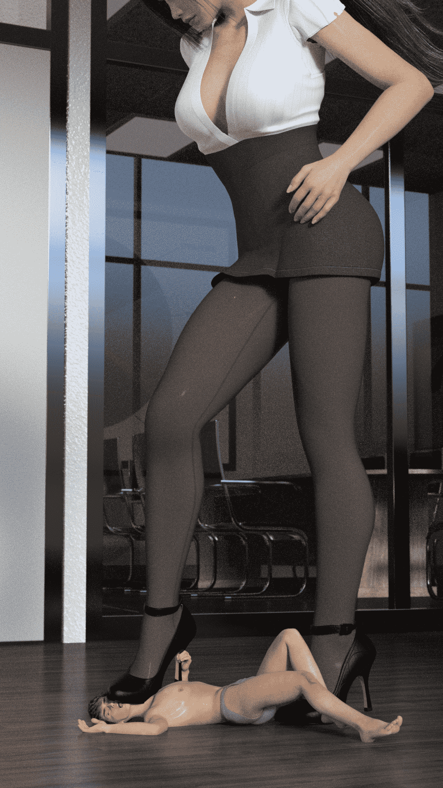
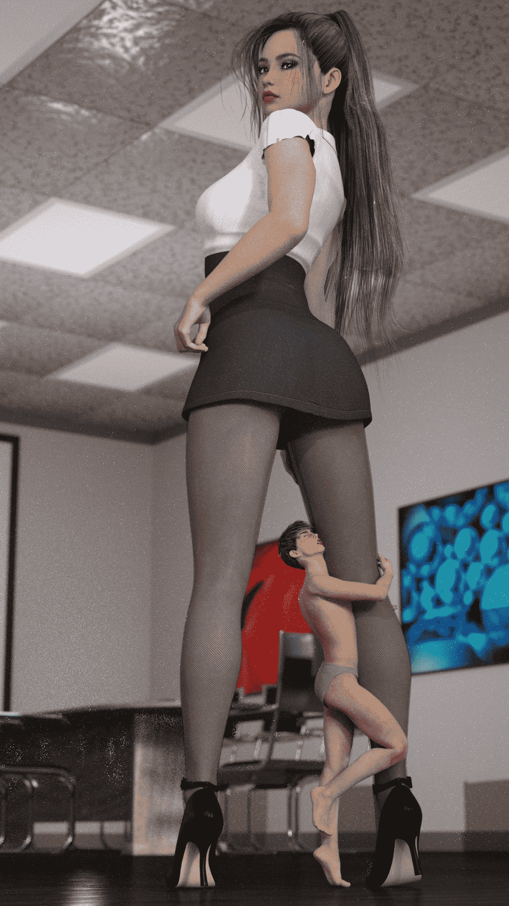
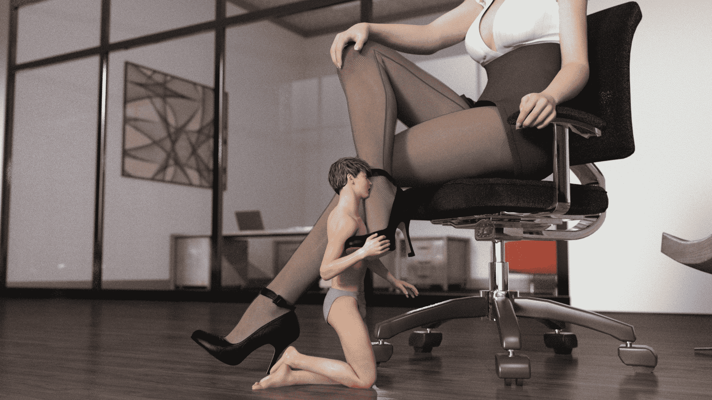

# iray渲染的几张图，就是太耗时间了！5月17更新

作者：小狐狸桑

TID：23096

<title>1</title> <link href="../Styles/Style.css" type="text/css" rel="stylesheet">

# 1

*本帖最後由 小狐狸桑 於 2017-5-17 10:28 編輯*

一天只能传5mb的，只够传一张…明天压缩下再传

<ignore_js_op>

**IMG_6059.PNG** *(4.18 MB, 下載次數: 73)*

[下載附件](forum.php?mod=attachment&aid=Njc4OTV8NGI0ZTNlNTl8MTYwMzg0ODM4MHwxODIzMHwyMzA5Ng%3D%3D&nothumb=yes)

2017-5-16 16:01 上傳

<ignore_js_op>

**IMG_6085.JPG** *(966.9 KB, 下載次數: 94)*

[下載附件](forum.php?mod=attachment&aid=Njc4OTl8NDBmODhmMDd8MTYwMzg0ODM4MHwxODIzMHwyMzA5Ng%3D%3D&nothumb=yes)

2017-5-17 10:27 上傳

<ignore_js_op>

**IMG_6086.JPG** *(955.82 KB, 下載次數: 39)*

[下載附件](forum.php?mod=attachment&aid=Njc5MDB8NWYxNjNmNzF8MTYwMzg0ODM4MHwxODIzMHwyMzA5Ng%3D%3D&nothumb=yes)

2017-5-17 10:27 上傳

<title>2</title> <link href="../Styles/Style.css" type="text/css" rel="stylesheet">

# 2

> [nietao06027 發表於 2017-5-17 08:54](https://giantessnight.com/gnforum2012/forum.php?mod=redirect&goto=findpost&pid=332664&ptid=23096)
> iray渲染的有时候就是觉得背景像素点很明显，楼主有什么好的模型素材之类的网站吗？我看你这个背景和DA里面 ...

等它渲染完了就没像素点了，但是实在好慢，我i7的cpu和1060的N卡都很吃力的样子，所以就半路取消啦，我模型都是从一个叫“cg艺术共和国”的网站上找的<title>3</title> <link href="../Styles/Style.css" type="text/css" rel="stylesheet">

# 3

> [nietao06027 發表於 2017-5-17 11:08](https://giantessnight.com/gnforum2012/forum.php?mod=redirect&goto=findpost&pid=332680&ptid=23096)
> 我也尝试过用呆姿来渲染过，用IRAY的效果确实很不错，不过感觉像DA，tiny-mk、lfcfangts这些人的渲染的和呆 ...

其实3Dlights还是最方便的，基本打3个灯质感还是可以的，还很快速，labean就坚持用，lfcfants的gif图片太赞了，但是图片感觉质感也一般。可能是用另一个渲染器叫reality，我也不知道欸。

个人最喜欢DA上的mike973的图，都是上乘之作</ignore_js_op></ignore_js_op></ignore_js_op>