# miku酱的绘画过程，希望对大家有帮助~

作者：wwj9520

TID：19006

 

# 1

既然有人有需要，那我就发上来，其实这张画的很快，现在看很多不满意的地方，细化太不到位了，所以把过程发上来还真是羞耻PLAY啊.jpg)

 

# 2

<ignore_js_op>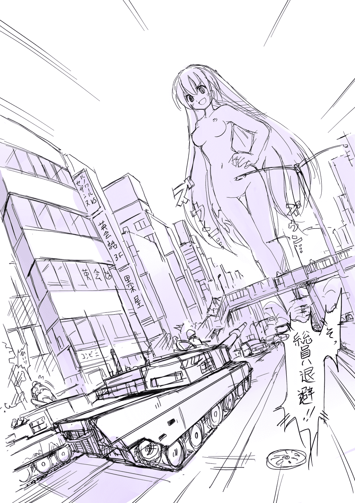

**90211273b434915a6cdb84911d2be1dd.jpeg** *(700.66 KB, 下載次數: 0)*

[下載附件](forum.php?mod=attachment&aid=NTE5Nzh8ZGVkN2VmMTl8MTYwMzg2NTc0NXwxODIzMHwxOTAwNg%3D%3D&nothumb=yes)

2015-5-20 13:40 上傳

首先确定构图，这是最重要的，这里就用瀬尾大大的构图(懒省事),大家一开始构图不太会的也可以参考大大的画来，进步会很快

 

# 3

<ignore_js_op>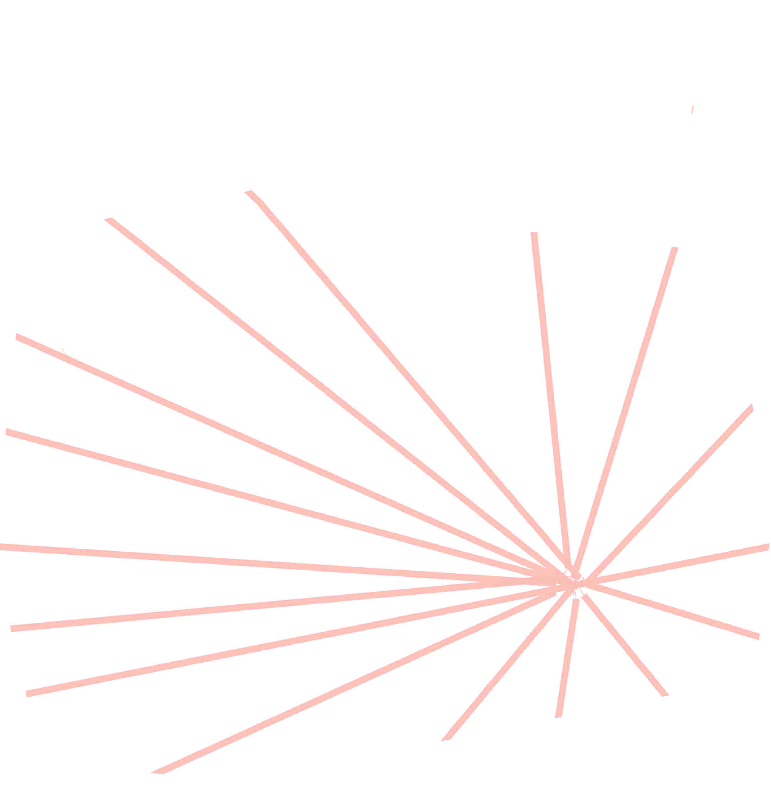

**1.jpg** *(130.96 KB, 下載次數: 0)*

[下載附件](forum.php?mod=attachment&aid=NTE5Nzl8NWU2YmI3ZDN8MTYwMzg2NTc0NXwxODIzMHwxOTAwNg%3D%3D&nothumb=yes)

2015-5-20 13:44 上傳

首先，打透视线（= =很重要）

<ignore_js_op>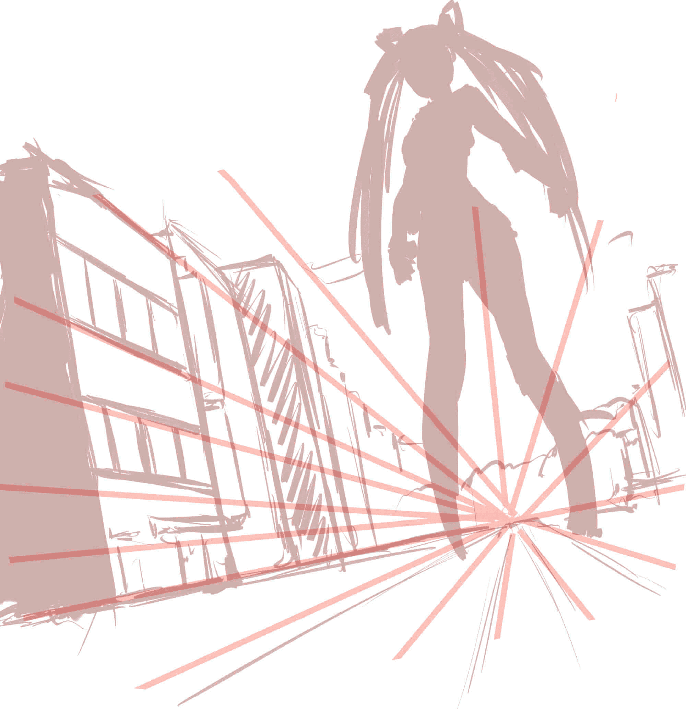

**2.jpg** *(170.39 KB, 下載次數: 0)*

[下載附件](forum.php?mod=attachment&aid=NTE5ODB8N2FiMTBjYzN8MTYwMzg2NTc0NXwxODIzMHwxOTAwNg%3D%3D&nothumb=yes)

2015-5-20 13:46 上傳

然后呢，拿一个粗的笔刷，简单画一下大色块，把自己想表达的大关系画出来就OK~.jpg)

<ignore_js_op>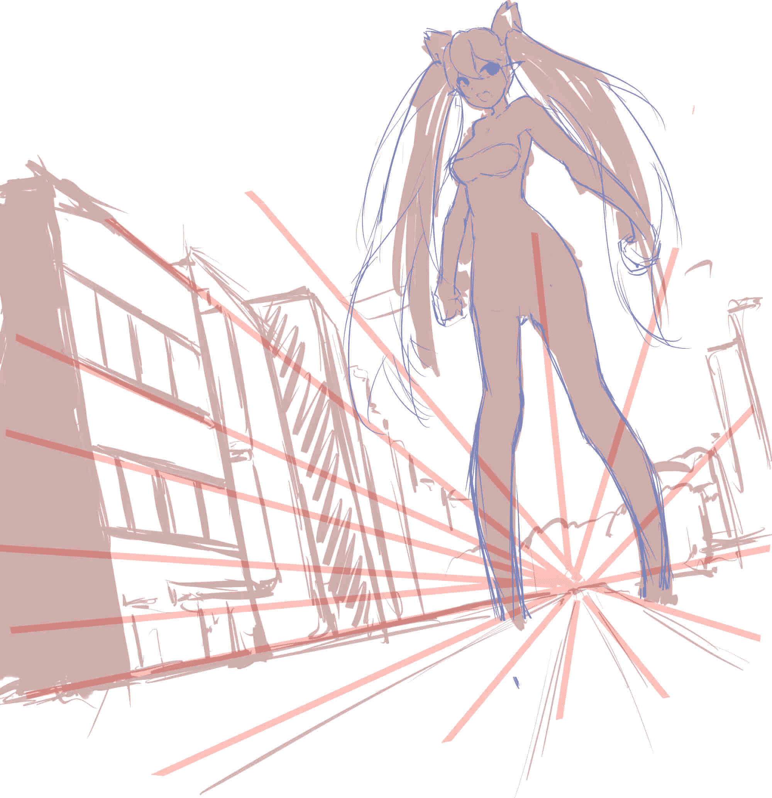

**3.jpg** *(193.79 KB, 下載次數: 0)*

[下載附件](forum.php?mod=attachment&aid=NTE5ODF8OTc3YjljNmN8MTYwMzg2NTc0NXwxODIzMHwxOTAwNg%3D%3D&nothumb=yes)

2015-5-20 13:47 上傳

<ignore_js_op>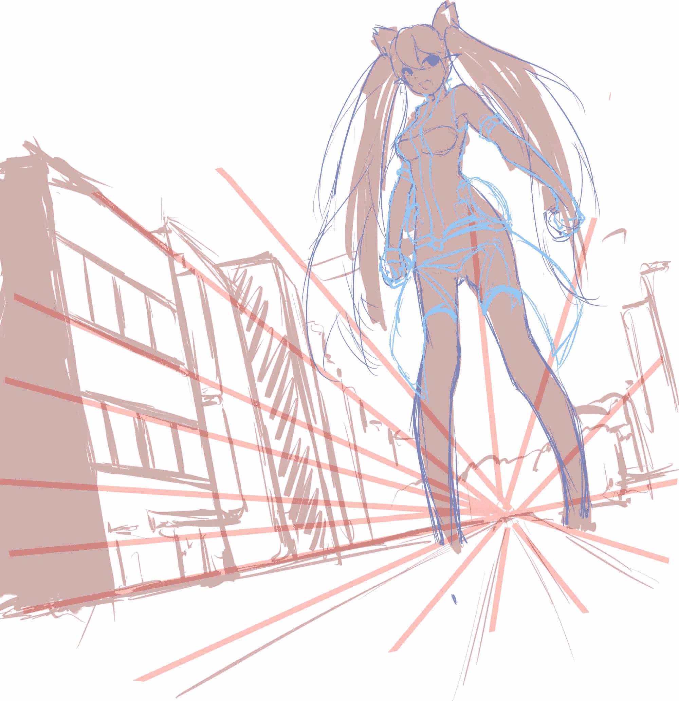

**4.jpg** *(201.59 KB, 下載次數: 0)*

[下載附件](forum.php?mod=attachment&aid=NTE5ODJ8Nzk2ODJkNTJ8MTYwMzg2NTc0NXwxODIzMHwxOTAwNg%3D%3D&nothumb=yes)

2015-5-20 13:47 上傳

接着撸，简单的把人物草稿画出来，加上衣服~

 

# 4

<ignore_js_op>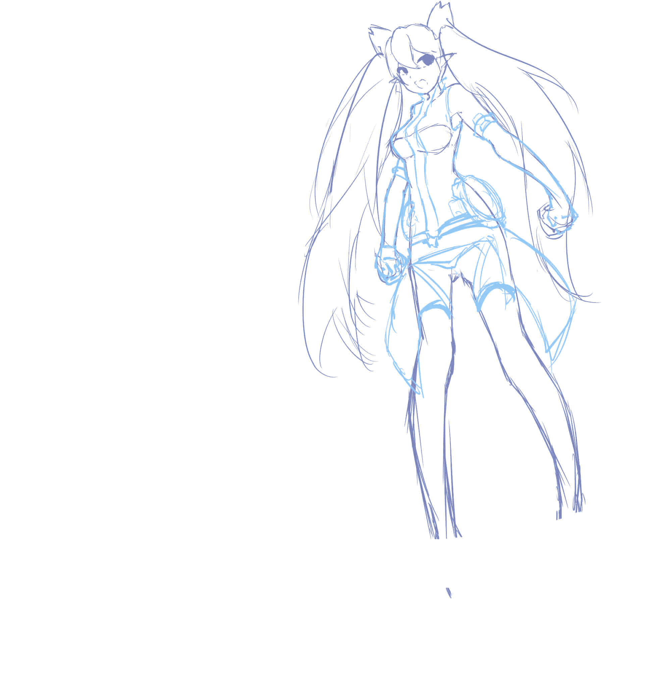

**5.jpg** *(154.54 KB, 下載次數: 0)*

[下載附件](forum.php?mod=attachment&aid=NTE5ODN8OTgyMjMwY2J8MTYwMzg2NTc0NXwxODIzMHwxOTAwNg%3D%3D&nothumb=yes)

2015-5-20 13:49 上傳

任务草稿已经露出来了，嘿嘿，是不是已经有点像初音了？.jpg)

别急，正戏才开始！

<ignore_js_op>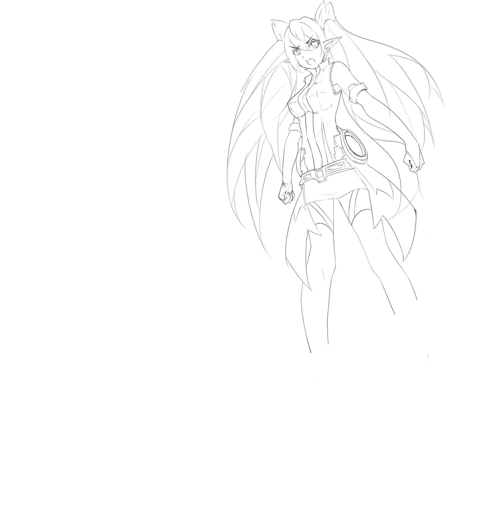

**6.jpg** *(140.23 KB, 下載次數: 0)*

[下載附件](forum.php?mod=attachment&aid=NTE5ODR8MTBiZWU2ZDd8MTYwMzg2NTc0NXwxODIzMHwxOTAwNg%3D%3D&nothumb=yes)

2015-5-20 13:49 上傳

非常重要的一步，勾线！这是比较费时间的一件事，而且对刚开始画画的人来说很痛苦，想把线画好可不是一件容易的事，需要大家加强训练~线稿画的好，整张画就会好！PS:厚涂的话另说，这里就先不提了233

<ignore_js_op>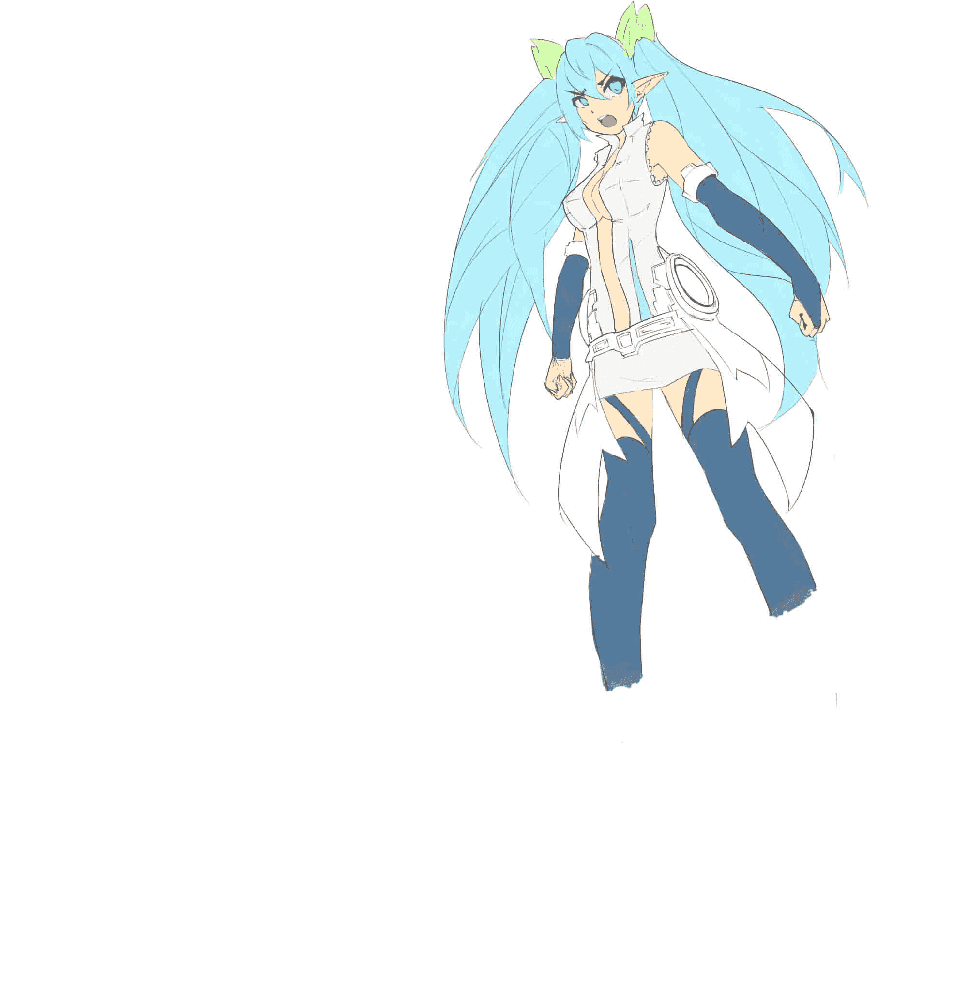

**7.jpg** *(142.57 KB, 下載次數: 0)*

[下載附件](forum.php?mod=attachment&aid=NTE5ODV8Zjk5YjhmZWV8MTYwMzg2NTc0NXwxODIzMHwxOTAwNg%3D%3D&nothumb=yes)

2015-5-20 13:49 上傳

铺底色，这里比较简单，注意不要涂到外面去就是了，另外= =不要要用油漆桶填色，老老实实拿笔画.jpg)

 

# 5

<ignore_js_op>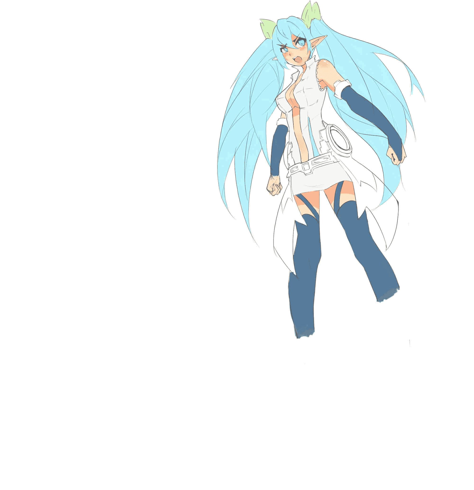

**8.jpg** *(143.01 KB, 下載次數: 0)*

[下載附件](forum.php?mod=attachment&aid=NTE5ODZ8MDc5OGZlN2F8MTYwMzg2NTc0NXwxODIzMHwxOTAwNg%3D%3D&nothumb=yes)

2015-5-20 13:59 上傳

下面我们开始深入，第一步皮肤，要把皮肤嫩嫩的感觉画出来，阴影颜色可以往红色稍微偏一点~

<ignore_js_op>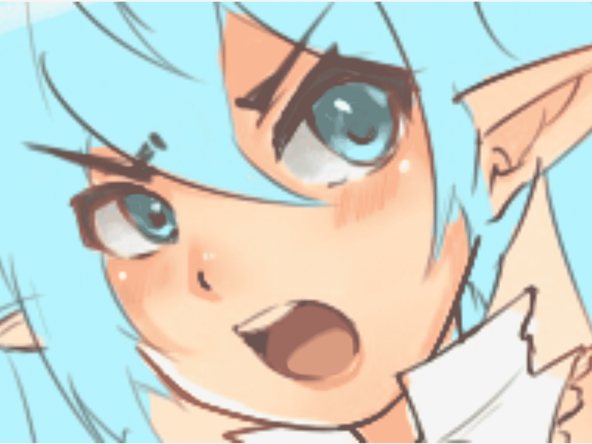</ignore_js_op> **脸.jpg** *(657.68 KB, 下載次數: 0)*

[下載附件](forum.php?mod=attachment&aid=NTE5OTN8NzBkMWQ2NGR8MTYwMzg2NTc0NXwxODIzMHwxOTAwNg%3D%3D&nothumb=yes)

2015-5-20 14:07 上傳

眼睛~眼镜是可以投入很多时间去画的，我这里并没有画很细

<ignore_js_op>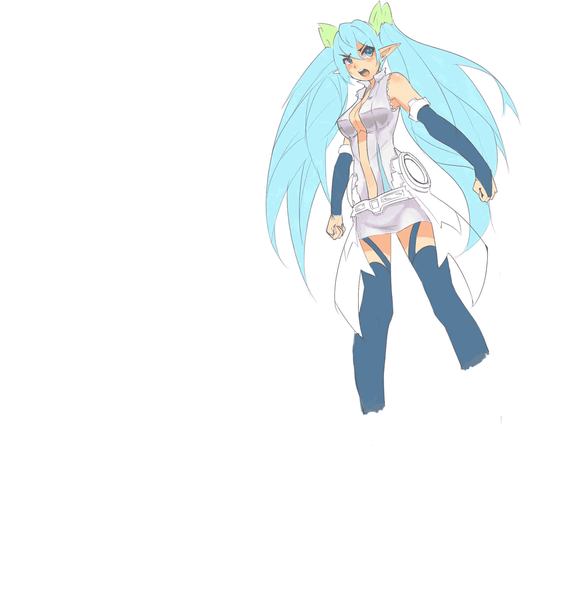</ignore_js_op> **10.jpg** *(143.38 KB, 下載次數: 0)*

[下載附件](forum.php?mod=attachment&aid=NTE5ODh8YTUwNjFhMDV8MTYwMzg2NTc0NXwxODIzMHwxOTAwNg%3D%3D&nothumb=yes)

2015-5-20 13:59 上傳

接下来是衣服，注意好衣服的结构，那里有阴影，那里没有

<ignore_js_op>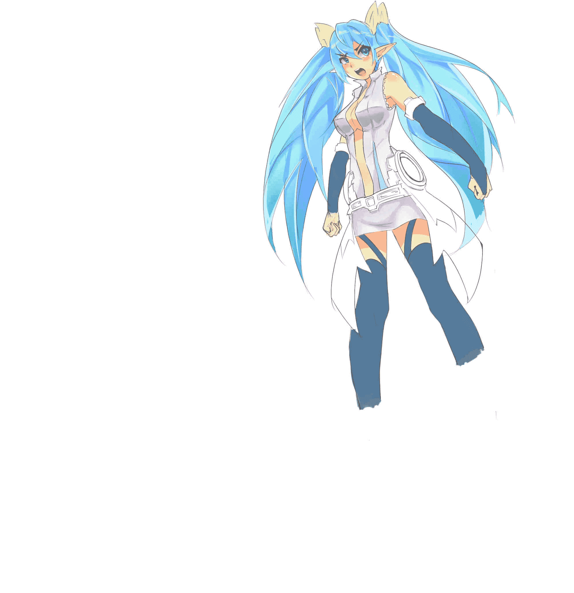</ignore_js_op> **11.jpg** *(147.71 KB, 下載次數: 0)*

[下載附件](forum.php?mod=attachment&aid=NTE5ODl8MzZiZTU3ZGJ8MTYwMzg2NTc0NXwxODIzMHwxOTAwNg%3D%3D&nothumb=yes)

2015-5-20 13:59 上傳

然后是头发，这里可以画的随意一点，毕竟是二次元对不对.jpg)依然是注意好前后关系

<ignore_js_op></ignore_js_op> **13.jpg** *(147.12 KB, 下載次數: 0)*

[下載附件](forum.php?mod=attachment&aid=NTE5OTF8ODQ3NWM1ZTl8MTYwMzg2NTc0NXwxODIzMHwxOTAwNg%3D%3D&nothumb=yes)

2015-5-20 13:59 上傳

<ignore_js_op>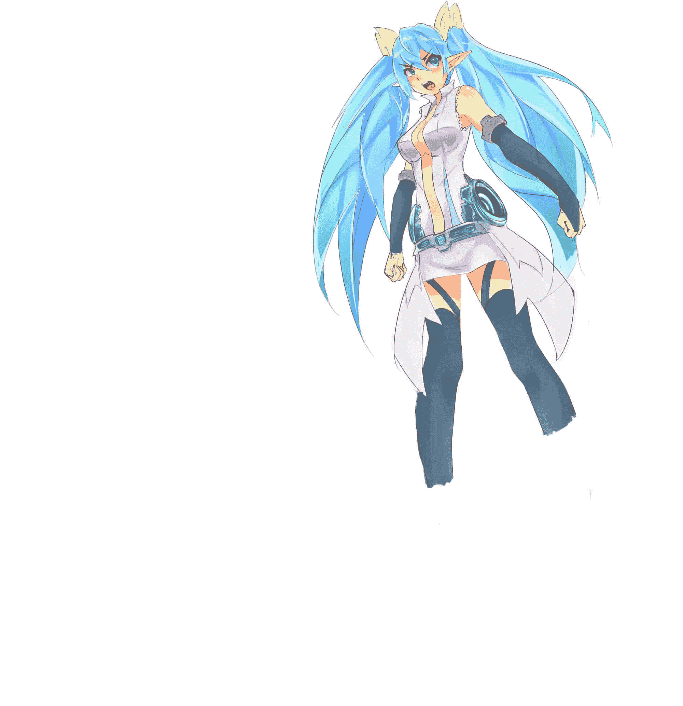</ignore_js_op> **14.jpg** *(147.7 KB, 下載次數: 0)*

[下載附件](forum.php?mod=attachment&aid=NTE5OTJ8ZGIwZGMyZTd8MTYwMzg2NTc0NXwxODIzMHwxOTAwNg%3D%3D&nothumb=yes)

2015-5-20 13:59 上傳

其他一些小细节 

 

# 6

<ignore_js_op>[12.jpg](forum.php?mod=attachment&aid=NTE5OTB8YTM5MWNiODN8MTYwMzg2NTc0NXwxODIzMHwxOTAwNg%3D%3D&nothumb=yes) *(147.72 KB, 下載次數: 0)*

[下載附件](forum.php?mod=attachment&aid=NTE5OTB8YTM5MWNiODN8MTYwMzg2NTc0NXwxODIzMHwxOTAwNg%3D%3D&nothumb=yes)

2015-5-20 13:59 上傳  

[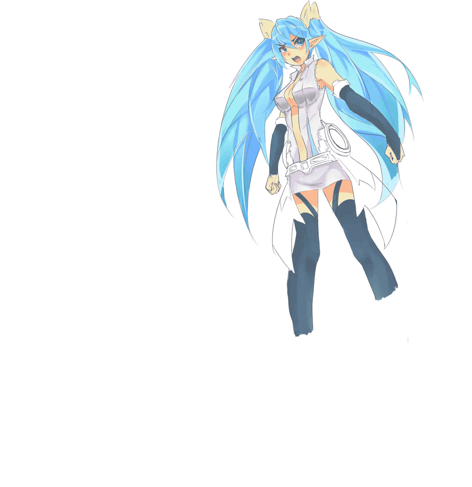](javascript:;)</ignore_js_op> <ignore_js_op>[9.jpg](forum.php?mod=attachment&aid=NTE5ODd8ODVlNTUzYzZ8MTYwMzg2NTc0NXwxODIzMHwxOTAwNg%3D%3D&nothumb=yes) *(142.97 KB, 下載次數: 0)*

[下載附件](forum.php?mod=attachment&aid=NTE5ODd8ODVlNTUzYzZ8MTYwMzg2NTc0NXwxODIzMHwxOTAwNg%3D%3D&nothumb=yes)

2015-5-20 13:59 上傳  

</ignore_js_op>  

# 7

> [ww69 發表於 2015-5-20 14:10](https://giantessnight.com/gnforum2012/forum.php?mod=redirect&goto=findpost&pid=255221&ptid=19006)

> 看起来好复杂  我还是老老实实看吧

嘛~也不是很复杂，这张图画的比较简单

 

# 8

居然忘了一小时只能发5个，坑了= = 

# 9

好了最重要的人物已经撸完了，下面就是场景了，介于场景我胡画了，就不在这里臭屁了，把图发上来大家简单看一下流程，基本是这样一个步骤，只是细化的问题了 <ignore_js_op>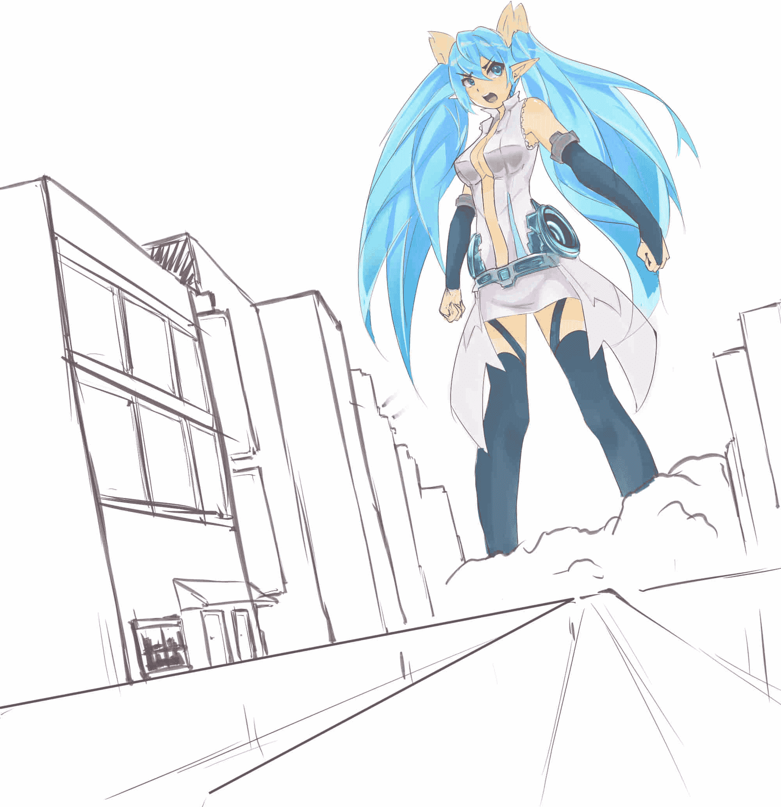

**15.jpg** *(190.79 KB, 下載次數: 0)*

[下載附件](forum.php?mod=attachment&aid=NTE5OTR8ZDBmMDA4YmZ8MTYwMzg2NTc0NXwxODIzMHwxOTAwNg%3D%3D&nothumb=yes)

2015-5-20 14:16 上傳

<ignore_js_op>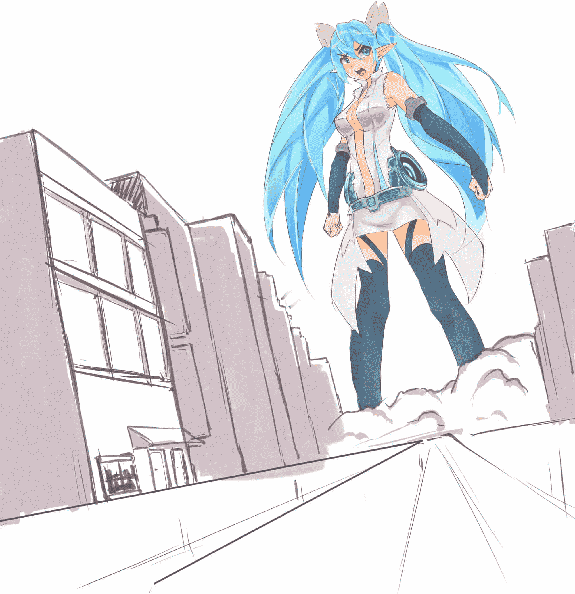

**16.jpg** *(190.29 KB, 下載次數: 0)*

[下載附件](forum.php?mod=attachment&aid=NTE5OTV8NDliMjNhOTZ8MTYwMzg2NTc0NXwxODIzMHwxOTAwNg%3D%3D&nothumb=yes)

2015-5-20 14:16 上傳

<ignore_js_op>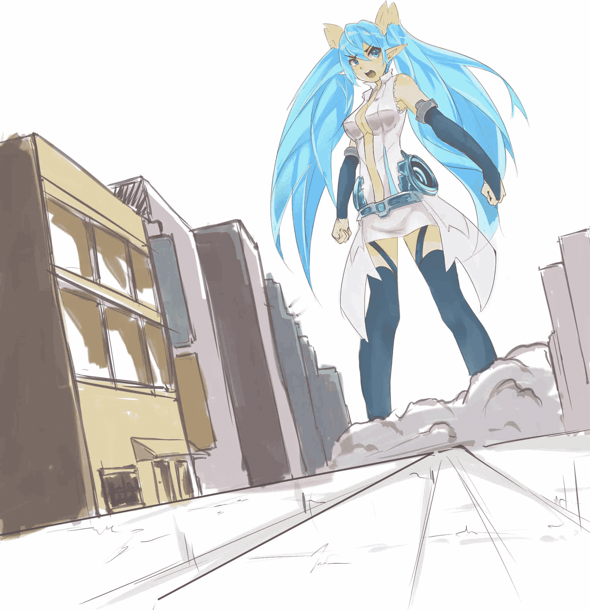

**17.jpg** *(191.25 KB, 下載次數: 0)*

[下載附件](forum.php?mod=attachment&aid=NTE5OTZ8NDY1MjNmNzN8MTYwMzg2NTc0NXwxODIzMHwxOTAwNg%3D%3D&nothumb=yes)

2015-5-20 14:16 上傳

<ignore_js_op>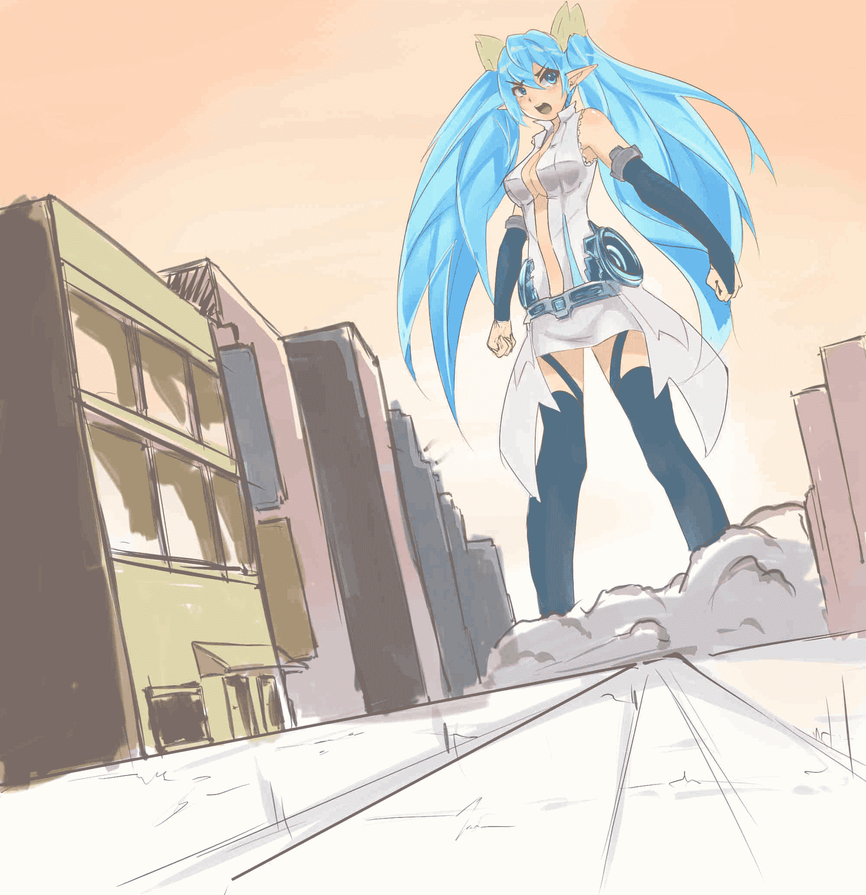

**18.jpg** *(190.76 KB, 下載次數: 0)*

[下載附件](forum.php?mod=attachment&aid=NTE5OTd8YTRlZjc5ZTd8MTYwMzg2NTc0NXwxODIzMHwxOTAwNg%3D%3D&nothumb=yes)

2015-5-20 14:16 上傳

<ignore_js_op>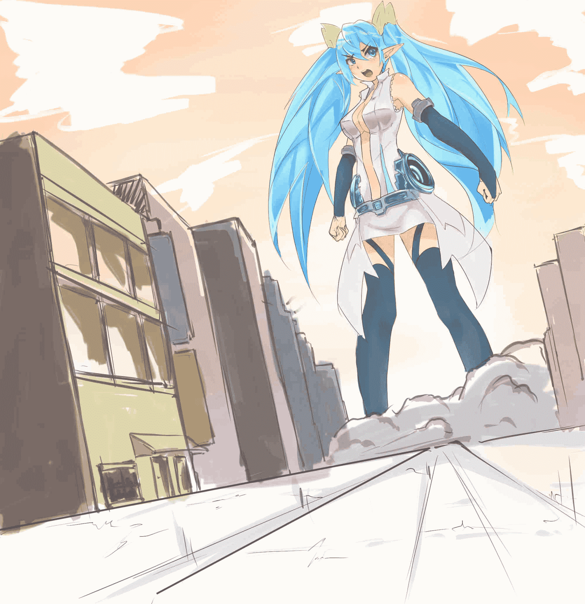

**19.jpg** *(193.67 KB, 下載次數: 0)*

[下載附件](forum.php?mod=attachment&aid=NTE5OTh8NWE2ZGExM2J8MTYwMzg2NTc0NXwxODIzMHwxOTAwNg%3D%3D&nothumb=yes)

2015-5-20 14:16 上傳

 

# 10

> [dijkstra 發表於 2015-5-20 15:24](https://giantessnight.com/gnforum2012/forum.php?mod=redirect&goto=findpost&pid=255225&ptid=19006)

> 前来支援！

> 问题( ´▽` )ﾉ：楼主铺底色是用一个图层吗，阴影和高光分别几个图层呢？颜色选择有技巧嘛 ...

底色是分开的，这样加阴影的时候可以用蒙版，不会涂出去，颜色的话可以去搜配色，网上有很多的，我选色不好，就不带坏你了= =，头发里的绿色是用了滤色功能     (我使用sai画的，PS的画名称不一样，不过找找都能找到）

 

# 11

> [中文之許. 發表於 2015-5-20 20:23](https://giantessnight.com/gnforum2012/forum.php?mod=redirect&goto=findpost&pid=255248&ptid=19006)

> 難怪當初感覺跟瀬尾老師的圖有幾分相似

> 

> 這張圖還是保留在論壇裡比較好...因為瀬尾老師其實還滿好戰的...

这不能算是抄袭了，毕竟我只是用了构图，如果说构图相似也算抄袭的话，那世界上就没什么画是原创了，当时正好翻到他的画，就直接用了，如果你们都对相似度这么忌讳的话，那就算了，全当我出来当小丑了，大家看看笑笑好了，毕竟我自己画的东西也不少，在论坛里看到大家也发临摹，我就没多想，难道是我太天真么了= =

 

# 12

> [z19950625 發表於 2015-5-21 02:36](https://giantessnight.com/gnforum2012/forum.php?mod=redirect&goto=findpost&pid=255271&ptid=19006)

> 绘画三要素，体积，空间跟质感，透视就是这里所说的空间感，正常多用于一点或两点透视，很少用多点跟散点透 ...

画画嘛，图个开心，你们能喜欢就好

 

# 13

> [dijkstra 發表於 2015-5-22 05:43](https://giantessnight.com/gnforum2012/forum.php?mod=redirect&goto=findpost&pid=255350&ptid=19006)

> 突然发现大神你是用厚涂的打稿方式啊！触到没朋友了！

> 我一直都是铅笔线稿擦擦改改的，再扫描，果然还是 ...

哈哈，我也是从你那样过来的，画多了，自然会有进步，我也还是刚入门，还有很多要学的，只要好好画，一定可以超过我的~</ignore_js_op></ignore_js_op></ignore_js_op></ignore_js_op></ignore_js_op></ignore_js_op></ignore_js_op></ignore_js_op></ignore_js_op></ignore_js_op></ignore_js_op></ignore_js_op></ignore_js_op></ignore_js_op>