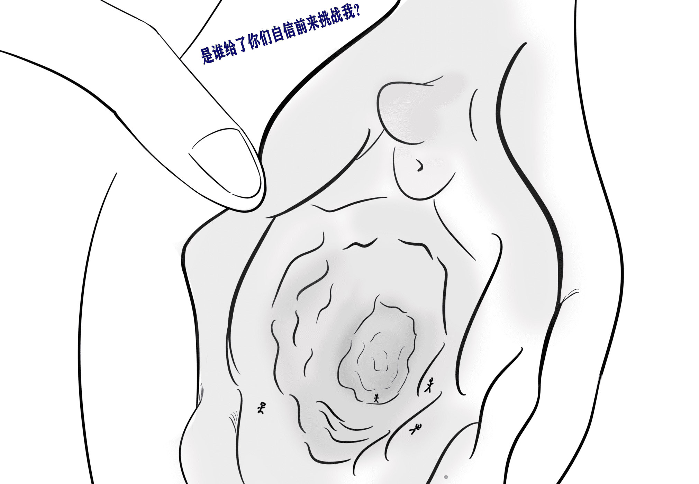
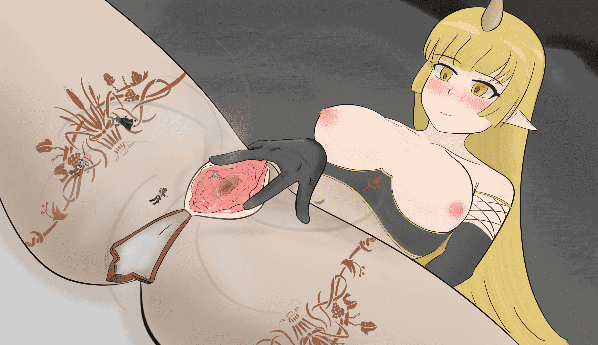
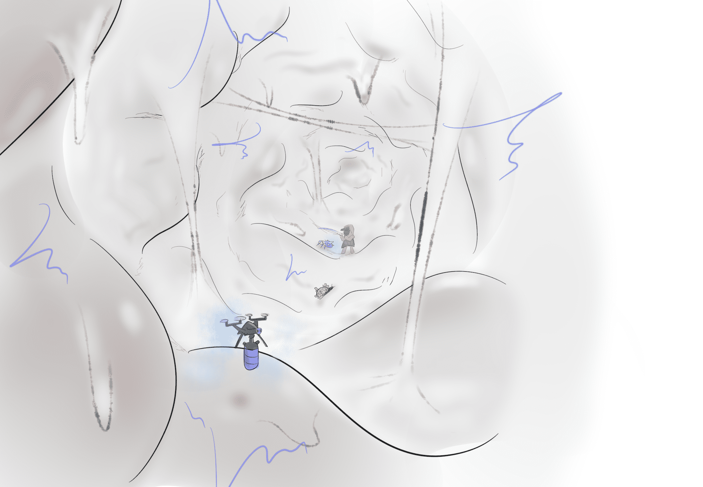
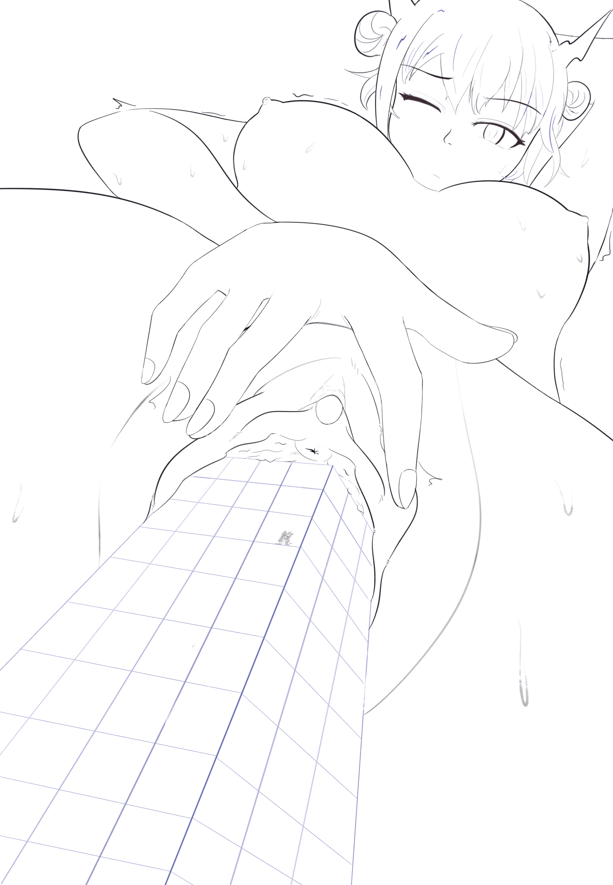
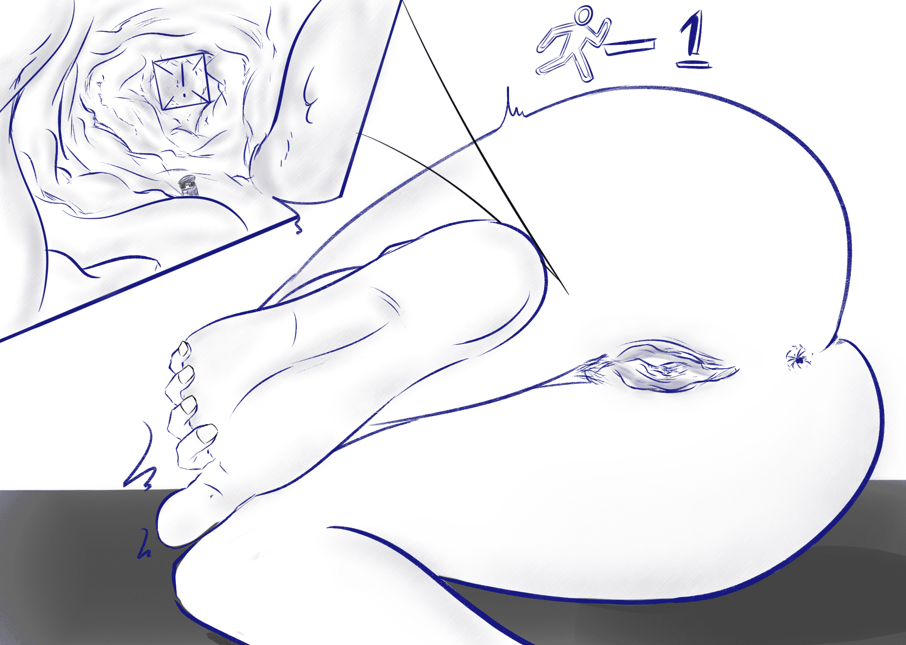

# 一些渣绘

作者：回收站站员

TID：28208

<title>1</title> <link href="../Styles/Style.css" type="text/css" rel="stylesheet">

# 1

蜗行摸索中的新人画手。欢迎带伙们提绘画上的建议或者各色的脑洞。
基本是在p站和推特更新，但我不知道该怎么分享自己主页到这里来（趴）。
希望带伙们能够喜欢。
<title>2</title> <link href="../Styles/Style.css" type="text/css" rel="stylesheet">

# 2

 <ignore_js_op>[陈2.2.png](forum.php?mod=attachment&aid=ODE3OTB8ODhkZmI0OWV8MTYwMzgyODM2M3wxODIzMHwyODIwOA%3D%3D&nothumb=yes) *(2.36 MB, 下載次數: 3)*

[下載附件](forum.php?mod=attachment&aid=ODE3OTB8ODhkZmI0OWV8MTYwMzgyODM2M3wxODIzMHwyODIwOA%3D%3D&nothumb=yes)

2020-3-6 01:36 上傳  

</ignore_js_op> <ignore_js_op>[陈2.1.png](forum.php?mod=attachment&aid=ODE3ODl8MTNjOWQ1ZGR8MTYwMzgyODM2M3wxODIzMHwyODIwOA%3D%3D&nothumb=yes) *(470.33 KB, 下載次數: 1)*

[下載附件](forum.php?mod=attachment&aid=ODE3ODl8MTNjOWQ1ZGR8MTYwMzgyODM2M3wxODIzMHwyODIwOA%3D%3D&nothumb=yes)

2020-3-6 01:36 上傳  

</ignore_js_op> <ignore_js_op>[陈1.png](forum.php?mod=attachment&aid=ODE3ODh8YTMxNmI4ZWN8MTYwMzgyODM2M3wxODIzMHwyODIwOA%3D%3D&nothumb=yes) *(1.08 MB, 下載次數: 2)*

[下載附件](forum.php?mod=attachment&aid=ODE3ODh8YTMxNmI4ZWN8MTYwMzgyODM2M3wxODIzMHwyODIwOA%3D%3D&nothumb=yes)

2020-3-6 01:36 上傳  

</ignore_js_op> <ignore_js_op>[德狗子-改.png](forum.php?mod=attachment&aid=ODE3ODd8MTUzZTBmM2J8MTYwMzgyODM2M3wxODIzMHwyODIwOA%3D%3D&nothumb=yes) *(2.44 MB, 下載次數: 9)*

[下載附件](forum.php?mod=attachment&aid=ODE3ODd8MTUzZTBmM2J8MTYwMzgyODM2M3wxODIzMHwyODIwOA%3D%3D&nothumb=yes)

2020-3-6 01:36 上傳  

</ignore_js_op> <title>3</title> <link href="../Styles/Style.css" type="text/css" rel="stylesheet">

# 3

发完才发现顺序是反的，唉<title>4</title> <link href="../Styles/Style.css" type="text/css" rel="stylesheet">

# 4

> [St2019 發表於 2020-3-6 06:23](https://giantessnight.com/gnforum2012/forum.php?mod=redirect&goto=findpost&pid=428864&ptid=28208)
> 支持楼主，真的一点都不渣啊！
> 这画的小穴的质感我得向楼主学习呢。
> ...

谢谢，喜欢就好。抱歉隔了这么长时间才回复。。。因为平时基本不怎么逛论坛。
<title>5</title> <link href="../Styles/Style.css" type="text/css" rel="stylesheet">

# 5

最近的更新，明明上色辣鸡画的却贼J8慢，我太能摸了。
试着画了FantiaM里头的一个用批吃主角的角色，看不懂片假名也不知道这角色叫啥。
遛弯的时候想到的脑洞，老陈过无人危楼结果中了埋伏（笑
反正也是近期投稿，能去P站贡献一波阅读量么？秋梨膏。<title>6</title> <link href="../Styles/Style.css" type="text/css" rel="stylesheet">

# 6

 <ignore_js_op>[F1.png](forum.php?mod=attachment&aid=ODIwMTJ8Y2ZiMDIzMmN8MTYwMzgyODM2M3wxODIzMHwyODIwOA%3D%3D&nothumb=yes) *(2.22 MB, 下載次數: 0)*

[下載附件](forum.php?mod=attachment&aid=ODIwMTJ8Y2ZiMDIzMmN8MTYwMzgyODM2M3wxODIzMHwyODIwOA%3D%3D&nothumb=yes)

2020-3-19 23:29 上傳  

</ignore_js_op> <ignore_js_op>[陈3.1.png](forum.php?mod=attachment&aid=ODIwMTN8MmIyODVlNDV8MTYwMzgyODM2M3wxODIzMHwyODIwOA%3D%3D&nothumb=yes) *(838.36 KB, 下載次數: 0)*

[下載附件](forum.php?mod=attachment&aid=ODIwMTN8MmIyODVlNDV8MTYwMzgyODM2M3wxODIzMHwyODIwOA%3D%3D&nothumb=yes)

2020-3-19 23:29 上傳  

</ignore_js_op> <ignore_js_op>[陈3-色.png](forum.php?mod=attachment&aid=ODIwMTR8ODYxMGQ3N2V8MTYwMzgyODM2M3wxODIzMHwyODIwOA%3D%3D&nothumb=yes) *(1.14 MB, 下載次數: 0)*

[下載附件](forum.php?mod=attachment&aid=ODIwMTR8ODYxMGQ3N2V8MTYwMzgyODM2M3wxODIzMHwyODIwOA%3D%3D&nothumb=yes)

2020-3-19 23:30 上傳  

</ignore_js_op> <ignore_js_op>[陈3-线.png](forum.php?mod=attachment&aid=ODIwMTV8N2UwMTczMjV8MTYwMzgyODM2M3wxODIzMHwyODIwOA%3D%3D&nothumb=yes) *(462.26 KB, 下載次數: 0)*

[下載附件](forum.php?mod=attachment&aid=ODIwMTV8N2UwMTczMjV8MTYwMzgyODM2M3wxODIzMHwyODIwOA%3D%3D&nothumb=yes)

2020-3-19 23:30 上傳  

</ignore_js_op> <title>7</title> <link href="../Styles/Style.css" type="text/css" rel="stylesheet">

# 7

> [回收站站员 發表於 2020-3-19 23:32](https://giantessnight.com/gnforum2012/forum.php?mod=redirect&goto=findpost&pid=430474&ptid=28208)
> 最近的更新，明明上色辣鸡画的却贼J8慢，我太能摸了。
> 试着画了FantiaM里头的一个用批吃主角的角色，看不懂 ...

我还不如不上色呢，头发找不到感觉
<title>8</title> <link href="../Styles/Style.css" type="text/css" rel="stylesheet">

# 8

早就想画一次缩学外传里那个副部长桥了，本来想试试撅着ass的姿势结果发现画功不够表现不出来（
主角和反派在动弹不得的副部长嘴里搏斗————当时就想，要是能在批里打就好了，怀着这种想法画了图。
上色好难哇，细节上还欠很多，果然还是应该多多练习。<title>9</title> <link href="../Styles/Style.css" type="text/css" rel="stylesheet">

# 9

 <ignore_js_op>[副部长.png](forum.php?mod=attachment&aid=ODI3NzF8NzliZGQyNzN8MTYwMzgyODM2M3wxODIzMHwyODIwOA%3D%3D&nothumb=yes) *(1.6 MB, 下載次數: 0)*

[下載附件](forum.php?mod=attachment&aid=ODI3NzF8NzliZGQyNzN8MTYwMzgyODM2M3wxODIzMHwyODIwOA%3D%3D&nothumb=yes)

2020-5-2 03:52 上傳  

</ignore_js_op> <title>10</title> <link href="../Styles/Style.css" type="text/css" rel="stylesheet">

# 10

上色太难了，画到最后实在没啥耐心，很多细节不愿去扣了。<title>11</title> <link href="../Styles/Style.css" type="text/css" rel="stylesheet">

# 11

 <ignore_js_op>[W.png](forum.php?mod=attachment&aid=ODMwNjN8YWMxODQ0NGN8MTYwMzgyODM2M3wxODIzMHwyODIwOA%3D%3D&nothumb=yes) *(1.43 MB, 下載次數: 0)*

[下載附件](forum.php?mod=attachment&aid=ODMwNjN8YWMxODQ0NGN8MTYwMzgyODM2M3wxODIzMHwyODIwOA%3D%3D&nothumb=yes)

2020-5-19 02:20 上傳  

</ignore_js_op> <title>12</title> <link href="../Styles/Style.css" type="text/css" rel="stylesheet">

# 12

????的电脑终于修好辣！
之前一段时间主板烧了，这个图实际上是将近一个月之前的产物。
草草的加工了一下，希望观众姥爷们康的高兴。
其实还有个差分的，但是我不想画了。<title>13</title> <link href="../Styles/Style.css" type="text/css" rel="stylesheet">

# 13

 <ignore_js_op>[副部长1.png](forum.php?mod=attachment&aid=ODM2MjF8ZTRmZTM5ZWZ8MTYwMzgyODM2M3wxODIzMHwyODIwOA%3D%3D&nothumb=yes) *(1.59 MB, 下載次數: 0)*

[下載附件](forum.php?mod=attachment&aid=ODM2MjF8ZTRmZTM5ZWZ8MTYwMzgyODM2M3wxODIzMHwyODIwOA%3D%3D&nothumb=yes)

2020-6-26 01:04 上傳  

</ignore_js_op> <title>14</title> <link href="../Styles/Style.css" type="text/css" rel="stylesheet">

# 14

这是为了答谢前些天电脑坏了时候，为我提供了帮助的朋友而作的图。
画完之后才发现，怎么把黑画的像推王。。。
多多少少有些赶工摸鱼的成分在里面，原谅我吧（趴<title>15</title> <link href="../Styles/Style.css" type="text/css" rel="stylesheet">

# 15

 <ignore_js_op>[交叉火力.png](forum.php?mod=attachment&aid=ODM2NjJ8YzY5NDcwZTh8MTYwMzgyODM2M3wxODIzMHwyODIwOA%3D%3D&nothumb=yes) *(1.55 MB, 下載次數: 0)*

[下載附件](forum.php?mod=attachment&aid=ODM2NjJ8YzY5NDcwZTh8MTYwMzgyODM2M3wxODIzMHwyODIwOA%3D%3D&nothumb=yes)

2020-6-28 03:27 上傳  

</ignore_js_op> <title>16</title> <link href="../Styles/Style.css" type="text/css" rel="stylesheet">

# 16

在某个项目上遇到了困难，有点自闭，涂个CEO转换心情。
做做表情练习。
MGSV真好玩儿（<title>17</title> <link href="../Styles/Style.css" type="text/css" rel="stylesheet">

# 17

 <ignore_js_op>[Lucifer1.png](forum.php?mod=attachment&aid=ODM3NjV8OTVkOTZiNzR8MTYwMzgyODM2M3wxODIzMHwyODIwOA%3D%3D&nothumb=yes) *(874.55 KB, 下載次數: 0)*

[下載附件](forum.php?mod=attachment&aid=ODM3NjV8OTVkOTZiNzR8MTYwMzgyODM2M3wxODIzMHwyODIwOA%3D%3D&nothumb=yes)

2020-7-4 19:08 上傳  

</ignore_js_op> <ignore_js_op>[Lucifer2.png](forum.php?mod=attachment&aid=ODM3NjZ8MWE2ZTA5YmN8MTYwMzgyODM2M3wxODIzMHwyODIwOA%3D%3D&nothumb=yes) *(884.24 KB, 下載次數: 0)*

[下載附件](forum.php?mod=attachment&aid=ODM3NjZ8MWE2ZTA5YmN8MTYwMzgyODM2M3wxODIzMHwyODIwOA%3D%3D&nothumb=yes)

2020-7-4 19:08 上傳  

</ignore_js_op> <title>18</title> <link href="../Styles/Style.css" type="text/css" rel="stylesheet">

# 18

摸索与练习
快 加 强 斯 卡 蒂（笑<title>19</title> <link href="../Styles/Style.css" type="text/css" rel="stylesheet">

# 19

 <ignore_js_op>[DD1.jpeg](forum.php?mod=attachment&aid=ODM5Mjh8YjQxYzA4Y2V8MTYwMzgyODQyMXwxODIzMHwyODIwOA%3D%3D&nothumb=yes) *(1022.31 KB, 下載次數: 0)*

[下載附件](forum.php?mod=attachment&aid=ODM5Mjh8YjQxYzA4Y2V8MTYwMzgyODQyMXwxODIzMHwyODIwOA%3D%3D&nothumb=yes)

2020-7-12 22:31 上傳  

</ignore_js_op> <ignore_js_op>[DD2.jpeg](forum.php?mod=attachment&aid=ODM5Mjl8MzJhNjQ3Njl8MTYwMzgyODQyMXwxODIzMHwyODIwOA%3D%3D&nothumb=yes) *(957.42 KB, 下載次數: 0)*

[下載附件](forum.php?mod=attachment&aid=ODM5Mjl8MzJhNjQ3Njl8MTYwMzgyODQyMXwxODIzMHwyODIwOA%3D%3D&nothumb=yes)

2020-7-12 22:31 上傳  

</ignore_js_op>