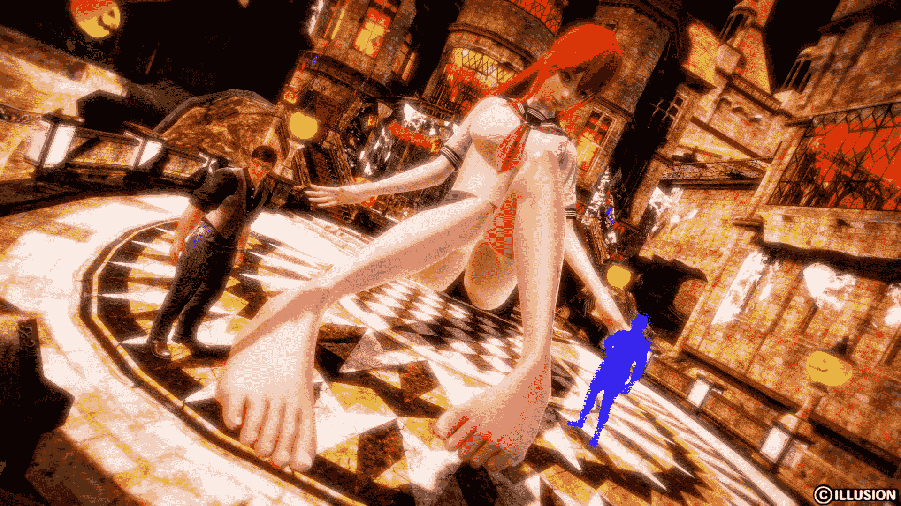
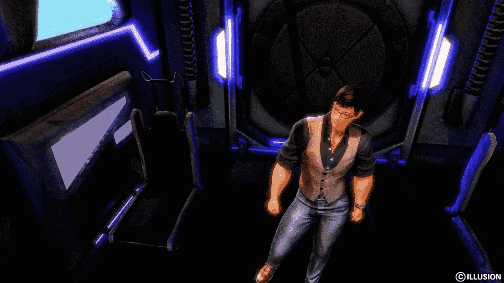
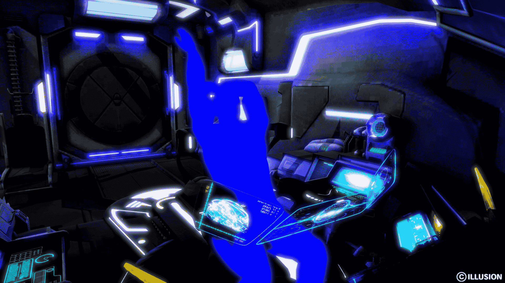

# 不可控实验人物介绍贴

作者：hsxz

TID：22532

<title>1</title> <link href="../Styles/Style.css" type="text/css" rel="stylesheet">

# 1

*本帖最後由 hsxz 於 2017-6-29 02:08 編輯*

介于漫画没有介绍人物，可能看不懂，我在这里先介绍人物
***[第一、二集地址](http://giantessnight.com/gnforum2012/forum.php?mod=viewthread&tid=22492)***
***[第三集地址](http://giantessnight.com/gnforum2012/forum.php?mod=viewthread&tid=23356)***

<title>2</title> <link href="../Styles/Style.css" type="text/css" rel="stylesheet">

# 2

 <ignore_js_op>[封面.jpg](forum.php?mod=attachment&aid=NjY2NjV8Yzc0YWIzYzd8MTYwMzg1NzYzMHwxODIzMHwyMjUzMg%3D%3D&nothumb=yes) *(619.09 KB, 下載次數: 4)*

[下載附件](forum.php?mod=attachment&aid=NjY2NjV8Yzc0YWIzYzd8MTYwMzg1NzYzMHwxODIzMHwyMjUzMg%3D%3D&nothumb=yes)

2017-1-30 16:16 上傳  

</ignore_js_op> <title>3</title> <link href="../Styles/Style.css" type="text/css" rel="stylesheet">

# 3

*本帖最後由 hsxz 於 2017-1-30 20:48 編輯*

**背景：**
博士用古代遗物开发出了一批特殊的武器，这种武器需要特殊的适应媒介才能发挥作用。
比如“救赎”就是博士曾经发明的激光武器，而它的适应媒介就是具有激光发射器构造的武器本身。
然而这次的实验中，“原罪”的适应媒介却是一位少女——kana

<title>4</title> <link href="../Styles/Style.css" type="text/css" rel="stylesheet">

# 4

*本帖最後由 hsxz 於 2017-1-30 20:49 編輯*

**人物介绍：** 男主角：
迈威（Marvel象征希望）
迈威是博士的得力助手，善于设计、组装机械，曾经参与帮助博士制造“救赎”的激光发射器，但对博士为了实验不顾一切的做法有些意见

（配图姿势绝对没有参考van♂样）

<title>5</title> <link href="../Styles/Style.css" type="text/css" rel="stylesheet">

# 5

 <ignore_js_op>[迈威.jpg](forum.php?mod=attachment&aid=NjY2Njd8MWFmNThiMTl8MTYwMzg1NzYzMHwxODIzMHwyMjUzMg%3D%3D&nothumb=yes) *(219.75 KB, 下載次數: 0)*

[下載附件](forum.php?mod=attachment&aid=NjY2Njd8MWFmNThiMTl8MTYwMzg1NzYzMHwxODIzMHwyMjUzMg%3D%3D&nothumb=yes)

2017-1-30 16:35 上傳  

</ignore_js_op> <title>6</title> <link href="../Styles/Style.css" type="text/css" rel="stylesheet">

# 6

*本帖最後由 hsxz 於 2017-1-31 16:18 編輯*

女主角：
kana kana的父母是考古学家，已死于一场遗物鉴定时引发的神秘事故。当时kana也在场，是唯一的幸存者。事后，博士收养了kana，条件是让kana答应日后参与自己的实验。

（图中的kana已经很大了，然而那只是为了放杀必死才做大的，和剧情无关）
<title>7</title> <link href="../Styles/Style.css" type="text/css" rel="stylesheet">

# 7

 <ignore_js_op>[kana.jpg](forum.php?mod=attachment&aid=NjY2Njl8M2Y3OWI0ZTl8MTYwMzg1NzYzMHwxODIzMHwyMjUzMg%3D%3D&nothumb=yes) *(303.95 KB, 下載次數: 4)*

[下載附件](forum.php?mod=attachment&aid=NjY2Njl8M2Y3OWI0ZTl8MTYwMzg1NzYzMHwxODIzMHwyMjUzMg%3D%3D&nothumb=yes)

2017-1-30 20:27 上傳  

</ignore_js_op> <title>8</title> <link href="../Styles/Style.css" type="text/css" rel="stylesheet">

# 8

*本帖最後由 hsxz 於 2017-1-30 20:50 編輯*

配角：
弗兰博士
科学工作者都知道一句古话：“闷声发大财。”弗拉博士也不例外，因此不求名利的他并没有脸。
比起一名资深的科学家，弗兰博士更像一位长者，他面对危机总算能做出最稳健的应对措施。

<title>9</title> <link href="../Styles/Style.css" type="text/css" rel="stylesheet">

# 9

 <ignore_js_op>[弗兰博士.jpg](forum.php?mod=attachment&aid=NjY2NzB8YTM4MzFkNDF8MTYwMzg1NzYzMHwxODIzMHwyMjUzMg%3D%3D&nothumb=yes) *(305.15 KB, 下載次數: 0)*

[下載附件](forum.php?mod=attachment&aid=NjY2NzB8YTM4MzFkNDF8MTYwMzg1NzYzMHwxODIzMHwyMjUzMg%3D%3D&nothumb=yes)

2017-1-30 20:29 上傳  

</ignore_js_op> <title>10</title> <link href="../Styles/Style.css" type="text/css" rel="stylesheet">

# 10

> [dajiangjiang 發表於 2017-1-30 17:11](https://giantessnight.com/gnforum2012/forum.php?mod=redirect&goto=findpost&pid=321967&ptid=22532)
> 男主手臂比头粗系列...开玩笑的啦，楼主加油

的确，手臂比头粗。貌似男主都会给人一种这样的感觉，因此我就形象的表现出来了
<title>11</title> <link href="../Styles/Style.css" type="text/css" rel="stylesheet">

# 11

> [yilin 發表於 2017-3-28 00:12](https://giantessnight.com/gnforum2012/forum.php?mod=redirect&goto=findpost&pid=327496&ptid=22532)
> 我很期待后面的剧情哦

抱歉，要等到6月以后了