# 不定期更新一些彩图（2月25日更新一张）

作者：Nightwish

TID：11354

<title>1</title> <link href="../Styles/Style.css" type="text/css" rel="stylesheet">

# 1

祝大家新年好运，心想事成~~
把去年的2张删除了。。。。。。

[ *本帖最後由 Nightwish 於 2012-2-26 00:24 編輯* ]<title>2</title> <link href="../Styles/Style.css" type="text/css" rel="stylesheet">

# 2

 <ignore_js_op>[2012-1-23副本.jpg](forum.php?mod=attachment&aid=Mjc1NTh8YmU5ZTgyYjd8MTYwMzg3NTY0NnwxODIzMHwxMTM1NA%3D%3D&nothumb=yes) *(380.15 KB, 下載次數: 23)*

[下載附件](forum.php?mod=attachment&aid=Mjc1NTh8YmU5ZTgyYjd8MTYwMzg3NTY0NnwxODIzMHwxMTM1NA%3D%3D&nothumb=yes)

2012-1-23 21:26 上傳  

[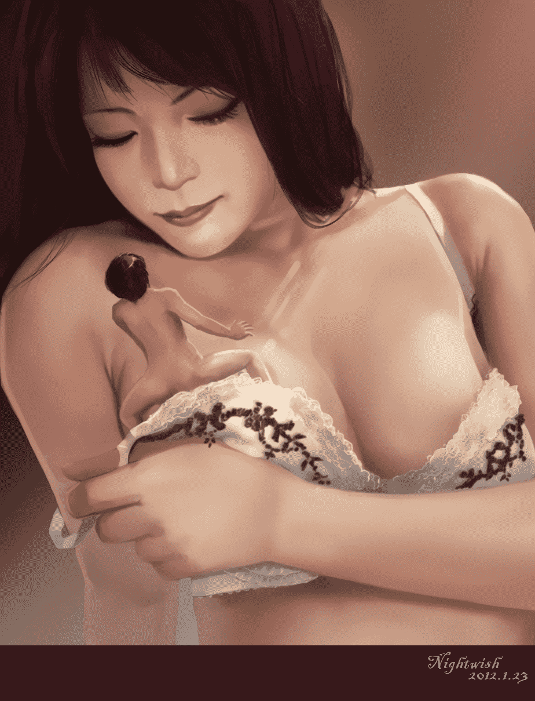](javascript:;)</ignore_js_op> <ignore_js_op>[2012-1-24a.jpg](forum.php?mod=attachment&aid=Mjc1NjB8OWI5ODhmN2V8MTYwMzg3NTY0NnwxODIzMHwxMTM1NA%3D%3D&nothumb=yes) *(418.07 KB, 下載次數: 14)*

[下載附件](forum.php?mod=attachment&aid=Mjc1NjB8OWI5ODhmN2V8MTYwMzg3NTY0NnwxODIzMHwxMTM1NA%3D%3D&nothumb=yes)

2012-1-25 03:25 上傳  

[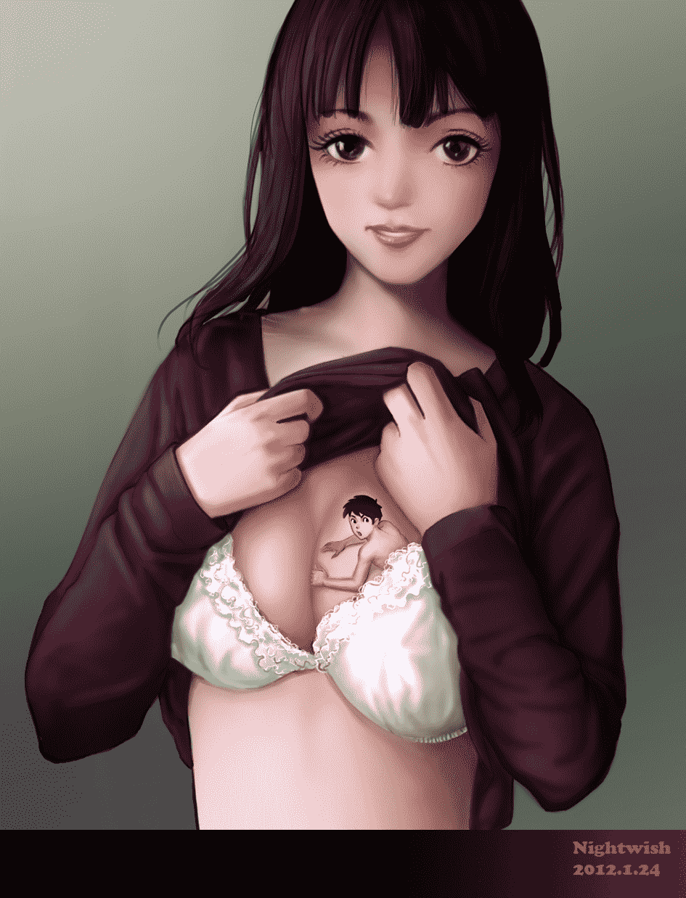](javascript:;)</ignore_js_op> <ignore_js_op>[2012-1-28副本.jpg](forum.php?mod=attachment&aid=Mjc2MDV8Y2E3NTU0MTJ8MTYwMzg3NTY0NnwxODIzMHwxMTM1NA%3D%3D&nothumb=yes) *(609.48 KB, 下載次數: 9)*

[下載附件](forum.php?mod=attachment&aid=Mjc2MDV8Y2E3NTU0MTJ8MTYwMzg3NTY0NnwxODIzMHwxMTM1NA%3D%3D&nothumb=yes)

2012-1-28 16:01 上傳  

[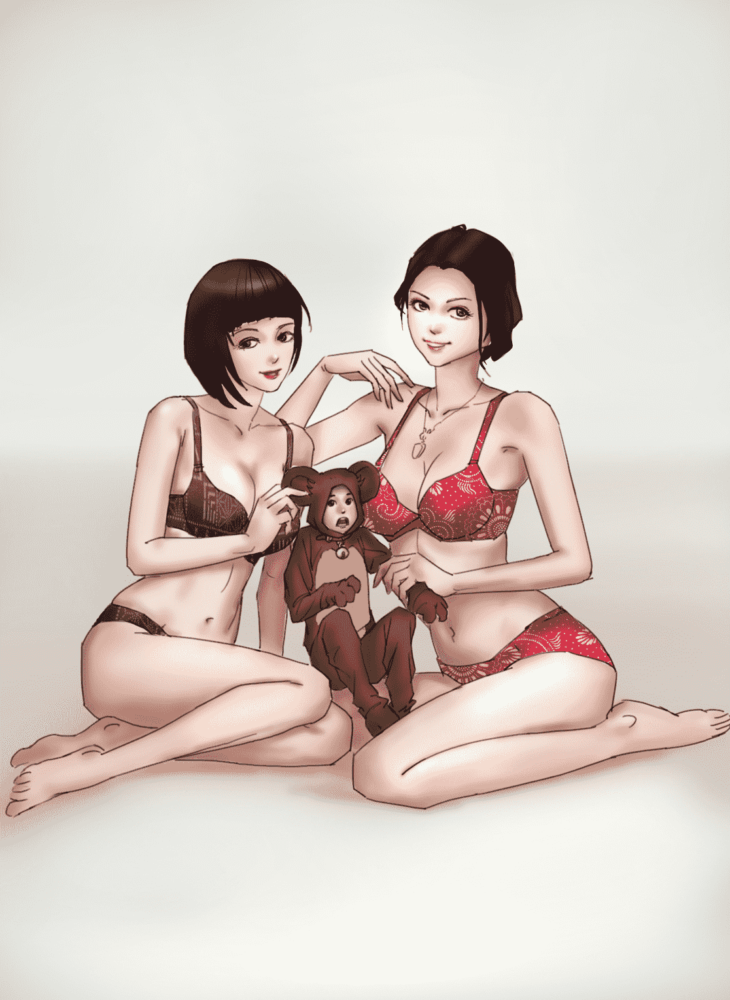](javascript:;)</ignore_js_op> <ignore_js_op>[2012-1-28a副本.jpg](forum.php?mod=attachment&aid=Mjc2MDh8NDA4YjliYjB8MTYwMzg3NTY0NnwxODIzMHwxMTM1NA%3D%3D&nothumb=yes) *(227.78 KB, 下載次數: 18)*

[下載附件](forum.php?mod=attachment&aid=Mjc2MDh8NDA4YjliYjB8MTYwMzg3NTY0NnwxODIzMHwxMTM1NA%3D%3D&nothumb=yes)

2012-1-29 00:09 上傳  

[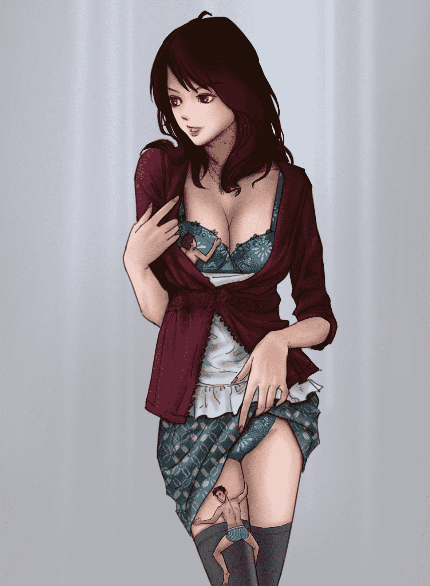](javascript:;)</ignore_js_op> <ignore_js_op>[2012-1-29.jpg](forum.php?mod=attachment&aid=Mjc2MTF8Nzk3NzFmZGV8MTYwMzg3NTY0NnwxODIzMHwxMTM1NA%3D%3D&nothumb=yes) *(240.92 KB, 下載次數: 19)*

[下載附件](forum.php?mod=attachment&aid=Mjc2MTF8Nzk3NzFmZGV8MTYwMzg3NTY0NnwxODIzMHwxMTM1NA%3D%3D&nothumb=yes)

2012-1-29 19:16 上傳  

[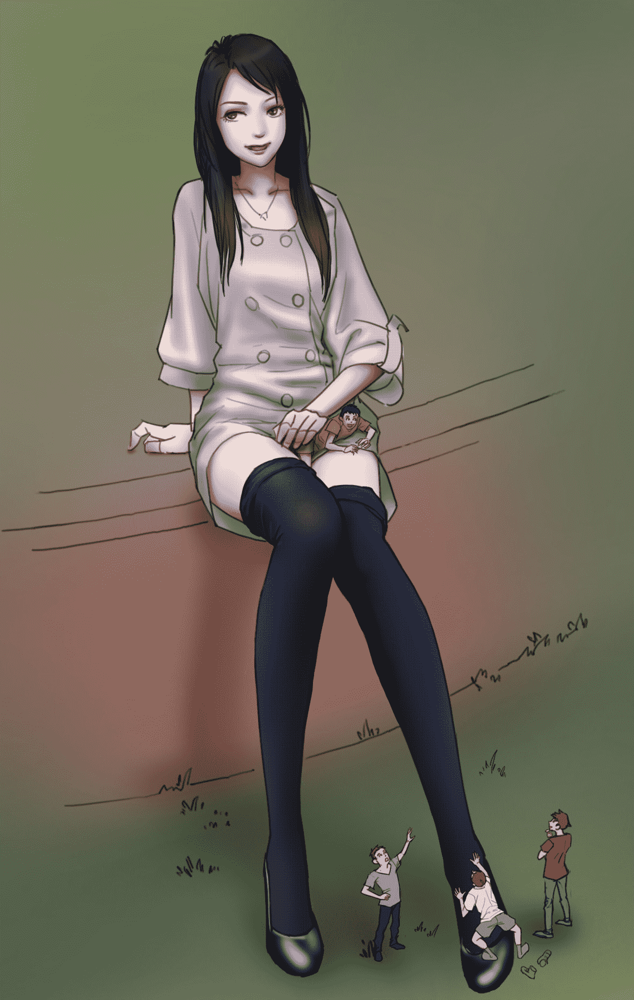](javascript:;)</ignore_js_op> <ignore_js_op>[2012-2-3副本.jpg](forum.php?mod=attachment&aid=Mjc2NTd8OTYwMWUyNTN8MTYwMzg3NTY0NnwxODIzMHwxMTM1NA%3D%3D&nothumb=yes) *(264.75 KB, 下載次數: 20)*

[下載附件](forum.php?mod=attachment&aid=Mjc2NTd8OTYwMWUyNTN8MTYwMzg3NTY0NnwxODIzMHwxMTM1NA%3D%3D&nothumb=yes)

2012-2-4 15:51 上傳  

[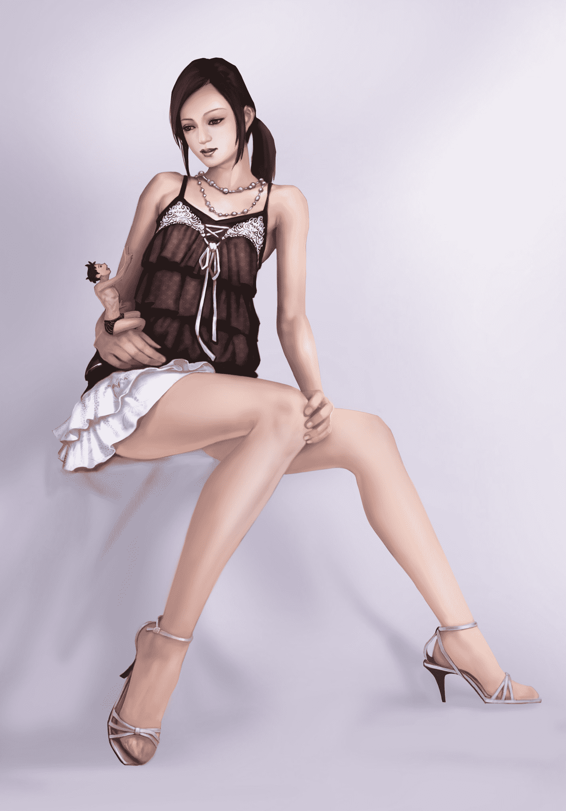](javascript:;)</ignore_js_op> <ignore_js_op>[2012-2-5副本.jpg](forum.php?mod=attachment&aid=Mjc2NzF8YjAzNjY0NjN8MTYwMzg3NTY0NnwxODIzMHwxMTM1NA%3D%3D&nothumb=yes) *(688.95 KB, 下載次數: 8)*

[下載附件](forum.php?mod=attachment&aid=Mjc2NzF8YjAzNjY0NjN8MTYwMzg3NTY0NnwxODIzMHwxMTM1NA%3D%3D&nothumb=yes)

2012-2-5 15:49 上傳  

[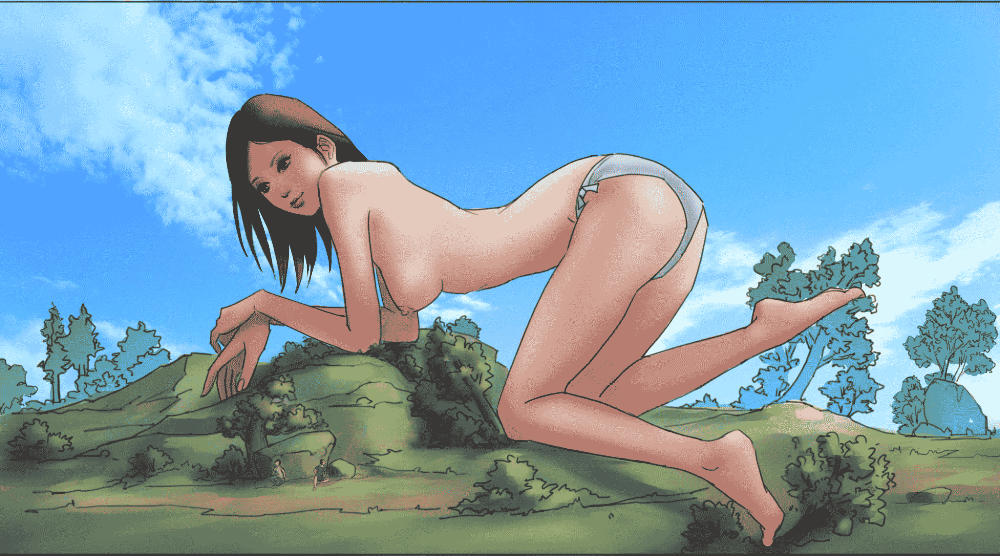](javascript:;)</ignore_js_op> <ignore_js_op>[2012-2-7副本.jpg](forum.php?mod=attachment&aid=Mjc2ODJ8OGMwNjk5ZTl8MTYwMzg3NTY0NnwxODIzMHwxMTM1NA%3D%3D&nothumb=yes) *(682.54 KB, 下載次數: 19)*

[下載附件](forum.php?mod=attachment&aid=Mjc2ODJ8OGMwNjk5ZTl8MTYwMzg3NTY0NnwxODIzMHwxMTM1NA%3D%3D&nothumb=yes)

2012-2-7 19:17 上傳  

[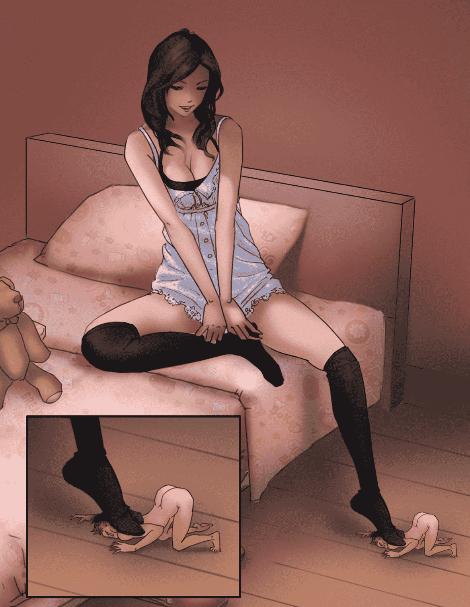](javascript:;)</ignore_js_op> <ignore_js_op>[2012-2-8副本.jpg](forum.php?mod=attachment&aid=Mjc2ODR8MTMxNTgxNWF8MTYwMzg3NTY0NnwxODIzMHwxMTM1NA%3D%3D&nothumb=yes) *(528.15 KB, 下載次數: 19)*

[下載附件](forum.php?mod=attachment&aid=Mjc2ODR8MTMxNTgxNWF8MTYwMzg3NTY0NnwxODIzMHwxMTM1NA%3D%3D&nothumb=yes)

2012-2-8 00:07 上傳  

[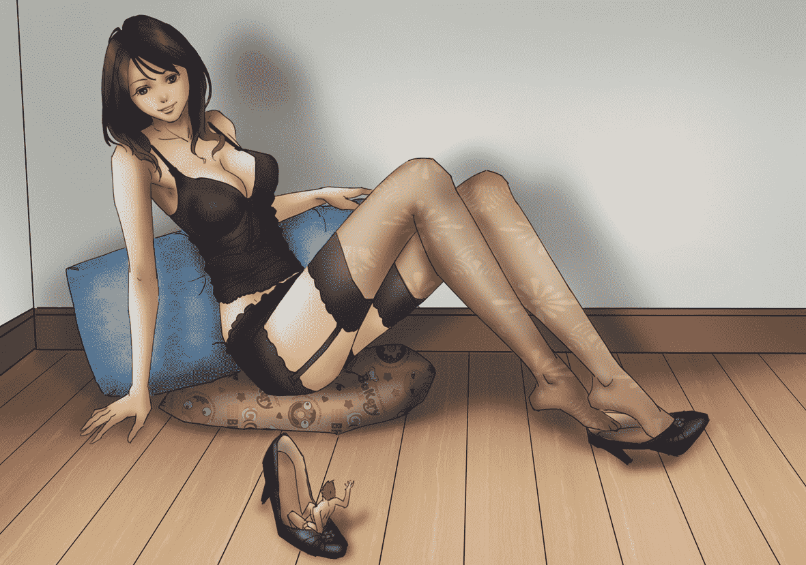](javascript:;)</ignore_js_op> <ignore_js_op>[2012-2-12a副本.jpg](forum.php?mod=attachment&aid=Mjc3MzB8Yzg2MDJkMjF8MTYwMzg3NTY0NnwxODIzMHwxMTM1NA%3D%3D&nothumb=yes) *(433.22 KB, 下載次數: 9)*

[下載附件](forum.php?mod=attachment&aid=Mjc3MzB8Yzg2MDJkMjF8MTYwMzg3NTY0NnwxODIzMHwxMTM1NA%3D%3D&nothumb=yes)

2012-2-13 02:15 上傳  

[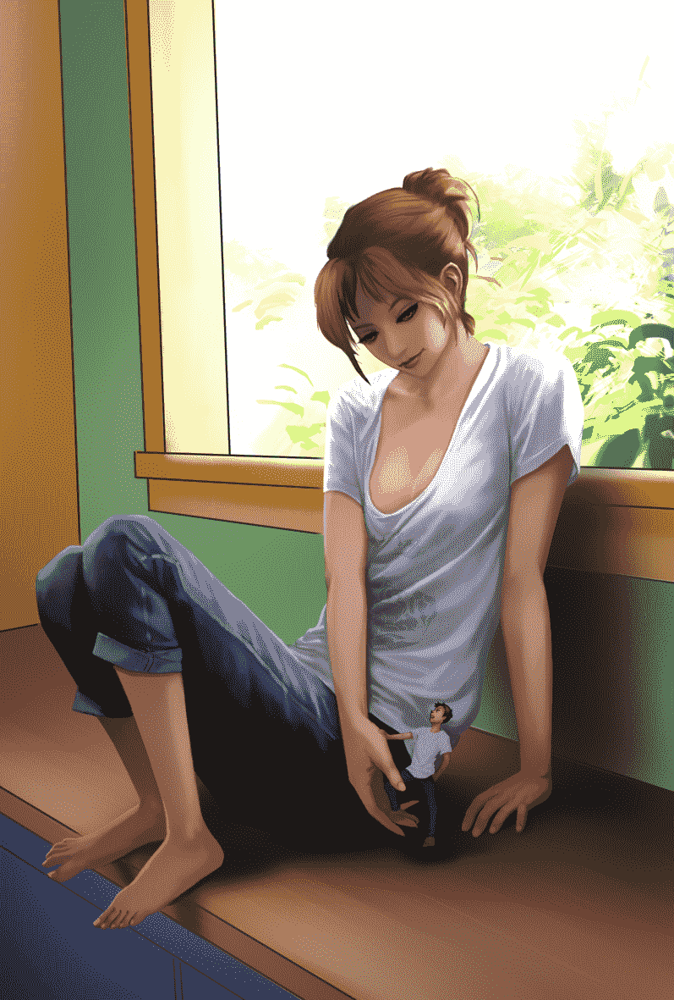](javascript:;)</ignore_js_op> <ignore_js_op>[2012-2-25副本.jpg](forum.php?mod=attachment&aid=Mjc4MjB8ZDVjZWMzYjV8MTYwMzg3NTY0NnwxODIzMHwxMTM1NA%3D%3D&nothumb=yes) *(850.92 KB, 下載次數: 25)*

[下載附件](forum.php?mod=attachment&aid=Mjc4MjB8ZDVjZWMzYjV8MTYwMzg3NTY0NnwxODIzMHwxMTM1NA%3D%3D&nothumb=yes)

2012-2-26 00:24 上傳  

[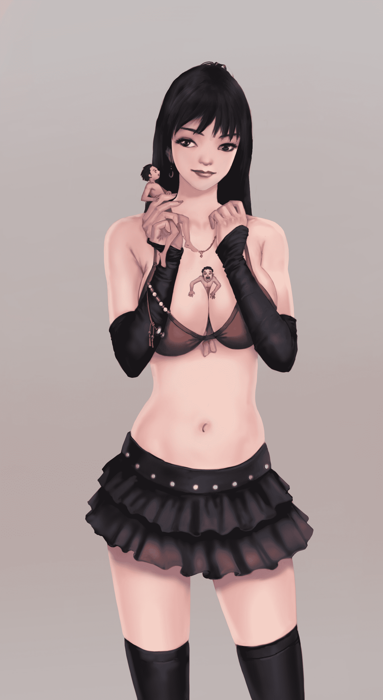](javascript:;)</ignore_js_op> <title>3</title> <link href="../Styles/Style.css" type="text/css" rel="stylesheet">

# 3

谢楼上各位支持。
果然还是画不好女人脸啊，头疼<title>4</title> <link href="../Styles/Style.css" type="text/css" rel="stylesheet">

# 4

> 原帖由 *infantryero* 於 2012-2-6 22:07 發表 
> lz画工了得啊！ 袜子的褶皱都能画出来！
> 
> 求更重口味

不知这位兄台所说的更重的口味指的是什么，或许你可以给点创作意见。比如用文字描述下你所希望看到的画面。太重口味的目前还不太能接受啊 <title>5</title> <link href="../Styles/Style.css" type="text/css" rel="stylesheet">

# 5

> 原帖由 *shengshi* 於 2012-2-6 23:39 發表 
>  好漂亮啊,楼主能教我做吗

额。
这个不知道从何处开始教起，你想制作的话就学画画吧。<title>6</title> <link href="../Styles/Style.css" type="text/css" rel="stylesheet">

# 6

> 原帖由 *xnr* 於 2012-2-6 21:21 發表 
> 更新了这么多！绝对支持！
> 
> 我想恐怕还有很多人没看到吧

多谢各位支持
估计是口味不同吧，我这些作品似乎属性比较单一，单幅的相对带有各种分镜的漫画来说代入感较弱。<title>7</title> <link href="../Styles/Style.css" type="text/css" rel="stylesheet">

# 7

> 原帖由 *atimelyrain* 於 2012-2-7 16:34 發表 
> 裸足+巨大化控表示最后一张很给力，就是点开大图人物轮廓有些残念
> 
> 楼主请再接再厉（求巨大娘裸足踩踏..

是线条的原因么，现在主要追求能快速制作，在质量上缺乏深入细致的刻画，主要是深入修图需要花费的时间精力是成倍上升的。