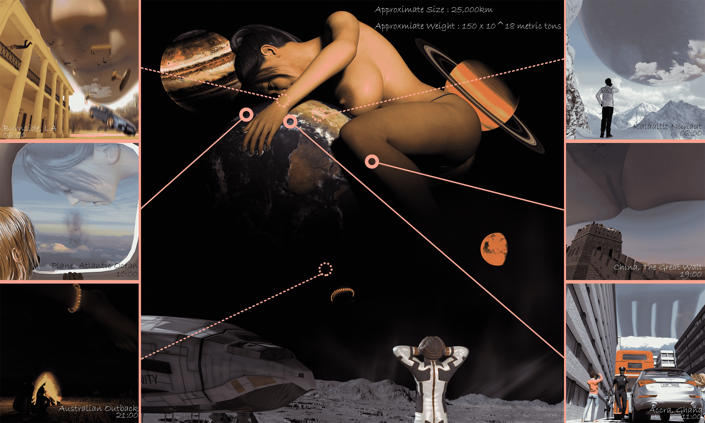

# 世界性災害(GIGA,星球級)

作者：kevinsky05

TID：26621

 

# 1

「一個巨大的女巨人能同時在各個城市做成巨大災害。」

花了幾天不務正業做了這一系列的GIGA圖，希望你們喜歡。

原圖太大了 只能放到百度上:

链接：[https://pan.baidu.com/s/1LLicGn2eVjnpdLGWRPo_6Q](https://pan.baidu.com/s/1LLicGn2eVjnpdLGWRPo_6Q)

提取码：oc8z

<ignore_js_op>

**World2.jpg** *(7.34 MB, 下載次數: 60)*

[下載附件](forum.php?mod=attachment&aid=NzczMTd8M2ZlMGUyNjl8MTYwMzgzNTkzNXwxODIzMHwyNjYyMQ%3D%3D&nothumb=yes)

2019-3-25 21:08 上傳

 

# 2

> [Java 發表於 2019-3-28 21:17](https://giantessnight.com/gnforum2012/forum.php?mod=redirect&goto=findpost&pid=401318&ptid=26621)

> 想知道澳洲那边那个带黄点的红圈是啥？脚环？

嗯 是發光的腳環

原意想做到像月亮那樣掛在天空發亮

做出來好像沒那樣的感覺了(?

 

# 3

> [王正念 發表於 2019-4-1 00:12](https://giantessnight.com/gnforum2012/forum.php?mod=redirect&goto=findpost&pid=401575&ptid=26621)

> 無法顯示，難過啊...

> 

> 能幫忙放其他連結嗎~

GD可以嗎?

[https://drive.google.com/open?id ... a7EVf473sNI5R1LLOui](https://drive.google.com/open?id=1Mg5CnT8nzi1roa7EVf473sNI5R1LLOui)</ignore_js_op>