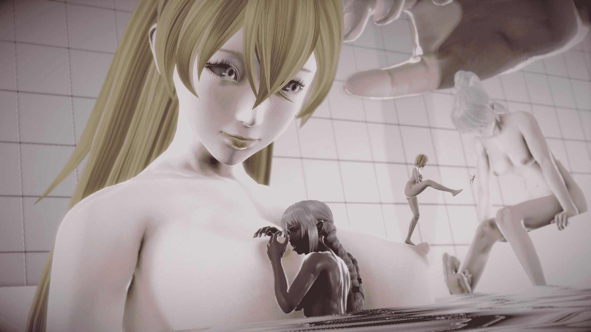
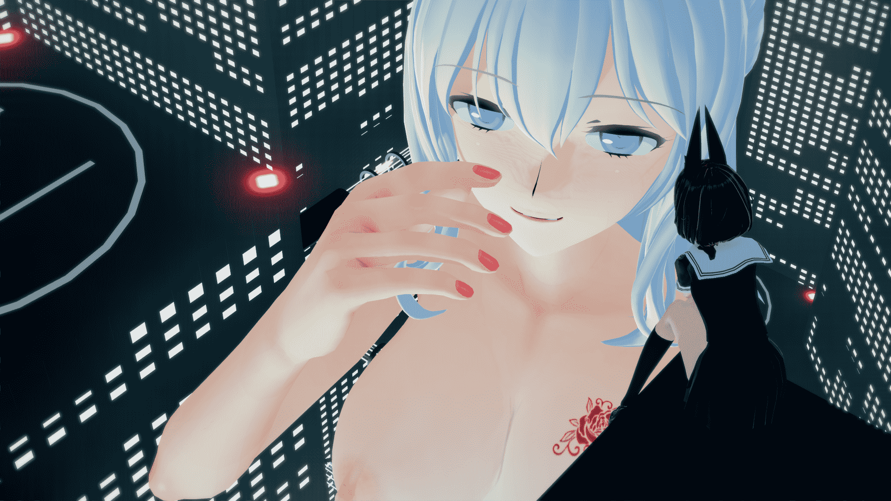

# 两种风格的做图

作者：feizipopo

TID：26916

 

# 1

两种风格的做图，一种是恋活的动漫风格，另一种是HS（PH更真一些，但是光影真的难调）那样的拟真实风格，不知道同好们更喜欢哪一种？

<ignore_js_op>

**20190507183323481.png** *(2.32 MB, 下載次數: 62)*

[下載附件](forum.php?mod=attachment&aid=Nzg2NTB8OWZjY2I3OWV8MTYwMzg0MDk1MnwxODIzMHwyNjkxNg%3D%3D&nothumb=yes)

2019-5-29 00:35 上傳

<ignore_js_op>

**Koikatsu-2019-05-28-23-46-58.png** *(2.08 MB, 下載次數: 9)*

[下載附件](forum.php?mod=attachment&aid=Nzg2NTF8ZjNmY2RjYWN8MTYwMzg0MDk1MnwxODIzMHwyNjkxNg%3D%3D&nothumb=yes)

2019-5-29 00:37 上傳

个人是更加喜欢HS这种风格的，但是比起恋活还是觉得可玩性不如后者，而且恋活FK有骨骼线条也更方便做pose。

不知道大家觉得如何呢？

PS：我不会写故事，虽然满脑子想法，所以欲望工坊（EC）是真的用不来，而且操作上也觉得恋活舒服些...</ignore_js_op></ignore_js_op>