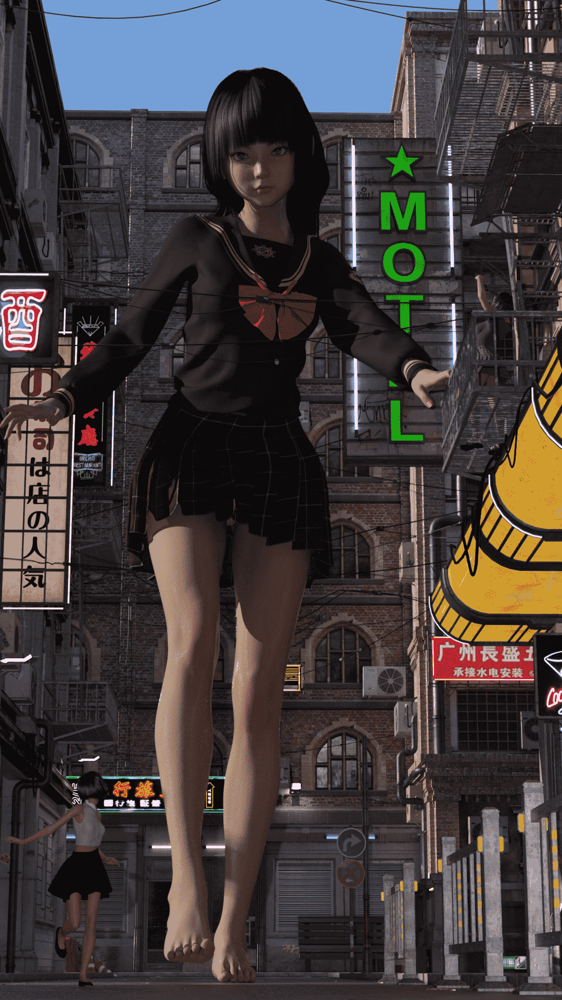

# 为难力不从心的缩小妹抖是否有些过分 4.30更新！

作者：蘑菇菇

TID：28568

<title>1</title> <link href="../Styles/Style.css" type="text/css" rel="stylesheet">

# 1

*本帖最後由 蘑菇菇 於 2020-4-30 17:40 編輯*

大家好，这里是蘑菇！毕业论文写多了只能想出些奇怪的标题了…这次尝试了更多新花样！依然在图里丢了点彩蛋，不妨找找看…QQ群号是854945655！
有什么想康的欢迎回复！
<title>2</title> <link href="../Styles/Style.css" type="text/css" rel="stylesheet">

# 2

 <ignore_js_op>[1(4).png](forum.php?mod=attachment&aid=ODI2OTZ8YWY4ZjJiODR8MTYwMzgzMjgyOHwxODIzMHwyODU2OA%3D%3D&nothumb=yes) *(4.09 MB, 下載次數: 148)*

[下載附件](forum.php?mod=attachment&aid=ODI2OTZ8YWY4ZjJiODR8MTYwMzgzMjgyOHwxODIzMHwyODU2OA%3D%3D&nothumb=yes)

2020-4-25 23:30 上傳  

[.png")](javascript:;)</ignore_js_op> <ignore_js_op>[2(4).png](forum.php?mod=attachment&aid=ODI2OTV8MDg2NTBmNWZ8MTYwMzgzMjgyOHwxODIzMHwyODU2OA%3D%3D&nothumb=yes) *(3.94 MB, 下載次數: 29)*

[下載附件](forum.php?mod=attachment&aid=ODI2OTV8MDg2NTBmNWZ8MTYwMzgzMjgyOHwxODIzMHwyODU2OA%3D%3D&nothumb=yes)

2020-4-25 23:30 上傳  

[.png")](javascript:;)</ignore_js_op> <ignore_js_op>[3(2).png](forum.php?mod=attachment&aid=ODI2OTR8YjgwNjY1M2F8MTYwMzgzMjgyOHwxODIzMHwyODU2OA%3D%3D&nothumb=yes) *(2.92 MB, 下載次數: 34)*

[下載附件](forum.php?mod=attachment&aid=ODI2OTR8YjgwNjY1M2F8MTYwMzgzMjgyOHwxODIzMHwyODU2OA%3D%3D&nothumb=yes)

2020-4-25 23:30 上傳  

[.png")](javascript:;)</ignore_js_op> <ignore_js_op>[4(2).png](forum.php?mod=attachment&aid=ODI2OTN8NTgwNmEwYzR8MTYwMzgzMjgyOHwxODIzMHwyODU2OA%3D%3D&nothumb=yes) *(3.25 MB, 下載次數: 31)*

[下載附件](forum.php?mod=attachment&aid=ODI2OTN8NTgwNmEwYzR8MTYwMzgzMjgyOHwxODIzMHwyODU2OA%3D%3D&nothumb=yes)

2020-4-25 23:30 上傳  

[.png")](javascript:;)</ignore_js_op> <title>3</title> <link href="../Styles/Style.css" type="text/css" rel="stylesheet">

# 3

*本帖最後由 蘑菇菇 於 2020-4-26 11:38 編輯*

番茄酱预警！不喜请跳过

本图是番茄酱试制图，并没有渲染太深，甚至还穿模了！但是这算是在番茄酱方面的首个尝试。
<title>4</title> <link href="../Styles/Style.css" type="text/css" rel="stylesheet">

# 4

 <ignore_js_op>[5(2).png](forum.php?mod=attachment&aid=ODI2OTd8YjQ5YjEzMzN8MTYwMzgzMjgyOHwxODIzMHwyODU2OA%3D%3D&nothumb=yes) *(4.51 MB, 下載次數: 36)*

[下載附件](forum.php?mod=attachment&aid=ODI2OTd8YjQ5YjEzMzN8MTYwMzgzMjgyOHwxODIzMHwyODU2OA%3D%3D&nothumb=yes)

2020-4-25 23:35 上傳  

[.png")](javascript:;)</ignore_js_op> <title>5</title> <link href="../Styles/Style.css" type="text/css" rel="stylesheet">

# 5

仍然做不出来第一人称视角…难搞哦。关于图文结合目前走在考虑…但是我想写的东西(挖的新坑)不是很容易做出来…
然后，
我们的口号是！…
<title>6</title> <link href="../Styles/Style.css" type="text/css" rel="stylesheet">

# 6

 <ignore_js_op>[6(1).png](forum.php?mod=attachment&aid=ODI3MTV8YTUwMmE5YzR8MTYwMzgzMjgyOHwxODIzMHwyODU2OA%3D%3D&nothumb=yes) *(3.05 MB, 下載次數: 16)*

[下載附件](forum.php?mod=attachment&aid=ODI3MTV8YTUwMmE5YzR8MTYwMzgzMjgyOHwxODIzMHwyODU2OA%3D%3D&nothumb=yes)

2020-4-26 22:57 上傳  

[.png")](javascript:;)</ignore_js_op> <ignore_js_op>[7(1).png](forum.php?mod=attachment&aid=ODI3MTR8YzE0ZTE2MjF8MTYwMzgzMjgyOHwxODIzMHwyODU2OA%3D%3D&nothumb=yes) *(3.06 MB, 下載次數: 12)*

[下載附件](forum.php?mod=attachment&aid=ODI3MTR8YzE0ZTE2MjF8MTYwMzgzMjgyOHwxODIzMHwyODU2OA%3D%3D&nothumb=yes)

2020-4-26 22:57 上傳  

[.png")](javascript:;)</ignore_js_op> <title>7</title> <link href="../Styles/Style.css" type="text/css" rel="stylesheet">

# 7

> [ACE 發表於 2020-4-30 15:16](https://giantessnight.com/gnforum2012/forum.php?mod=redirect&goto=findpost&pid=434938&ptid=28568)
> 楼主做得实在太有感觉了！想问下学到这种程度需要多少时间？（智力中等，每天只有一小时。。） ...

软件操作不难的，自己随便用用就能搞明白，大概一周就能熟练一些。主要是渲染参数设置比较麻烦，想达到最好的效果还就得多了解一些。最后就是有一定的硬件要求，首先Iray只支持N卡，A卡用不了。然后最好用好一点的显卡，我用2070大概出一张图1小时到1小时40分之间，还是我优化过的结果……
<title>8</title> <link href="../Styles/Style.css" type="text/css" rel="stylesheet">

# 8

做了两张新图，虽然不是可怜的女仆酱了…
<title>9</title> <link href="../Styles/Style.css" type="text/css" rel="stylesheet">

# 9

 <ignore_js_op>[fw2.png](forum.php?mod=attachment&aid=ODI3NTd8MTE0MDRmMTZ8MTYwMzgzMjgyOHwxODIzMHwyODU2OA%3D%3D&nothumb=yes) *(3.42 MB, 下載次數: 19)*

[下載附件](forum.php?mod=attachment&aid=ODI3NTd8MTE0MDRmMTZ8MTYwMzgzMjgyOHwxODIzMHwyODU2OA%3D%3D&nothumb=yes)

2020-4-30 17:37 上傳  

</ignore_js_op> <ignore_js_op>[fw1.png](forum.php?mod=attachment&aid=ODI3NTZ8ZmMzNWU1Y2J8MTYwMzgzMjgyOHwxODIzMHwyODU2OA%3D%3D&nothumb=yes) *(3.22 MB, 下載次數: 11)*

[下載附件](forum.php?mod=attachment&aid=ODI3NTZ8ZmMzNWU1Y2J8MTYwMzgzMjgyOHwxODIzMHwyODU2OA%3D%3D&nothumb=yes)

2020-4-30 17:35 上傳  

</ignore_js_op>