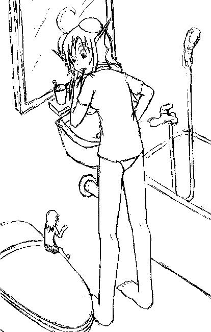
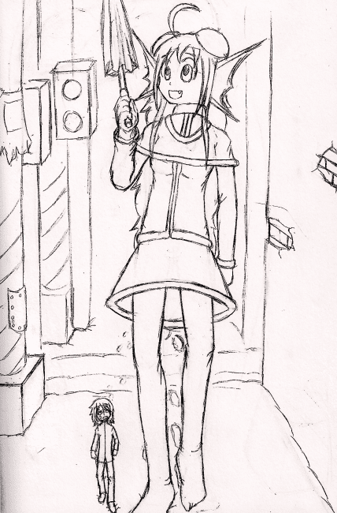

# 代貼-（7／6更新一張）

作者：Dante

TID：8331

<title>1</title> <link href="../Styles/Style.css" type="text/css" rel="stylesheet">

# 1

.
這是本站創作者之一的 fladramon 的作品。
因種種緣故，要求我幫他代貼，我欣然答應幫忙。

然後，我也希望大家可以多給他一點鼓勵。
有什麼心得或建議，都可以在底下提出來，不過請具體一點。
吐嘈可以是一種與人互動的方式，不過這對創作者本身沒有幫助，我也不希望在這裡成天看見精神修煉之類的戲碼。
希望大家將心比心囉！

＊7/1　再度新增 fladramon 作品一張
＊7/6　再度新增 fladramon 作品一張<title>2</title> <link href="../Styles/Style.css" type="text/css" rel="stylesheet">

# 2

 <ignore_js_op>[未命名 - 2(2).jpg](forum.php?mod=attachment&aid=MjEyMjZ8MTI5NzQxYzd8MTYwMzg3OTMyOXwxODIzMHw4MzMx&nothumb=yes) *(38.9 KB, 下載次數: 4)*

[下載附件](forum.php?mod=attachment&aid=MjEyMjZ8MTI5NzQxYzd8MTYwMzg3OTMyOXwxODIzMHw4MzMx&nothumb=yes)

2010-7-1 00:05 上傳  

[.jpg")](javascript:;)</ignore_js_op> <ignore_js_op>[z.jpg](forum.php?mod=attachment&aid=MjEyODJ8NTMyMzM5ZGJ8MTYwMzg3OTMyOXwxODIzMHw4MzMx&nothumb=yes) *(48.49 KB, 下載次數: 0)*

[下載附件](forum.php?mod=attachment&aid=MjEyODJ8NTMyMzM5ZGJ8MTYwMzg3OTMyOXwxODIzMHw4MzMx&nothumb=yes)

2010-7-2 12:49 上傳  

7/1 更新

</ignore_js_op>  <ignore_js_op>[scan0001.jpg](forum.php?mod=attachment&aid=MjE0MTd8YTliYTc3Njh8MTYwMzg3OTMyOXwxODIzMHw4MzMx&nothumb=yes) *(252.46 KB, 下載次數: 3)*

[下載附件](forum.php?mod=attachment&aid=MjE0MTd8YTliYTc3Njh8MTYwMzg3OTMyOXwxODIzMHw4MzMx&nothumb=yes)

2010-7-6 00:18 上傳  

7/6 更新

</ignore_js_op> <title>3</title> <link href="../Styles/Style.css" type="text/css" rel="stylesheet">

# 3

.
今天在DA上又看到作者有更新了，速度真是快呢。

不覺得能夠把腦子裡的東西具現化出來的力量是很厲害的嗎？<title>4</title> <link href="../Styles/Style.css" type="text/css" rel="stylesheet">

# 4

.
對自己要有自信點，這樣才會有動力去追求進步。
藝術的東西總是活到老練到老的。挑戰上色、挑戰不同的構圖、挑戰更複雜的線條或背景……很多東西等著你去發揮。

你會畫出屬於自己的一片天的。