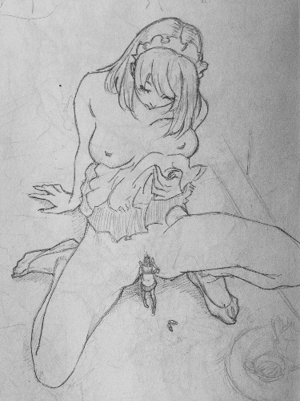
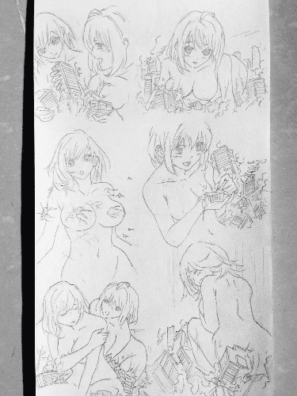
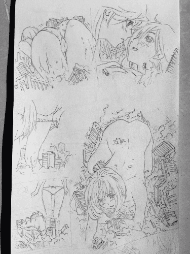

# 仿河下水希作品

作者：414215152

TID：22214

<title>1</title> <link href="../Styles/Style.css" type="text/css" rel="stylesheet">

# 1

*本帖最後由 414215152 於 2016-11-28 00:12 編輯*

来迟了
现在才得闲

我虽然不怎么看过现在的动漫
但我以前也是崇拜几位漫画大师的
现在名字差不多都忘了⋯⋯
也没几个
印象最深的就八月薰与河下水希了
就说河下水希吧
我是写实派的
但不知道为什么就是特别喜欢她那种二次元的风格
说丰满又苗条
说⋯⋯
不说了
总之
以前非常喜欢模仿她的画风画也幻想过让她画女巨人⋯⋯
虽然她也擦边了不少
不说了
上图
也拜托XP窗口朋友了
[http://pan.baidu.com/share/link? ... 8&uk=1312049522](http://pan.baidu.com/share/link?shareid=2051192648&uk=1312049522)
<title>2</title> <link href="../Styles/Style.css" type="text/css" rel="stylesheet">

# 2

 <ignore_js_op>[image.jpg](forum.php?mod=attachment&aid=NjU3Mzl8YzMyNjFhOGF8MTYwMzg1ODQwNHwxODIzMHwyMjIxNA%3D%3D&nothumb=yes) *(63.87 KB, 下載次數: 13)*

[下載附件](forum.php?mod=attachment&aid=NjU3Mzl8YzMyNjFhOGF8MTYwMzg1ODQwNHwxODIzMHwyMjIxNA%3D%3D&nothumb=yes)

2016-11-27 14:59 上傳  

</ignore_js_op> <ignore_js_op>[image.jpg](forum.php?mod=attachment&aid=NjU3Mzh8ZGY5ZWRlYjd8MTYwMzg1ODQwNHwxODIzMHwyMjIxNA%3D%3D&nothumb=yes) *(63.97 KB, 下載次數: 9)*

[下載附件](forum.php?mod=attachment&aid=NjU3Mzh8ZGY5ZWRlYjd8MTYwMzg1ODQwNHwxODIzMHwyMjIxNA%3D%3D&nothumb=yes)

2016-11-27 14:58 上傳  

</ignore_js_op> <ignore_js_op>[image.jpg](forum.php?mod=attachment&aid=NjU3Mzd8ZTg0OWFjNDJ8MTYwMzg1ODQwNHwxODIzMHwyMjIxNA%3D%3D&nothumb=yes) *(69 KB, 下載次數: 6)*

[下載附件](forum.php?mod=attachment&aid=NjU3Mzd8ZTg0OWFjNDJ8MTYwMzg1ODQwNHwxODIzMHwyMjIxNA%3D%3D&nothumb=yes)

2016-11-27 14:57 上傳  

</ignore_js_op> <title>3</title> <link href="../Styles/Style.css" type="text/css" rel="stylesheet">

# 3

> 3213213210 發表於 2016-11-27 18:32
> 想到桂正和 久保代人也滿厲害的

嗯
桂正和也可以
但画风太复古
不怎么感兴趣
久保带人确实厉害
以前的同学有让我看过他的作品
非常细腻
只是他好像都是画热血肌肉男
模仿他的画风感觉有点恶⋯⋯
所以也不感兴趣
话说朋友收到了吗
能行吗<title>4</title> <link href="../Styles/Style.css" type="text/css" rel="stylesheet">

# 4

> seelenerve 發表於 2016-11-27 16:15
> 我其实好希望楼主可以把之前那些女中学生的图也转成高清大图~

你不说我居然忘了
抱歉
找个时间重新拍
之前的太暗了
话说你这么支持是我的动力啊
<title>5</title> <link href="../Styles/Style.css" type="text/css" rel="stylesheet">

# 5

> 3213213210 發表於 2016-11-29 13:52
> 我沒收到私訊啊
> 還是你在說這帖

啊啊
就是這個鏈接啊
我不會私信啊
放了幾天啦<title>6</title> <link href="../Styles/Style.css" type="text/css" rel="stylesheet">

# 6

> 3213213210 發表於 2016-11-30 14:45
> 二三張這種圖集的我不太會用(主要是解析度太差細節會很難處理)像第一張這樣人完整放進來的就很好……如果 ...

好吧也就是说目前只能处理单图么
我下次找找合适的
诺真的没空做的话请告诉我吧
不必勉强自己
本来我也是想试试看而已