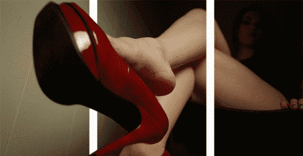
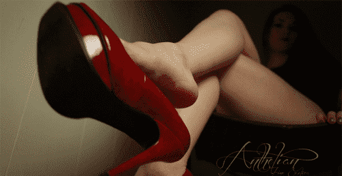

# 伪裸眼3D，适用于签名图片

作者：wxy112300

TID：16216

<title>1</title> <link href="../Styles/Style.css" type="text/css" rel="stylesheet">

# 1

其实就是偶然看到的别人的签名图，角度看起来不错...于是自己处理了下，手动去了水印加了边框，这回尺寸压缩的也很好...

<ignore_js_op>

**rander.gif** *(699.32 KB, 下載次數: 46)*

[下載附件](forum.php?mod=attachment&aid=NDA4MTl8YjAxZGRhYzR8MTYwMzg3MTgxMHwxODIzMHwxNjIxNg%3D%3D&nothumb=yes)

2014-2-11 23:22 上傳

<title>2</title> <link href="../Styles/Style.css" type="text/css" rel="stylesheet">

# 2

> [Mr丶DerbI 發表於 2014-2-12 19:05](https://giantessnight.com/gnforum2012/forum.php?mod=redirect&goto=findpost&pid=215816&ptid=16216)
> 楼主这次3D效果很棒啊，美足一勾一勾的太诱惑人了！

论素材的重要性....素材好效果当然就好了
<title>3</title> <link href="../Styles/Style.css" type="text/css" rel="stylesheet">

# 3

> [s-man 發表於 2014-2-12 23:27](https://giantessnight.com/gnforum2012/forum.php?mod=redirect&goto=findpost&pid=215858&ptid=16216)
> 能发下原图吗？

<ignore_js_op>

**d439b6003af33a873c70b318c45c10385343b597.gif** *(745.02 KB, 下載次數: 2)*

[下載附件](forum.php?mod=attachment&aid=NDA4MzB8MWRjNTA5Mjl8MTYwMzg3MTgxMHwxODIzMHwxNjIxNg%3D%3D&nothumb=yes)

2014-2-12 23:59 上傳

原图在此....
<title>4</title> <link href="../Styles/Style.css" type="text/css" rel="stylesheet">

# 4

> [awkeygen 發表於 2014-2-12 23:32](https://giantessnight.com/gnforum2012/forum.php?mod=redirect&goto=findpost&pid=215860&ptid=16216)
> 嗯，楼主这种表现方式很新颖，增加了很多立体感！
> 顺便求科普，AE主要用来做什么的？ ...

惊现A大...

After Effects主要是做后期特效的，就像名字本身一样...但是相比胡迪尼之类的软件操作起来要简单的多..
特效方面主要是后期合成，把虚拟的场景合成到现实当中，很多好莱坞电影都是用的AE制作的特效。
相当强大的软件了，可以说就是动态的Photoshop。有像PS一样的图层功能，还有很方便的蒙版工具，抠像插件，追踪，调色之类的功能，还支持3D图层，配合Element 3D插件还可以直接使用3D模型。
在圈内像Media Impact的VFX视频或者K姐的视频完全可以用AE很容易的做出来的...</ignore_js_op></ignore_js_op>