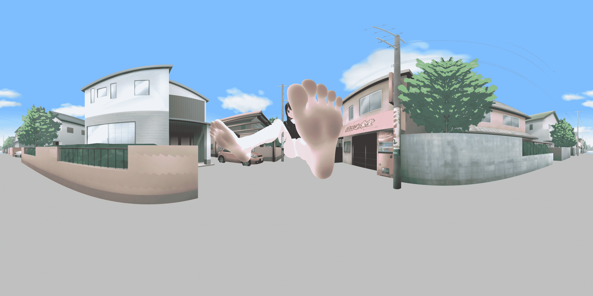
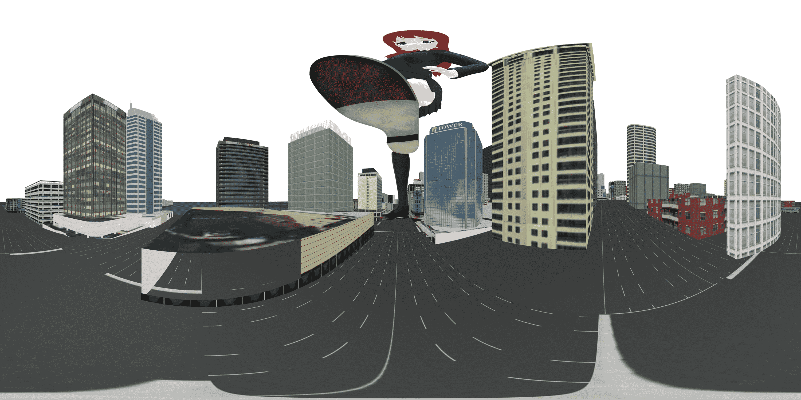
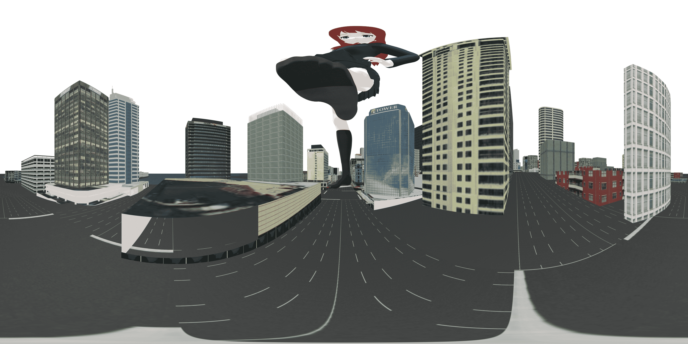
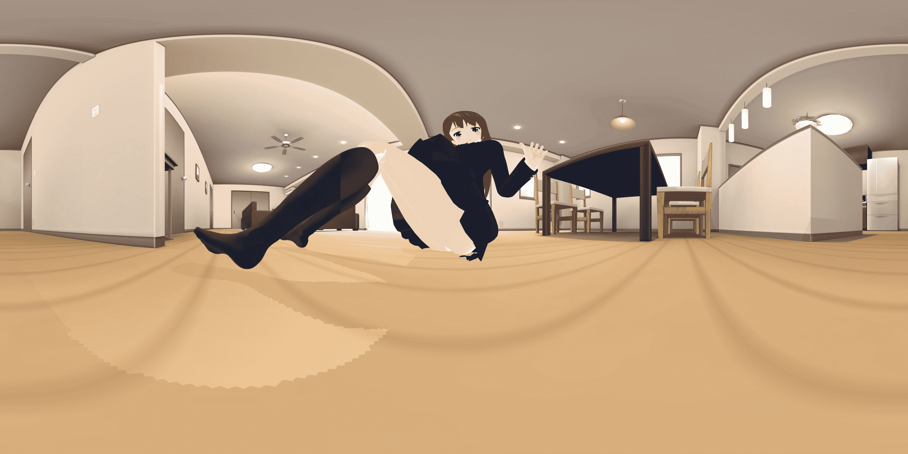
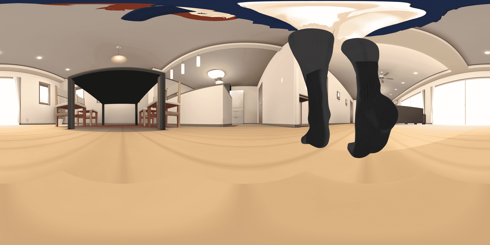
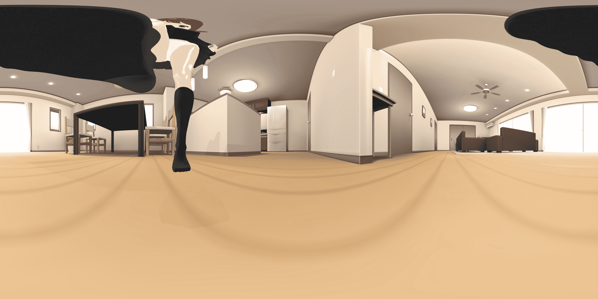
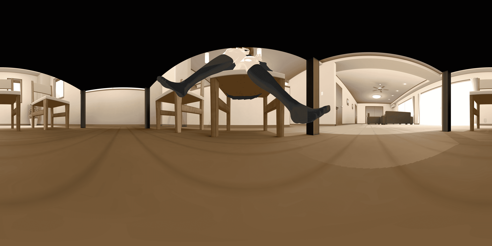
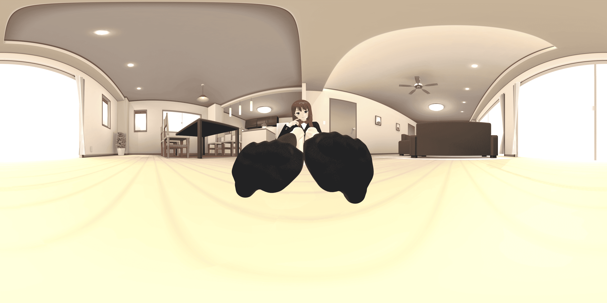

# 体验小人的视角，MMD制作的沉浸式VR全景图（附超简单教程）

作者：界界界界

TID：22210

 

# 1

*本帖最後由 界界界界 於 2016-11-28 20:41 編輯*

本人其实不怎么会使MMD，但看M78124大大做的全景图并且用我IPhone7的渣屏幕试了一下，效果十分震撼，就决定也试着做一下，没想到做出来之后效果不错，就想着发出来分享一下，并且打算做一个教程，因为方法实在太简单了，任何建模软件都可以做出全景图。

[超简单的MMD（即各种建模软件）的VR全景图制作方法](http://giantessnight.com/gnforum2012/forum.php?mod=viewthread&tid=22211)，姿势摆好五分钟一张，任何小白都能做（我就是），大神们也可以用原来的工程轻松做出全景图！

<ignore_js_op>

**Pano01_mini.jpg** *(459.81 KB, 下載次數: 4)*

[下載附件](forum.php?mod=attachment&aid=NjU3NjZ8YWU3MTM1M2J8MTYwMzg1OTY0M3wxODIzMHwyMjIxMA%3D%3D&nothumb=yes)

2016-11-28 20:39 上傳

这张是做的第一张，相比起使用的模型，效果已经爆炸

<ignore_js_op>

**Pano02_mini.jpg** *(812.8 KB, 下載次數: 2)*

[下載附件](forum.php?mod=attachment&aid=NjU3Njd8ZGYzOWJiMTZ8MTYwMzg1OTY0M3wxODIzMHwyMjIxMA%3D%3D&nothumb=yes)

2016-11-28 20:39 上傳

<ignore_js_op>

**Pano03_mini.jpg** *(808.94 KB, 下載次數: 4)*

[下載附件](forum.php?mod=attachment&aid=NjU3Njh8MzQyYzA5NWV8MTYwMzg1OTY0M3wxODIzMHwyMjIxMA%3D%3D&nothumb=yes)

2016-11-28 20:39 上傳

<ignore_js_op>

**Pano04_mini.jpg** *(471.18 KB, 下載次數: 4)*

[下載附件](forum.php?mod=attachment&aid=NjU3Njl8M2FhMjI1NzJ8MTYwMzg1OTY0M3wxODIzMHwyMjIxMA%3D%3D&nothumb=yes)

2016-11-28 20:39 上傳

<ignore_js_op>

**Pano05_mini.jpg** *(520 KB, 下載次數: 7)*

[下載附件](forum.php?mod=attachment&aid=NjU3NzB8NzZjYjMxY2R8MTYwMzg1OTY0M3wxODIzMHwyMjIxMA%3D%3D&nothumb=yes)

2016-11-28 20:39 上傳

<ignore_js_op>

**Pano06_mini.jpg** *(522.84 KB, 下載次數: 3)*

[下載附件](forum.php?mod=attachment&aid=NjU3NzF8OGE5OTEzYjh8MTYwMzg1OTY0M3wxODIzMHwyMjIxMA%3D%3D&nothumb=yes)

2016-11-28 20:39 上傳

<ignore_js_op>

**Pano07_mini.jpg** *(412.86 KB, 下載次數: 5)*

[下載附件](forum.php?mod=attachment&aid=NjU3NzJ8YTJiMTFlYTR8MTYwMzg1OTY0M3wxODIzMHwyMjIxMA%3D%3D&nothumb=yes)

2016-11-28 20:39 上傳

<ignore_js_op>

**Pano10_mini.jpg** *(427.06 KB, 下載次數: 4)*

[下載附件](forum.php?mod=attachment&aid=NjU3NzN8MTgyZDlkMDB8MTYwMzg1OTY0M3wxODIzMHwyMjIxMA%3D%3D&nothumb=yes)

2016-11-28 20:39 上傳

我用的模型和姿势基本都是现成的，也没有经过渲染，主要还是想推广这种制作全景图的方法，让体验利用VR技术不断上升。

使用方法将手机连接电脑，把全景图导入到应用的文件夹里。

我用的是ios上的Insta360Player，安卓上的VR Gallery安卓应该这类软件更多，一百度都是，但我没有安卓机，并没有实验这个到底能不能用，效果如何，如果不能用请告诉我。

附高清图下载链接：[http://pan.baidu.com/s/1i5I5bCh1i5I5bCh](http://pan.baidu.com/s/1i5I5bCh) 密码：9rft

 

# 2

> [TYY 發表於 2016-11-26 21:54](https://giantessnight.com/gnforum2012/forum.php?mod=redirect&goto=findpost&pid=315884&ptid=22210)

> 表示只能用体验版的简陋vr眼镜看，不过效果还是很不错的

是啊我iphone的渣屏幕 1080p都不是也很震撼

 

# 3

> [qreeper 發表於 2016-11-26 20:13](https://giantessnight.com/gnforum2012/forum.php?mod=redirect&goto=findpost&pid=315867&ptid=22210)

> 楼主怎么做的啊，好棒！

教程写完拉，在最上面

 

# 4

> [444666444666 發表於 2016-11-26 23:19](https://giantessnight.com/gnforum2012/forum.php?mod=redirect&goto=findpost&pid=315913&ptid=22210)

> 这个要用什么软件看？没有看图片的软件啊

试试VR Gallery

我没有安卓机，没法实验行不行，但看功能和截图应该可以。

 

# 5

> [remirs 發表於 2016-11-26 22:13](https://giantessnight.com/gnforum2012/forum.php?mod=redirect&goto=findpost&pid=315891&ptid=22210)

> 这个在手机上要怎么看啊。。。本人不懂

试试VR Gallery

我没有安卓机，没法实验行不行，但看功能和截图应该可以。</ignore_js_op></ignore_js_op></ignore_js_op></ignore_js_op></ignore_js_op></ignore_js_op></ignore_js_op></ignore_js_op>