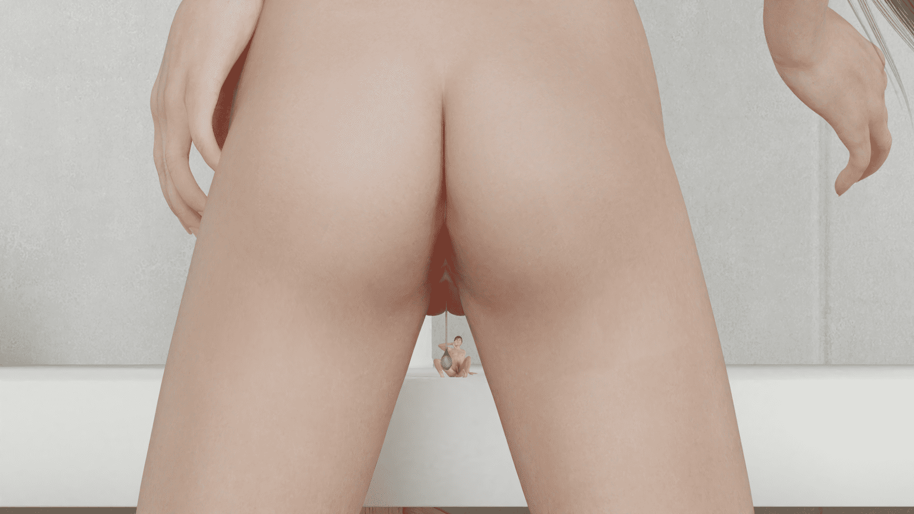
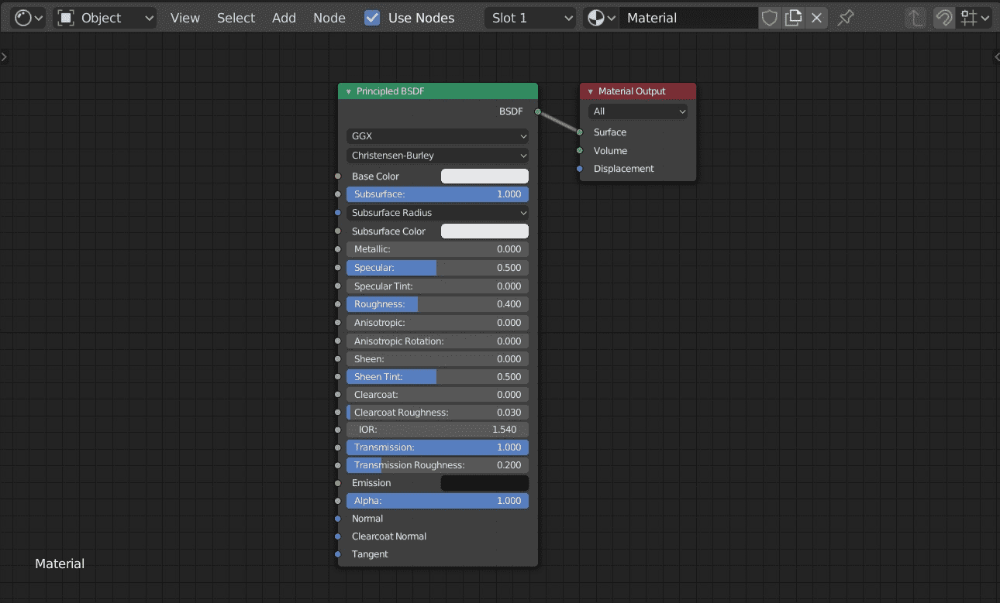

# 做了圖，但看起來很怪......

作者：3213213210

TID：27323

 

# 1

*本帖最後由 3213213210 於 2019-9-1 16:32 編輯*

一如往常的Blender 2.8

雖然喜歡這個構圖，但感覺少了什麼，所以加了垂吊的陰道分泌液

然後......

<ignore_js_op>

**1280.png** *(2.47 MB, 下載次數: 9)*

[下載附件](forum.php?mod=attachment&aid=Nzk1MjJ8YTQzOWE0NTJ8MTYwMzg0MDA0MnwxODIzMHwyNzMyMw%3D%3D&nothumb=yes)

2019-9-1 14:13 上傳

......看起來好像毛玻璃

有沒有什麼修正方法的建議? 感恩

Material node:

<ignore_js_op>

**MT.jpg** *(169.72 KB, 下載次數: 0)*

[下載附件](forum.php?mod=attachment&aid=Nzk1MjR8OTBjZGU4MWJ8MTYwMzg0MDA0MnwxODIzMHwyNzMyMw%3D%3D&nothumb=yes)

2019-9-1 16:29 上傳

透明拉最大、IOR(折射率)調高，再加一點Roughness

這幾項再怎麼拉都像是玻璃，是不是中間還得加點雜訊?

還是這是建模的問題?

 

# 2

> [缩小的男人 發表於 2019-9-3 14:54](https://giantessnight.com/gnforum2012/forum.php?mod=redirect&goto=findpost&pid=413985&ptid=27323)

> 果然很像玻璃，不过人物看起来很棒，很有感觉

[https://smutba.se/](https://smutba.se/)

模型是抓現成的

 

# 3

> [marycat 發表於 2019-9-15 19:13](https://giantessnight.com/gnforum2012/forum.php?mod=redirect&goto=findpost&pid=414905&ptid=27323)

> eevee渲染器吗？eevee现在做折射效果还是不太行，折射率太诡异了。一般可以混合透明+光泽节点来替代折射。 ...

是用Cycle喔，Eevee現在要處理透明材質太麻煩了</ignore_js_op></ignore_js_op>