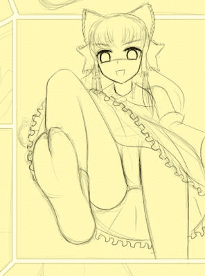
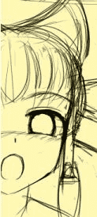

# 再发两张截图

作者：xnr

TID：8830

<title>1</title> <link href="../Styles/Style.css" type="text/css" rel="stylesheet">

# 1

正在创作中的作品，预计明年二月底交货（我争取不跳票到三月）。
因为这之前还有其他的作品要做。。。（一月份，春节前）
嗯，其他不多解释了。

<ignore_js_op>

**Snap3.jpg** *(18.68 KB, 下載次數: 9)*

[下載附件](forum.php?mod=attachment&aid=MjIxNzl8Yjg0OWJiYTF8MTYwMzg3ODA4OHwxODIzMHw4ODMw&nothumb=yes)

2010-12-9 22:50 上傳

————————————————————————————————————
<ignore_js_op>

**Snap4.jpg** *(19.52 KB, 下載次數: 10)*

[下載附件](forum.php?mod=attachment&aid=MjIxODB8ODZiODRmZjl8MTYwMzg3ODA4OHwxODIzMHw4ODMw&nothumb=yes)

2010-12-9 23:48 上傳

发这个帖子的目的还是希望大家多多交流和讨论，分享彼此的灵感和想法，激励大家共同创作。

这两个帖子又沉下去了，求游戏的人不少，想扩展和补完的人却不多，这样怎么能促进圈内同好的创作呢？
也许你的想法会与创作者不谋而合呢。

上一次的截图：
[http://giantessnight.com/gnforum ... &extra=page%3D1](http://giantessnight.com/gnforum/viewthread.php?tid=8781&extra=page%3D1)
讨论串：
[http://giantessnight.com/gnforum ... &extra=page%3D1](http://giantessnight.com/gnforum/viewthread.php?tid=8515&extra=page%3D1)
欢迎大家多多留言，每一个帖子我都会认真去看并且回复的，请不要灌水哦！

最后，赠送半张非常适合脑补的图：
<ignore_js_op>

**snap5.jpg** *(10.5 KB, 下載次數: 4)*

[下載附件](forum.php?mod=attachment&aid=MjIxODF8MzU0NDYxNmV8MTYwMzg3ODA4OHwxODIzMHw4ODMw&nothumb=yes)

2010-12-9 22:50 上傳

灵梦：“看爽了都不回帖的人，最最讨厌了！”

[ *本帖最後由 xnr 於 2011-2-19 20:50 編輯* ]<title>2</title> <link href="../Styles/Style.css" type="text/css" rel="stylesheet">

# 2

> 原帖由 *rce* 於 2010-12-10 01:39 發表 
> 个人还是觉得有个呆毛比较合适……

红白没有呆毛，所以不会加的，抱歉。<title>3</title> <link href="../Styles/Style.css" type="text/css" rel="stylesheet">

# 3

> 原帖由 *qqww99* 於 2010-12-10 05:53 發表 
> 精神可嘉!继续努力!

我发图的目的是为了抛砖引玉，不是听什么精神可嘉之类的话。（你觉得这是什么精神？）<title>4</title> <link href="../Styles/Style.css" type="text/css" rel="stylesheet">

# 4

> 原帖由 *killer9999* 於 2010-12-10 17:02 發表 
> 話說...都呆了這麼多天 截圖數量依然沒變啊...

我对待每个同好都是平等的呀，他们还没看过呢。。。不过话说其他截图也不好再透露了。。。<title>5</title> <link href="../Styles/Style.css" type="text/css" rel="stylesheet">

# 5

呵呵，欢迎恶搞，没问题啦，只要大家开心就好！<title>6</title> <link href="../Styles/Style.css" type="text/css" rel="stylesheet">

# 6

兔子你赢了。。。愕然发现你也很有艺术细胞的说。。。<title>7</title> <link href="../Styles/Style.css" type="text/css" rel="stylesheet">

# 7

> 原帖由 *DAVID* 於 2010-12-12 13:37 發表 
> 不是很喜欢这样的袜子

那不是袜子，是巫女的足袋，很多人就是控这个。

另外，若你不喜欢，请说出你喜欢的东西，就这么丢一句不喜欢，对于作者实在是毫无帮助。<title>8</title> <link href="../Styles/Style.css" type="text/css" rel="stylesheet">

# 8

> 原帖由 *DAVID* 於 2010-12-19 00:21 發表 
>  更喜欢裸足了。。。不过估计会增加绘画难度

难是不难的，我以前画过裸足的，所以这次主攻足袋。

你可以翻一下我的旧帖子。</ignore_js_op></ignore_js_op></ignore_js_op>