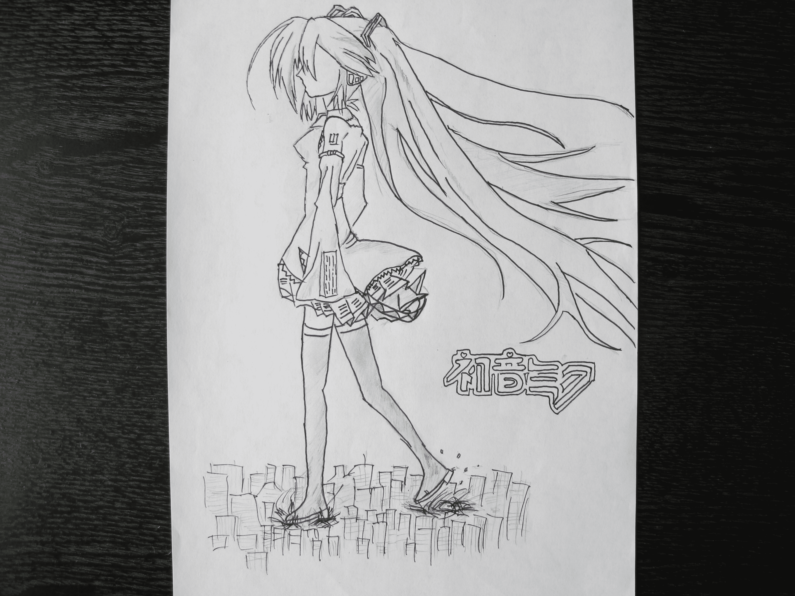
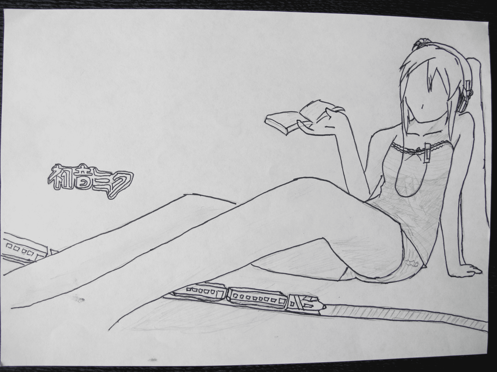
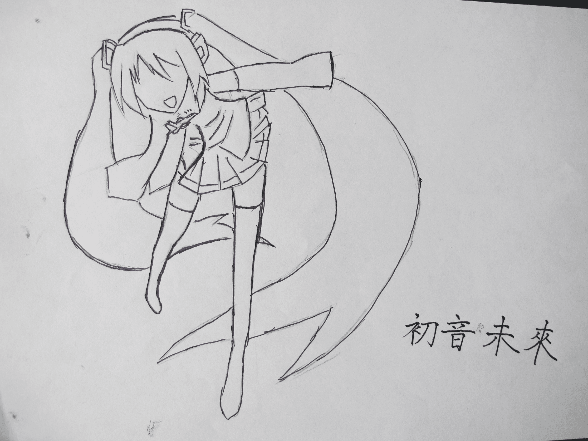
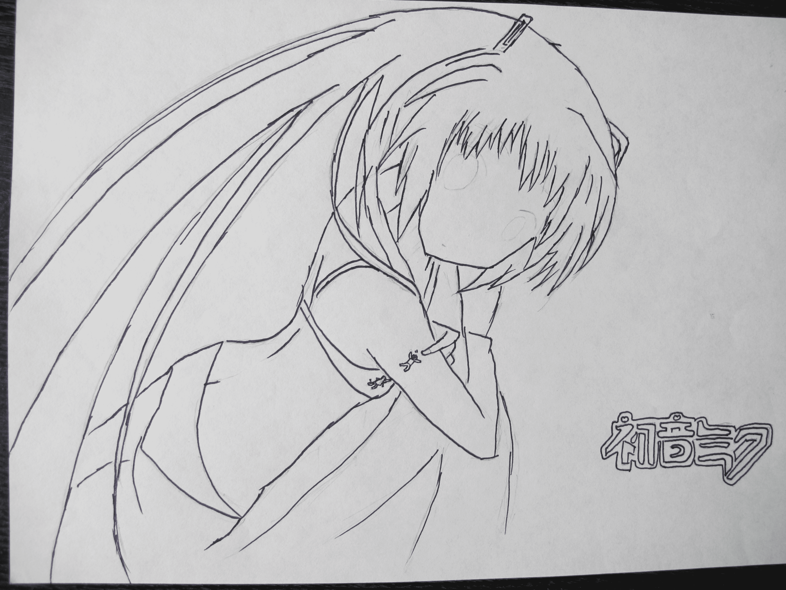
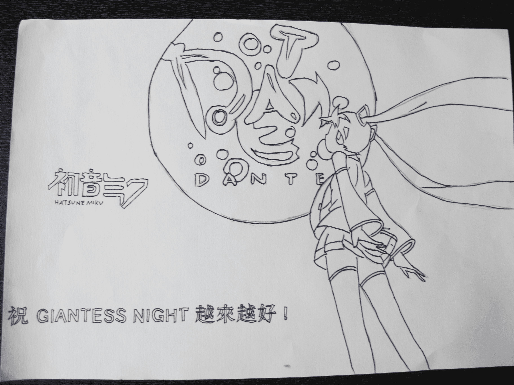
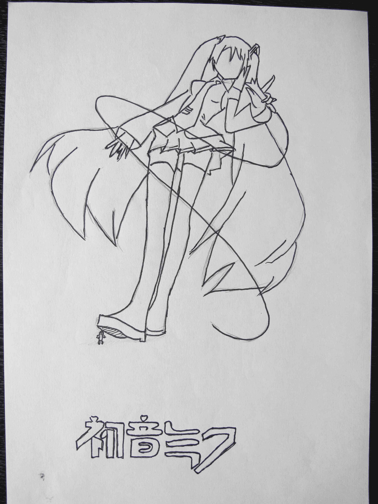

# 初音ミク（我知道擔不起這個名字）

作者：0128

TID：10600

 

# 1

由衷感謝大家能點擊進入。

這些畫是在下第一次在論壇上貼出來的，繪這些（6張——有一張是其他…）圖時，自己偷了很多懶，畫的是相當草草，相當的不細致，用現在論壇上流行的題目叫渣圖也不為過……

再者，在下的水平也只有小學加初一的純業餘（什麼都没學，現在丢了1年後更加縮水），没有明暗條紋，那個，繪制起來有點麻煩，自己也不怎麼會，所以…………大家千萬不要報以希望，喜歡初音未來的同好看了後生氣就說出來吧，在下會在今後的作品（這個可能會等很久，當然不再是初音未來了）中改正的，對初音没興趣的同好，也寬容一

下作品的質量，……

還有就是畫面的GTS成分極少！！

關於這些畫，我想說的還有點多……

首先是——畫什麼好呢？這是個問題，最早我是喜歡畫高達的，但是，如果加入GTS成分就那什麼讓我很為難（也確實很難，單單從畫來說也很難……）。抓耳撓腮，揪扯頭發……

就在這時，同學的QQ頭像在桌面下方閃爍——是什麼？——初音未來！抓住念頭就别放過！

就決定是妳了！！

——但是，初音什麼的只是聽同學每日在耳邊念叨，歌也是同學拿着MP4在教室音響上放過，真的是一點也不了解耶！可是人家人氣有這麼高，其實長得也不錯……

方法一：畫册！——其實是好辦法！可惜過不了媽媽那一關，找同學假借一本來，放那麼大一本在家，不被媽媽發現才怪………這個行不通！

方法二：電繪！——用專業的繪圖軟件繪制初音，聽上去不錯，可是，我没那麼多時間呀………看來，這也不行！

方法三：學習機！——這個最後的廉價必殺技還……叫同學傳點初音的圖像過來——然後畫——啊~怎麼圖片這麼模糊，藍藍綠綠的，分不清楚呀——處理一下——白色素描是我最喜歡用的功能——雖然依然不尽人意，但——知足矣……

開始畫咯！碰！——立馬碰壁！

自己設定動作？怎麼做呀？有了構思，心有餘而力不足！頂着頭皮畫呀！

唉——還是不行，怎麼就是畫不好，技術差太遠了……還是口胡了一張，看大家能不能看出來……

向同學求助！“或許，你可以把我發給你的現成動作作為基礎，在上面加一點什麼元素……”對！我怎麼就這麼笨呀！就以大師們的原畫為基礎，添加少量GTS元素就OK了……這樣做好麼，會不會有版權問題？——但是我轉而一想，翻譯作品方可在原創文章，我亦不可？實在不行，就搬家到熱情貼圖區好了！

其實繪的還慢艱苦的，先2B草稿一章，在水性筆勾，再HB一張，再水性筆勾（其實我開始就想放HB的上來的，但是不很清晰，所以又用水性筆勾了一下……）

最後，在下懇請各位不要把它放在其他任何網站上，這樣——呀——丢死人了啦！

看來我果然廢話很多……

謝謝大家把它看完！——謝謝！

[ *本帖最後由 0128 於 2011-7-16 17:52 編輯* ] 

# 2

6張圖———很緊張的發上來！

都没有眼睛！！！太可怕了！！！為什麼？

因為，眼睛那個太重要，

以至於會影響整張畫面的，為了正題，再加上自己也真的不是很擅長繪制少女萌萌的大眼睛，所以，就省略掉了，真的自己都覺得蠻可惜的，但是，自己的手實在太拙的緣故……

——————放在下一馬！ 

# 3

<ignore_js_op>[IMG_1637.JPG](forum.php?mod=attachment&aid=MjU1NzF8MzJiNWRjYTN8MTYwMzg3NjM4NHwxODIzMHwxMDYwMA%3D%3D&nothumb=yes) *(1.99 MB, 下載次數: 44)*

[下載附件](forum.php?mod=attachment&aid=MjU1NzF8MzJiNWRjYTN8MTYwMzg3NjM4NHwxODIzMHwxMDYwMA%3D%3D&nothumb=yes)

2011-7-16 17:49 上傳  

</ignore_js_op> <ignore_js_op>[IMG_1638.JPG](forum.php?mod=attachment&aid=MjU1NzJ8M2JmNWFiNzN8MTYwMzg3NjM4NHwxODIzMHwxMDYwMA%3D%3D&nothumb=yes) *(1.69 MB, 下載次數: 2)*

[下載附件](forum.php?mod=attachment&aid=MjU1NzJ8M2JmNWFiNzN8MTYwMzg3NjM4NHwxODIzMHwxMDYwMA%3D%3D&nothumb=yes)

2011-7-16 17:49 上傳  

</ignore_js_op> <ignore_js_op>[IMG_1639.JPG](forum.php?mod=attachment&aid=MjU1NzN8NzVhMTZmN2Z8MTYwMzg3NjM4NHwxODIzMHwxMDYwMA%3D%3D&nothumb=yes) *(1.61 MB, 下載次數: 0)*

[下載附件](forum.php?mod=attachment&aid=MjU1NzN8NzVhMTZmN2Z8MTYwMzg3NjM4NHwxODIzMHwxMDYwMA%3D%3D&nothumb=yes)

2011-7-16 17:49 上傳  

</ignore_js_op> <ignore_js_op>[IMG_1641.JPG](forum.php?mod=attachment&aid=MjU1NzR8ZWNkMTY4ZWV8MTYwMzg3NjM4NHwxODIzMHwxMDYwMA%3D%3D&nothumb=yes) *(1.81 MB, 下載次數: 0)*

[下載附件](forum.php?mod=attachment&aid=MjU1NzR8ZWNkMTY4ZWV8MTYwMzg3NjM4NHwxODIzMHwxMDYwMA%3D%3D&nothumb=yes)

2011-7-16 17:49 上傳  

</ignore_js_op> <ignore_js_op>[IMG_1642.JPG](forum.php?mod=attachment&aid=MjU1NzV8NTc2OTYwMzh8MTYwMzg3NjM4NHwxODIzMHwxMDYwMA%3D%3D&nothumb=yes) *(1.51 MB, 下載次數: 0)*

[下載附件](forum.php?mod=attachment&aid=MjU1NzV8NTc2OTYwMzh8MTYwMzg3NjM4NHwxODIzMHwxMDYwMA%3D%3D&nothumb=yes)

2011-7-16 17:49 上傳  

</ignore_js_op> <ignore_js_op>[旋&#36716; IMG_1640.JPG](forum.php?mod=attachment&aid=MjU1NzZ8MmJhZmExYjl8MTYwMzg3NjM4NHwxODIzMHwxMDYwMA%3D%3D&nothumb=yes) *(1.89 MB, 下載次數: 3)*

[下載附件](forum.php?mod=attachment&aid=MjU1NzZ8MmJhZmExYjl8MTYwMzg3NjM4NHwxODIzMHwxMDYwMA%3D%3D&nothumb=yes)

2011-7-16 17:49 上傳  

</ignore_js_op>  

# 4

看來，果然逃不過眼睛這一劫……

好的！眼睛而已了，補上！！……

這可能要等一陣子了……其實練書法,補習,跆拳道一起蠻累的……

最後，很早很早以前的那張EOE的……現在也在最後的修飾。

這次一發不可收了，堅持着，畫下去吧！少年！